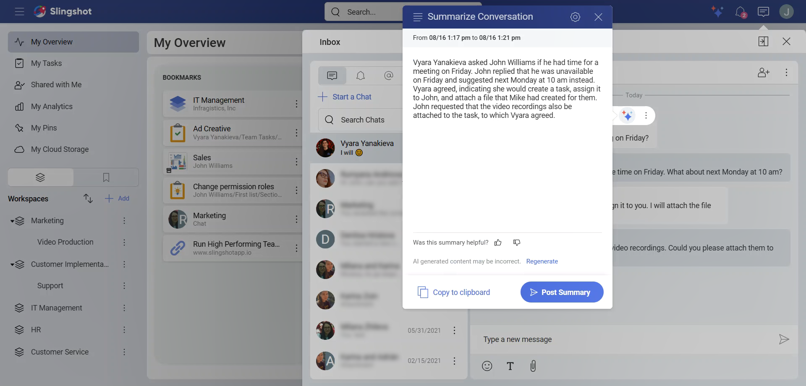
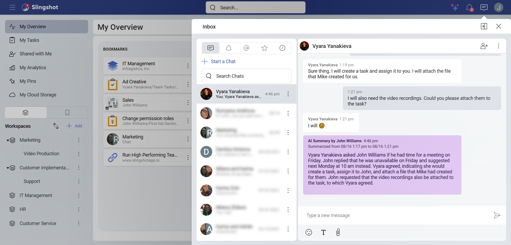

# Summarization

There are many AI-powered features available to you within Slingshot, one of these features is the summarization of text within discussions and chats. It allows you to quickly extract key information from the text, providing you and your team with an instant overview of discussions. 

The key benefits of this feature include: 

- **Time Saving** – get a quick summary of any discussion or chat in seconds 

- **Improved Collaborations** – Ensure everyone is on the same page 

- **Enhanced Decision-Making** – Quickly access the information you need to make information decisions 

As with all Slingshot AI features, it is a paid feature, available under the *Slingshot* and *Slingshot Enterprise* subscriptions. For more information on upgrading your license, please visit [here](https://www.slingshotapp.io/pricing). 

## How can I use the Slingshot AI Summarization feature? 

Using the Slingshot AI Summarization feature is simple to use and helps you catch up you have missed in seconds. This feature works by summarizing the conversation downwards from a starting point message you have selected. 

Navigate to a discussion or chat you want to summarize.  

1. Hover over or long press (for mobile devices) on a message in a chat, discussion, or a task. 

2. You will see different options, such as reacting to the message with emojis, or directly replying to it. To see a list of the Slingshot AI features that are available to conversations, click/tap on the three-star AI button.  

3. You will see a list of Slingshot AI features. For this walkthrough, choose **Summarize from Here**. This means that the message you have opened will be used as a starting point for the text summarization. 

4. From here a dialog box will pop up with the summarized text. 

 

From here, there are many more options you can do: 

- **Generate** new versions of summarized text. This way you can choose a version that best describes your conversation.

- **Copy to clipboard** if you want to reuse the summarization. 

- **Give us feedback**. We value our users’ experience with the app and are always striving to improve it.

- **Post the summary** in the chat, discussion or task that you have opened. Everyone who can see the messages will also be able to see the summary. Before you post, you can also edit the text from here. Once posted, the summarized text will appear in purple.

 

>[!Note] You can only use the Slingshot AI summarization feature on non-generated messages. This means that you cannot summarize messages that have already been summarized.  

## Troubleshooting 

If a conversation is too long, you will get an error message informing you that you need to pick a different starting point.  

When nothing useful could be extracted from a conversation, you will be prompted to reduce the number of messages to summarize from. 

## How do I disable the Slingshot AI Summarization Feature: 

Slingshot AI is turned on by default, unless you are part of an Organization and your Org Admin has disabled it for the entire organization.  

If you want to turn Slingshot AI off: 

1. You can access the settings panel in two separate scenarios: 

   a. Navigate to your Avatar in the top right corner.  

   b. Directly from the summarized text window navigate to the settings icon in the top right corner. 

2. From the Settings Panel, select *AI*. 

3. Toggle the **General AI Features** off. 

 

