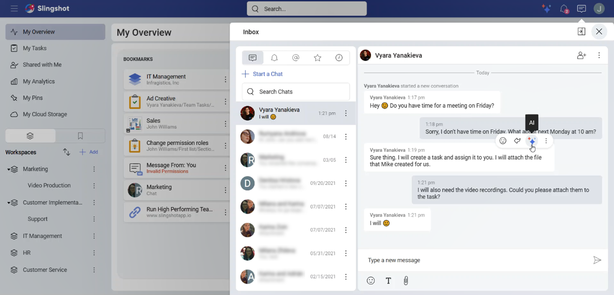
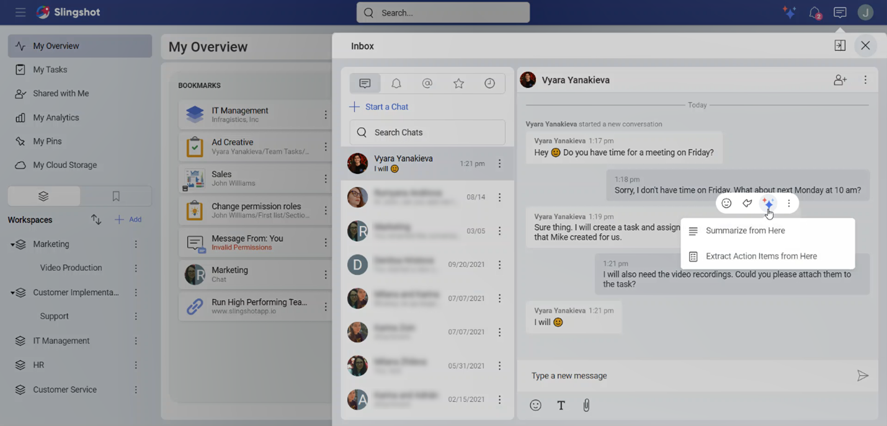
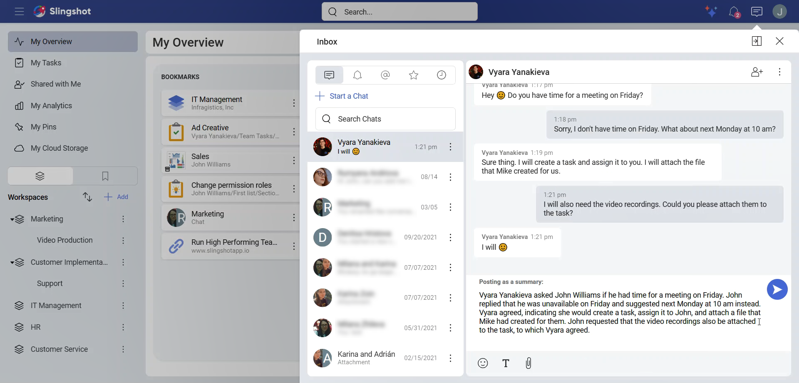

# Summarization

With the Slingshot AI summarization, you can extract the most important info from a text in just a few seconds. This way you and your team members can quickly get an overview of what has been discussed. No more waste of time in reading long messages. 

>[!Note] Summarize from Here is a *Slingshot* and *Slingshot Enterprise* feature.

## Where can I find the AI Summarization feature?

You can find it when you:

1. Hover over or long press (for mobile devices) on a message in a chat, discussion, or a task.

2. You will see different options, such as reacting to the message with emojis, or directly replying to it. To see a list of the AI features that are available to messages, click/tap on the three-star button. 

 

3. You will see the following list. Choose **Summarize from Here**. This means that the message you have opened will be used as a starting point for the text summarization.  

 

If a conversation is too long, you will get an error message informing you that you need to pick a different starting point. 

When nothing useful could be extracted from a conversation, you will be prompted to reduce the number of messages to summarize from.

## How can I summarize a text?

When you click/tap on **Summarize from Here**, you will be presented with the following dialog box:

 

Here you can:

- **Generate** new versions of summarized text. This way you can choose a version that best describes your conversation.

- **Copy to clipboard** if you want to reuse the summarization. 

- Give us feedback. We value our users’ experience with the app and are always striving to improve it.

- Post the summary in the chat, discussion or task that you have opened. Everyone who can see the messages will also be able to see the summary.

- Open the AI settings from the settings icon in the top right corner.

Before posting the summary, you can edit the text in the message editor. 

 

Once posted, the summarized text will appear in purple. 

 

>[!Note] You can extract text only from non-generated messages. This means that you can create summarized messages from text messages that are not in purple (created with the help of Artificial Intelligence). 

## How can I turn off AI Summarization?

If you are creating a summarization, you can:

1.	Click/tap on the **Settings** button in the upper right corner of the summarization dialog box.

 

2.	The AI section in the user settings will open up. From there on, you can toggle **General AI Features** off. Note that this will also disable **[Action Items Extraction](extract-action-items.md)**.

 

Alternatively, you can disable the AI features directly from your user settings when you:

1.	Go to the upper right corner and select your profile image.

2.	Click/tap on **Settings**.

 

3.	Open the *AI* section.

 

4.	Toggle **General AI Features** off.

