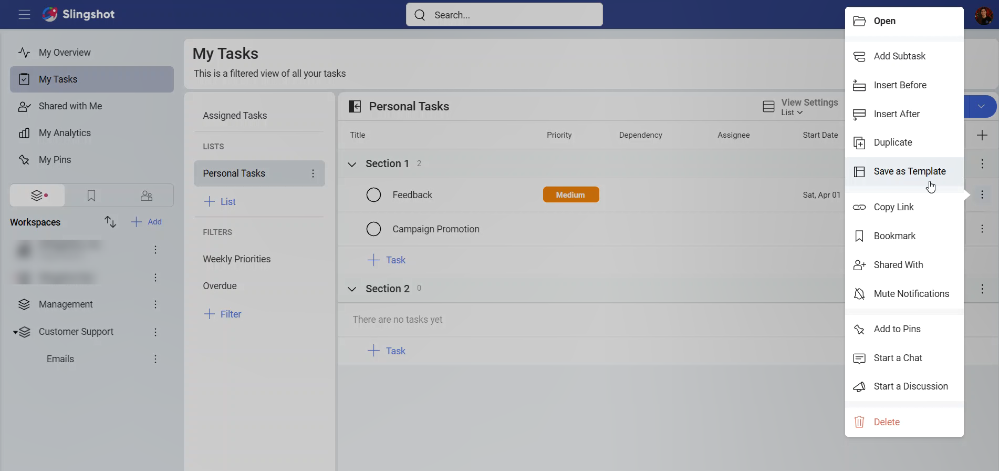
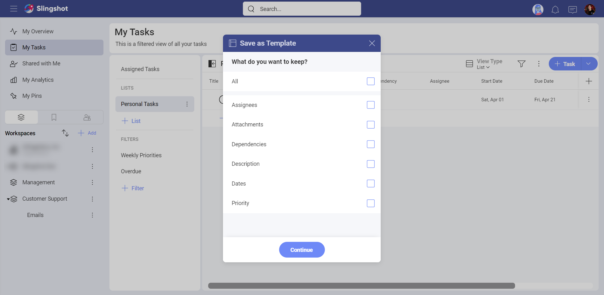
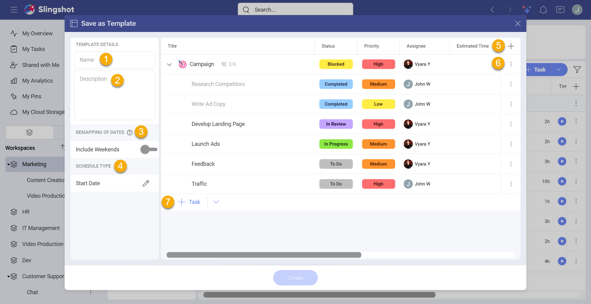
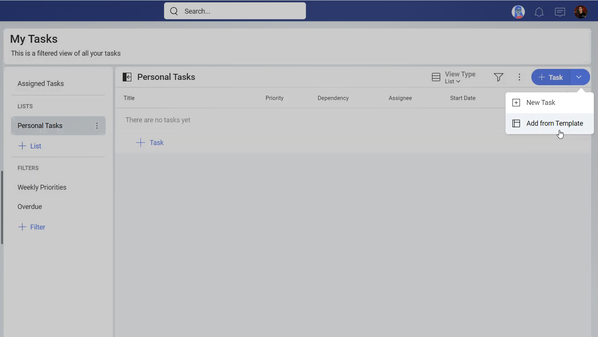
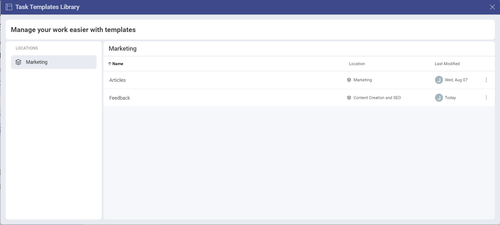
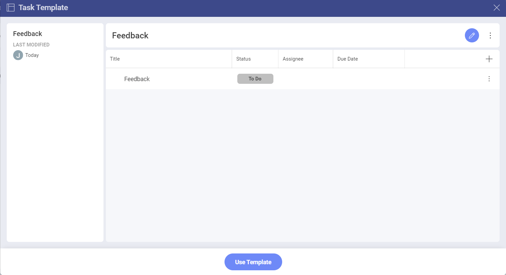
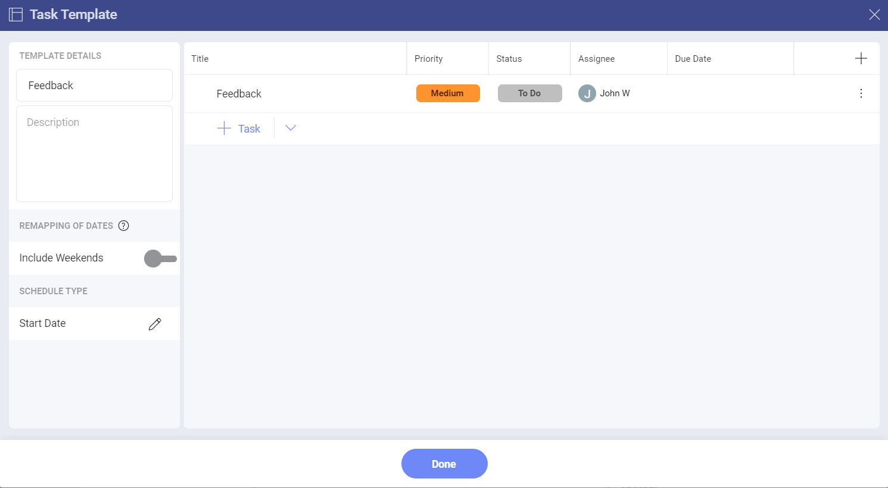

# Task Templates

With Task Templates, you can save time and increase your productivity by reusing already created task templates. You can easily reuse previously created task templates, with the option to choose to keep all the information in a specific task template or adjust it to your teams’ needs.

## How can I create a Task Template?

You can create task templates in different projects, workspaces or in the **My Tasks** section. To access the option to create a task template, you need to:

1.	Open the overflow menu of a specific task (as shown below), a task list or a task section.

2.	Click/tap on **Save as Template**.

    

3. The following dialog will open up. Here you can choose what to keep from the task and use it for the template. When you are ready, click/tap on **Continue**.
       
     

Before creating the template, you will have the option to:

1.	Give a name to the task template in order to create it.

2.	Add a description. *(optional)*

3.	Toggle on/off the option to include weekends. *(optional)*

4.	Choose the **Schedule Type**. Here you can set the Start Date and the Due date. *(optional)*

5.	Filter tasks. You can filter tasks based on your chosen criteria. *(optional)*

6.	Open the task, add subtasks to it, or delete it. From here, you can also insert a task right above or below another task. *(optional)*

7.	Add a new task to use alongside the other tasks for the template. *(optional)*

      

Once you have created a task template, you can use it in order to create a new task or a set of tasks. 

>[!NOTE] Keep in mind that the option to create task templates is available to *Slingshot* and *Slingshot Enterprise* users.

## How can I access different Task Templates lists?

To access your personal task templates or templates that are stored in another location, such as another workspace or project, you can:

1.	Click/tap on the **+Task** split button in the upper right corner and then choose **Add from Template**.

      

    Alternatively, you can choose a section ⇒ open the overflow menu ⇒ choose **Add from Template**. 
       
      

2.	The following dialog will pop up:

     

In the left panel you can:

- Check all your task templates.

- Check the templates that you have recently used.

- Filter the templates by *Created by Me* or *Shared with Me*.

If you want to search a template by its name, you can use the search bar in the upper right corner.

Besides this, you can also open the overflow menu on the right side of each task template and take the following actions:

- Open the template.

- Create a *Copy* of the template and *Edit* it. This will lead you to the **Save as Template** dialog where you can make changes before creating a template copy.

- Copy the link to the task template.

- Add the template to **Bookmarks** or remove it from there.

- Share the template.

- Delete the template.

   

## How can I edit a Task Template?

To edit a Task Template, you need to:

1.	Click/tap on the template in order to open it.

2.	Click/tap on the pencil icon in the upper right corner.

    

3.	The **Task Template** dialog will open up where you can make the necessary changes. When you are ready, click/tap on **Done**.

     

>[!NOTE] Keep in mind that you have the same options for applying changes as in the **Save as Template** dialog.

If you want to find more information about how you can create and use tasks, head [here](tasks.md#how-to-create-a-task).

