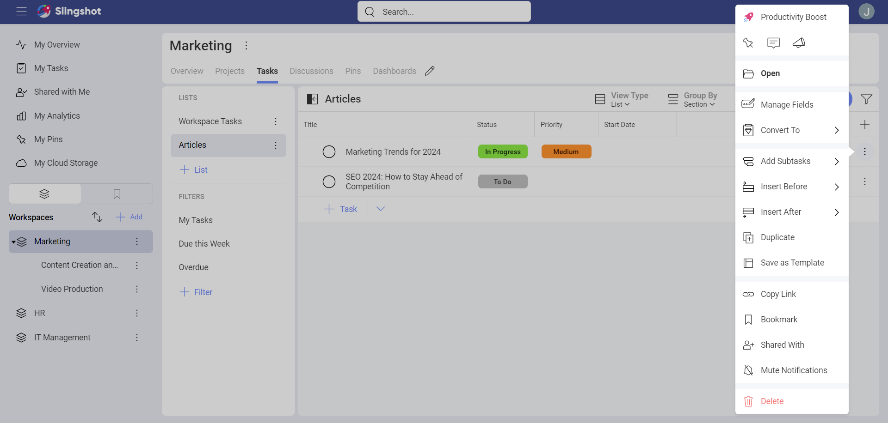
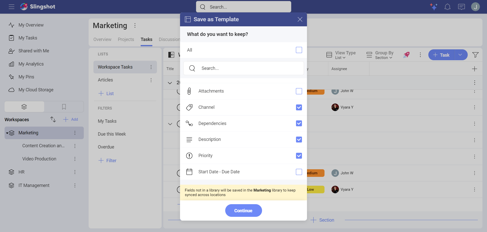
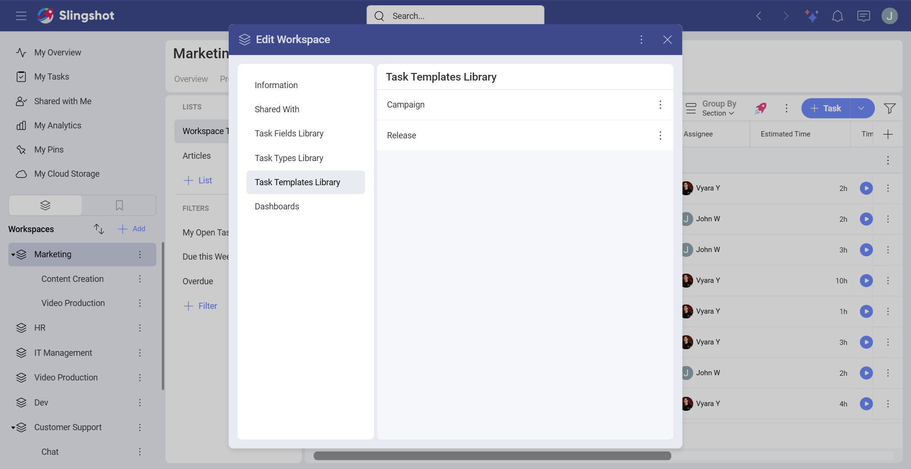
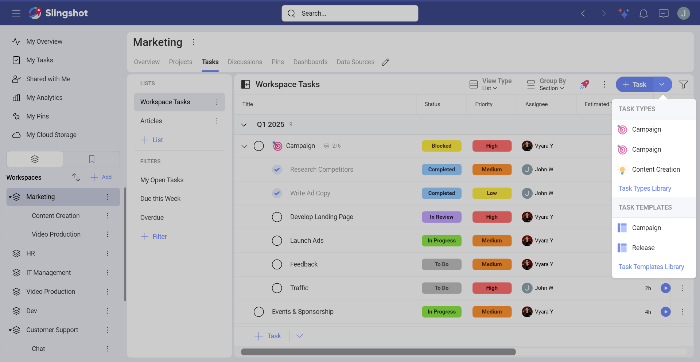
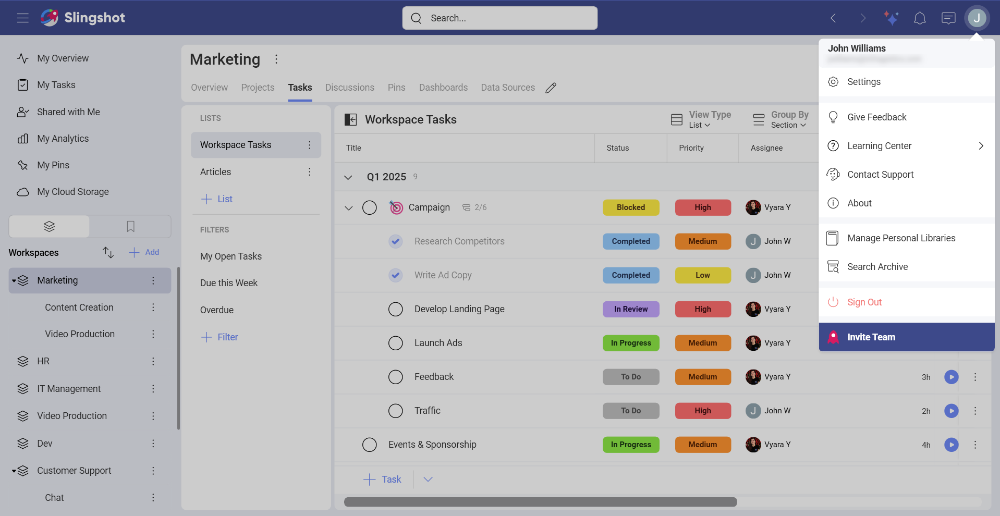

# Task Templates

With Task Templates, you can save time and increase your productivity by reusing already created task templates. You can easily reuse previously created task templates, with the option to choose to keep all the information in a specific task template or adjust it to your teams’ needs.

## How can I create a Task Template?

The option to create task templates is available to *Slingshot* and *Slingshot Enterprise* users.

You can create task templates in different projects, workspaces or in the **My Tasks** section. To access the option to create a task template, you need to:

1.	Open the overflow menu of a specific task (as shown below), a task list or a task section.

2.	Click/tap on **Save as Template**.

3. The following dialog will open up. Here you can choose which fields of the task (for example *Priority*) to use for the template. If the task has [custom fields](custom-fields.md), you can also keep them. When you are ready, click/tap on **Continue**.
       
  

Before creating the template, you will have the option to:

1.	Give a name to the task template in order to create it.

2.	Add a description. *(optional)*

3.	Toggle on/off the option to include weekends. *(optional)*

4.	Choose the **Schedule Type**. Here you can set the Start Date and the Due date. *(optional)*

5.	Filter tasks. You can filter tasks based on your chosen criteria. *(optional)*

6.	Open the task, add subtasks to it, or delete it. From here, you can also insert a task right above or below another task. *(optional)*

7.	Add a new task to use alongside the other tasks for the template. *(optional)*

  

Once you have created a task template, you can use it in order to create a new task or a set of tasks. 

## How can I access different Task Templates lists?

Task Templates are organized in libraries. You can save task templates in workspaces and projects libraries, or your private library.

>[!Note]When you open a Workspace Task Template Library, you can browse through the templates that are stored both in the workspace and its projects.

To open a Task Template Library, you can:

1. Open a project or a workspace's settings.

2. Click/tap on **Task Template Library**.

 

If you have opened a task list, you can click/tap on the **+Task** split button in the upper right corner and then choose **Task Template Library**.

  

To open you private task templates, you can go to your profile settings and click/tap on **Manage Personal Libraries**.

 

Besides this, you can also open the overflow menu on the right side of each task template and take the following actions:

- Open the template.

- Copy the link to the task template.

- Add the template to **Bookmarks** or remove it from there.

- Delete the template.

 

## How can I edit a Task Template?

To edit a Task Template, you need to:

1.	Click/tap on the template in order to open it.

2.	Click/tap on the pencil icon in the upper right corner.

3.	The **Task Template** dialog will open up where you can make the necessary changes. When you are ready, click/tap on **Done**.

>[!NOTE] Keep in mind that you have the same options for applying changes as in the **Save as Template** dialog.

If you want to find more information about how you can create and use tasks, head [here](tasks.md#how-to-create-a-task).
