## Learn more about Tasks

Welcome! Read on to get answers to your questions about tasks.

### Personal vs shared tasks
In Slingshot you can have personal and shared tasks, they work pretty much the same but they do have a few differences detailed below.

Only you have access to your **personal tasks** and you can find them in your personal space (**My Stuff**).

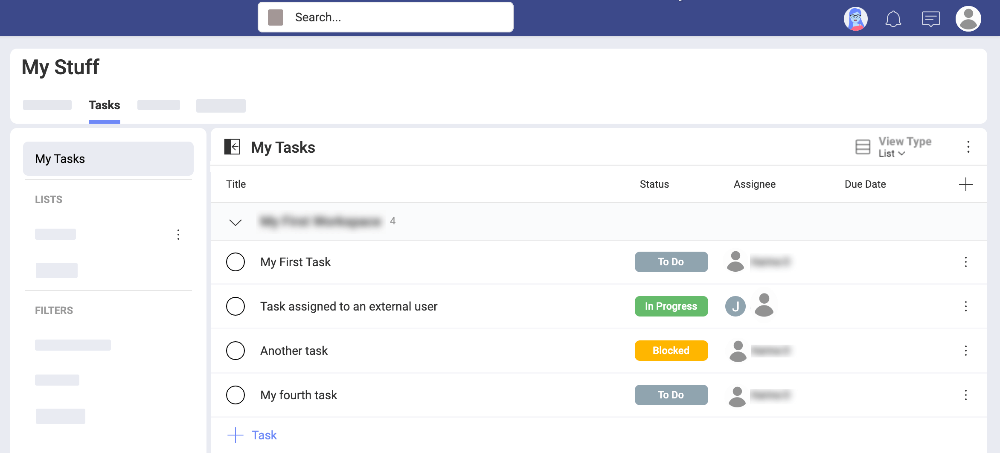

All the members of a workspace can access the tasks created within that workspace, no matter who is assigned. And every member can manage these shared tasks freely.

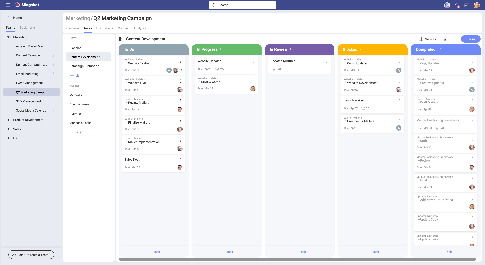

>[!NOTE] Members of a [parent workspace](workspaces.html#using-workspaces-within-the-workspace) can view the tasks in all sub-workspaces, even when they haven't joined the sub-workspaces. However, the members of а sub-workspace, who are not members of the parent workspace cannot view the tasks in the parent workspace.

### How can I access my tasks?

You can access your tasks by going to a workspace and selecting the **Tasks** tab on top (see below).

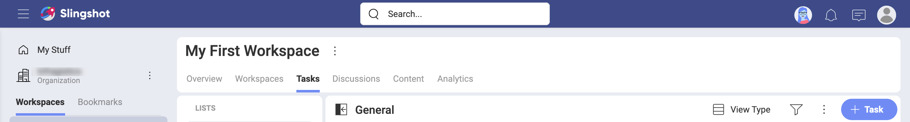

Depending on where you stand, you will be accessing different tasks.

In **My Stuff**, you can access every task assigned to you. These tasks are saved inside *My Tasks*. There you will find personal, and workspace tasks - very useful to have all your tasks in just one place!

Within a **workspace**, you get access to all created tasks, no matter who is assigned.  
Also, use the *My Tasks* pre-set [filter](#how-can-i-filter-tasks) and you will see only tasks assigned to you. If you are in a parent workspace, containing sub-workspaces, use *My Tasks* to find all tasks assigned to you in the workspace and all its sub-workspaces. 

To open a task, just click/tap over it.

### How can I create a new task or subtask?

You can always create a **new task** with the button on the top right of the screen, no matter the view type you have selected (*List*, *Kanban*, or *Timeline*).

As shown above, there are always other _+ Task_ buttons depending on the *view type*.

You can directly create a new **subtask** using the main task's overflow menu, as shown below.

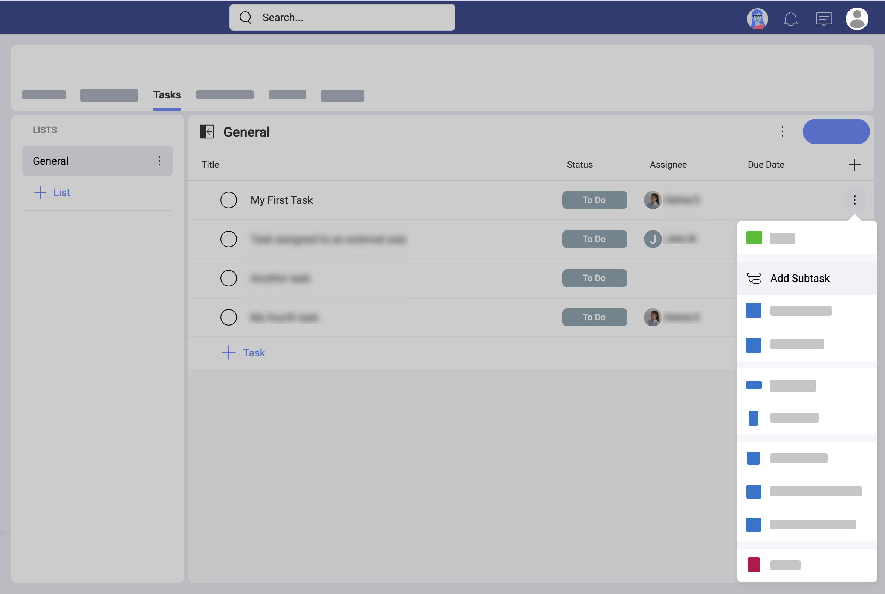

Alternatively, you can create subtasks for a task that is already opened:

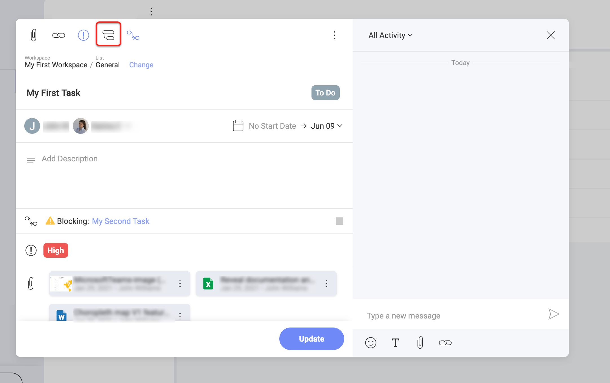

Having the task opened also allows you to insert new subtasks and this way reorder the existing subtasks (see below)

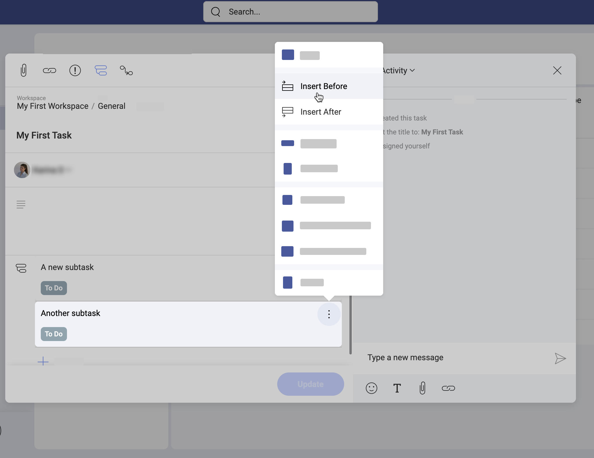

### How can I make a task depend on another task? 

Two or more tasks may depend on each other's completion. Slingshot helps you keep everyone informed about that with the task *dependency* property. 

You can set a task dependency in the task creation dialog by selecting the *Dependencies* icon on top (see the screenshot below). 

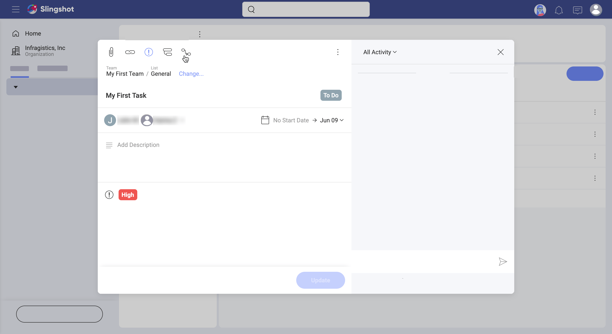

Here, you can choose between two dependency types: 

* **Waiting On** - this means your task can't be started before another task is finished. 
* **Blocking** - other tasks can't start before this task is completed.

Select the **+ Pick Waiting on Tasks** blue button to add the tasks that need to be completed before your task. Select the **+ Pick Blocking Tasks** blue button to add the tasks that can't be started before your task is completed. You can set both dependencies for the same task because one task can depend on and/or block more than one other task.

### How can I change properties?

All the properties of a task, such as a title, assignees, dependencies, status, or priority can be changed using different methods.

The **most reliable method** is to open a task by clicking/tapping it (or through the overflow button and then _Open_).

A **faster method** is to just click/tap the property value you want to change, like shown below with the _Status_ property.

### How can I show/hide properties?

Tasks have many field properties that can be displayed when in the *List* and *Kanban* view. By default, you can only see the *Title*, *Assignee*, and *Due Date* of a task before opening it.

To show/hide properties, click/tap the **overflow** button on top (next to the *+New* button) > **Fields** and select from the list of properties (as shown below).

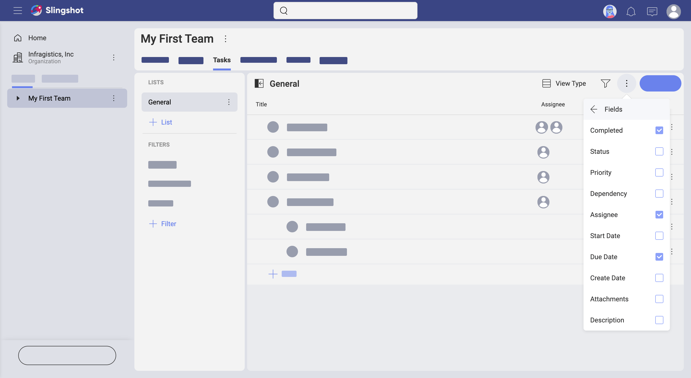

### How can I filter tasks?
Filtering allows you to choose a smaller amount of tasks, helping you find those tasks you currently need.

You can access the _Filters editor_ by clicking/tapping the filter icon on the top right of the screen (see the screenshot below).

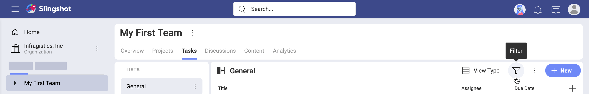

In the _Filters editor_ you can create *Basic* or more *Advanced* rules. The *Basic* rules will be enough most of the time, *Advanced* is recommended in the case that you really need to define more complex conditions in your filter.

Sometimes you might want to save a filter and use it again in the future. This allows you to keep at hand a list of already filtered tasks that is relevant to you. 

To create and save a filter use _+ Filter_ as shown below.

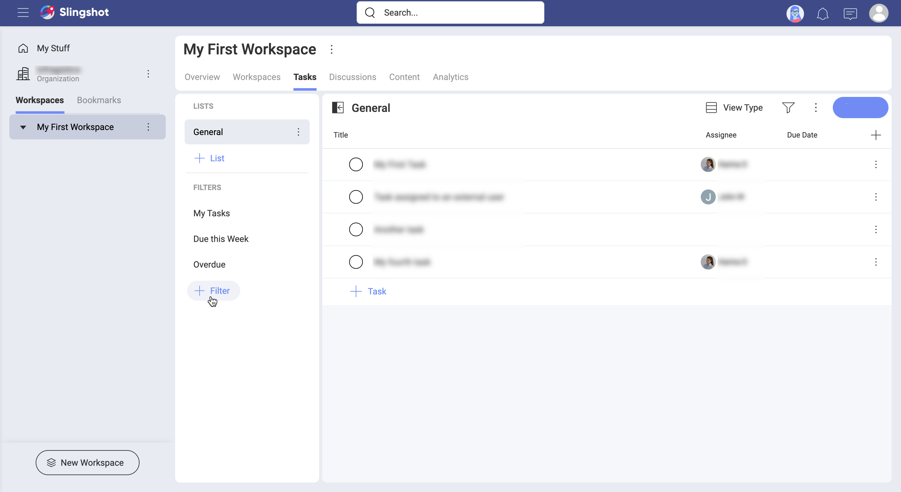

Slingshot has a few filters out-of-the-box: _My Tasks_, _Due this Week_, and _Overdue_ (shown in the screenshot above). But at any time you can create new custom filters or edit existing custom filters.

Keep in mind that filters you create and save in a workspace will be visible not only for you but also for the other members.

In addition, you can save a filter you just created on the spot using _Save As Filter_, as shown below.

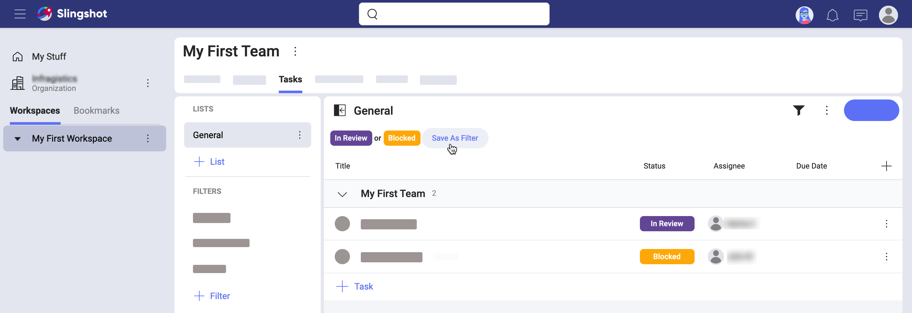

To stop filtering tasks, click/tap the **filter icon** to open the **Filters** dialog. Then, select the **Clear** button at the bottom to remove the current filters, and **Apply** to save your changes. 

For those times that you can't find a specific task, try expanding collapsed panels, removing existing filters, and/or adding filters using the properties of the task you want. Remember that the icon changes to help you identify when you have active filters or not.

### How can I switch between List, Kanban, and Timeline

You can choose between three different visualizations (_List_, _Kanban_, _Timeline_), depending on what you want to achieve.

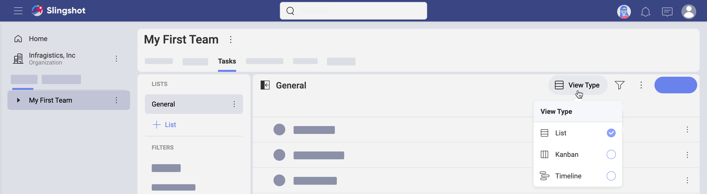

By default, you view your tasks as a straightforward **List**, which is often good enough. Most of the screenshots in this documentation present tasks in the *List* view. This is so because most of the time the preferred view type does not affect how *Tasks* are used and managed. When it does, we will show the differences in each view. 

*Kanban* is a Japanese word, commonly known as a workflow management method designed to help visualize work and maximize efficiency. In Slingshot, the **Kanban** view shows a visual representation of tasks in the form of cards. Each card contains information about the task, including [task properties](#how-can-i-change-properties) such as status, deadline, assignee, etc. 

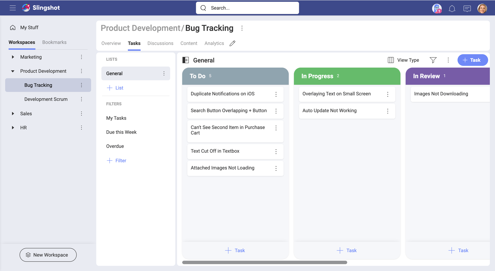

Besides, the cards are arranged in columns. By default, the columns represent different stages of the status workflow (see above). You can use drag & drop to move the cards through the workflow by changing their status on the spot. 

A **Timeline** always shows a list of events in chronological order. In Slingshot, you can see tasks over a set period of time.

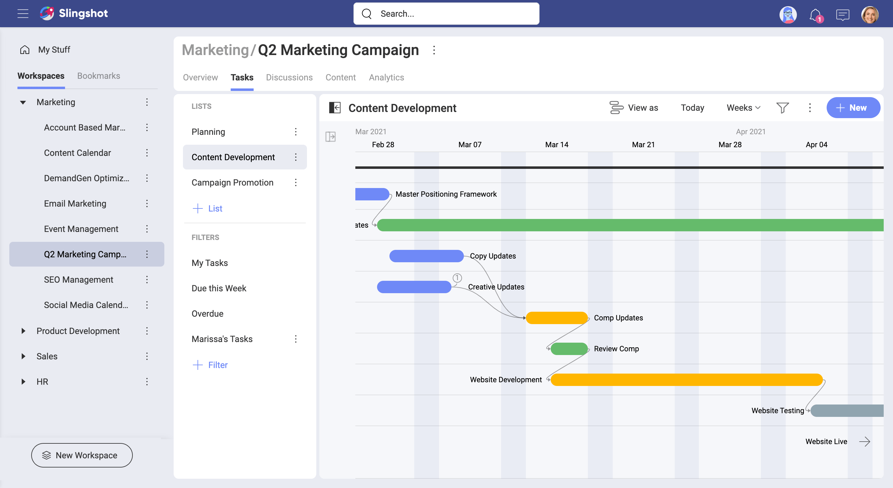

You can pick a task on the timeline and re-arrange the start and due dates by dragging its ends. 

In addition, you are able to change the scale (days, weeks, months) by using the dropdown next to the filter icon. Use the **Today** button on top to go back to the current day. If your scale shows weeks or months, *today* will bring you back to the beginning of the current week or month, respectively. 
You can even show/hide weekends by checking the **Show Weekends** box in the overflow menu on top.

You will notice a hook on both corners of each task on the timeline. Drag the left hook of a task and connect it to another task (see in the screenshot below). With this, you will add a *waiting on* [**dependency**](#how-can-i-add-a-task-dependency) to the first task. Use the right hook to add a blocking dependency. 

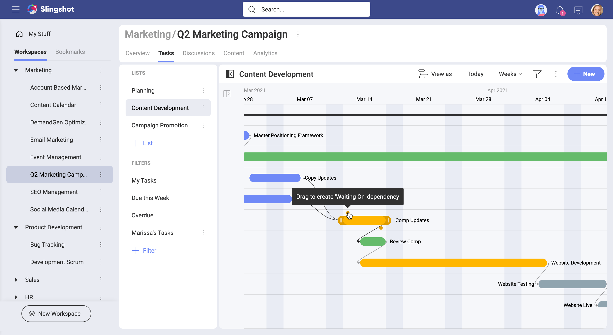

### How can I group my tasks? 

_Group by_ options include ordering your tasks by section, priority, assignee, and other criteria. To group your tasks, select the **overflow menu > Group by** (shown below). 

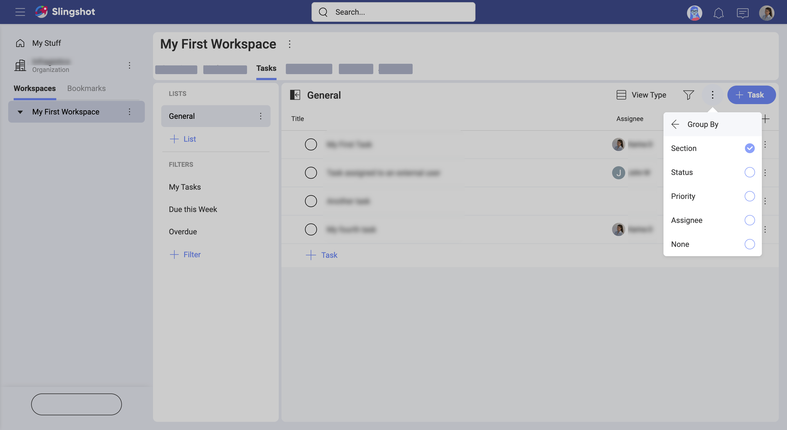

*Group by* is available for all _View Types_. Grouping your tasks helps you find quickly tasks that share a specific property, for example, tasks assigned to the same user. Unlike filtering, the grouping will show you all tasks at the same time. Changing the *group by* criteria will affect only the current list and only the way you see your tasks. Other workspace members can apply different grouping criteria to the same list, but this will not affect how you see this list in your profile. 

### How can I sort tasks? 

When you are looking at your tasks you may be wondering how they are ordered. Sorting helps you arrange your tasks in ascending or descending order by using a task property as the criterion. 

You can apply sorting only to the *List* and *Timeline* view.  

In the **List** view, your tasks are ordered by their date of creation by default. This means the last task you created will be added to the bottom of the list. To change the sorting criterion, you can click/tap on a property title at the top of the list and sort tasks by ascending or descending order of *Status*, *Assignee* (name), *Start/Due Date*, *Attachments* (having or not), *Priority* (see the screenshot below). If the property you want to sort by is not there, see how to [show a property](#how-can-i-showhide-properties) in the *List* view.  

In the **Timeline** view, your tasks are ordered by default. However, you can use the *Sort by* option in the overflow menu on the right. 

### How can I use lists and sections?

In Slingshot, you can organize your tasks by using **Lists** and **Sections**.  

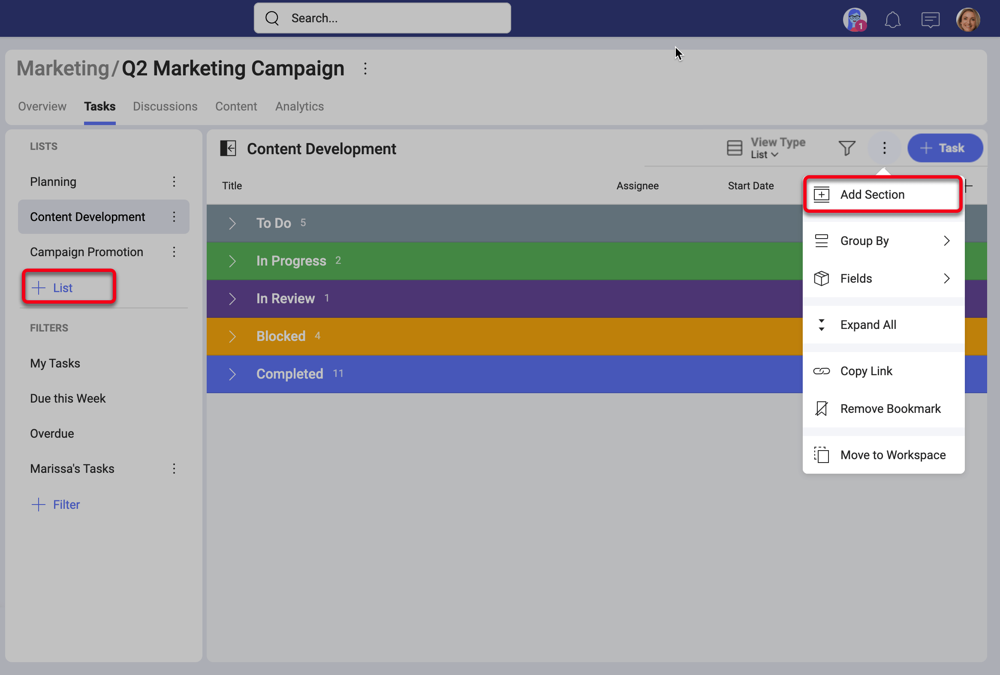

**Sections** are simply divisions of a list. A list can have one or more sections, and a natural way to organize your list of tasks is grouping by sections.

**Lists** help you organize your tasks and can be reorganized, copied, and moved around if needed.
This is very important as it makes it easy for you to focus on your work, not planning ahead which lists or sections you need. All these changes can happen organically and were designed to boost productivity and avoid losing time.  

### How can I move tasks? 

You can move tasks between tasks lists in the same workspace or between lists inside different sub-workspaces under the same parent workspace. A task is always moved with all its subtasks. 

To move a task, simply open it and click/tap the *Change* blue button right over the task name (see the screenshot below). Choose a new location by navigating to the workspace and list where you want to move your task. When finished, you will find your task at the bottom of the tasks list. 

Alternatively, click and hold on a task and drag it to another list. Then drop it there. You can’t use drag & drop for tasks you want to move from one sub-workspace to another. 

>[!NOTE] Coming Soon on mobile!
Drag & drop tasks is currently not available on Slingshot mobile. 

You **can’t move**: 
-	tasks between two parent workspaces;
-	sub-tasks separately; 
-	any tasks if you are a *viewer* of the workspace or sub-workspace, from or to which you want to move a task.

### How can I move tasks lists? 

You can move a full tasks list from one workspace to another. The destination workspaces need to be under the same parent workspace. You can also move a tasks list from a parent workspace to one of its sub-workspaces. 

To move a tasks list, select its overflow menu > *Move to Workspace* > a destination workspace > *Move*. 

Now, you can use the tasks list in its new workspace.

### How can I add attachments?

The ability to add **Attachments** ensures that Slingshot captures all the relevant information for your tasks and subtasks.

Each task can include one or more attachments, including images, documents, or links for specific tasks and subtasks.

Files attached can be opened, downloaded, or detached (unpinned) from the task.

> [!NOTE]
> Attaching files to tasks is similar to pinning files to boards. You can link content from a personal or a workspace cloud storage, in both cases attachments are never stored in Slingshot.

To attach a file, open a task and click/tap the clip icon as shown below.

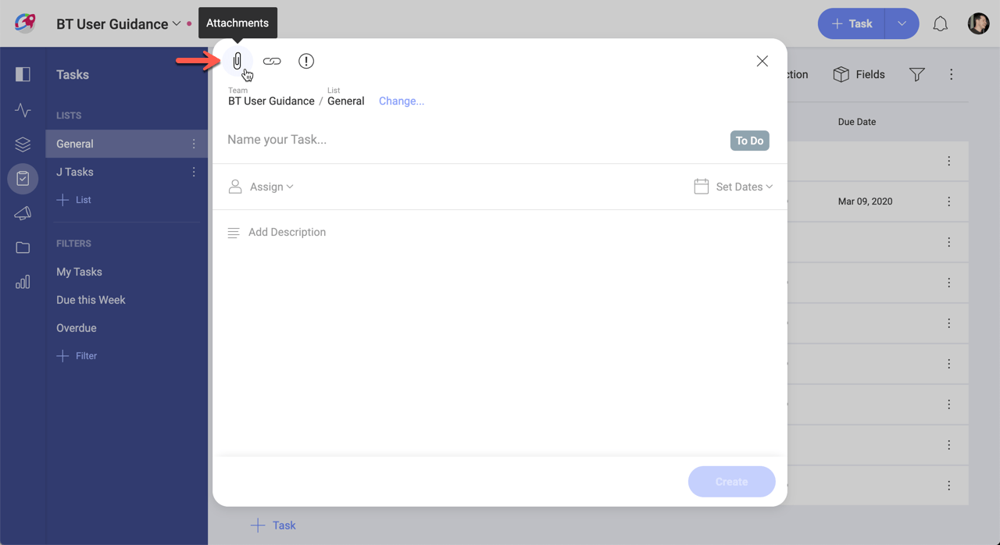

### How to create a task from a discussion or a chat message?

Slingshot ensures all your communication and collaboration tools are in one place, making remote teams stay productive no matter where they are. 

Improve your productivity by creating tasks from your messages as shown below:

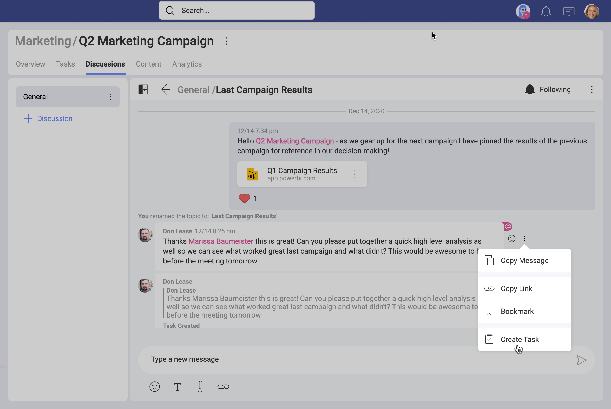

You can use any discussion or private/group chat message to start quickly. After selecting where you want to add your task from the message, you will have the message automatically added to the description of your new task. 