# Tasks

When it comes to running a successful project – task management is at the heart of that. You need everything organized in one place to manage tasks throughout the full lifecycle of the project. Setting deadlines, dependencies, and priorities are all essential to ensure projects stay on track and get completed on time.   

There is a task tab available within your workspaces and projects, listing all the tasks assigned to everyone in those workspaces and projects. You can view your own tasks assigned to you within the **My Tasks** section.

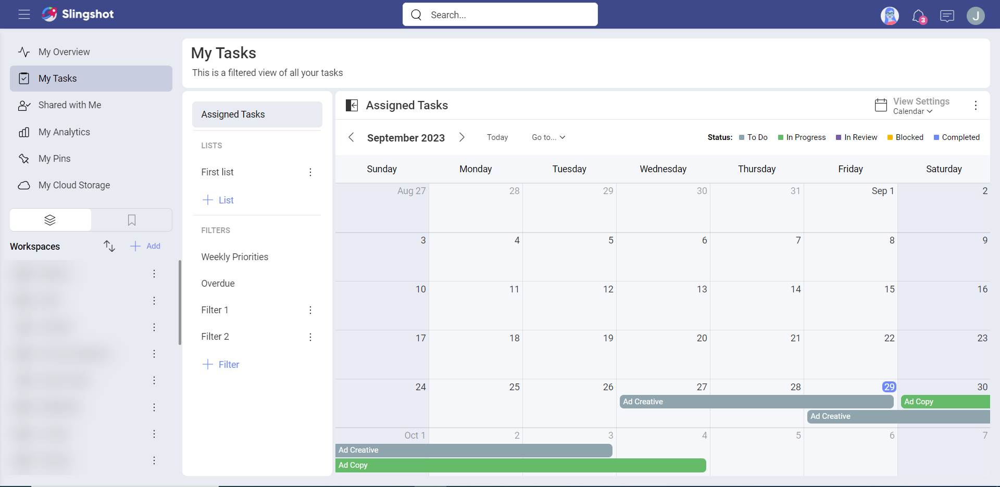

## What are Tasks?  

Tasks are a visual representation of work that needs to get done. Within tasks, you can store relevant documents, set clear ownership of responsibility, and have threaded conversations, so everything is transparent in one place.  

## How to Create a Task  

There are multiple ways to create a task in Slingshot:  

- Using the **+ Task** button will add a task to the bottom of your list.

- If you are using sections, you can quickly add a task to a section using the inline **+ Task**. 

- If you want to insert a task right above or below another, you can do so from that task overflow menu.

Subtasks can be created from inside the task card or from the parent task's overflow menu.

>[!IMPORTANT] **Slingshot Tip**: You can also create tasks directly from a chat, pin or dashboard in Slingshot. Check out more productivity flows from within Slingshot to enhance your productivity.

## Task Fields  

Tasks are very important for driving the productivity of your teams and projects. Your task card, without any added [custom fields](custom-fields.md), has the following fields:  

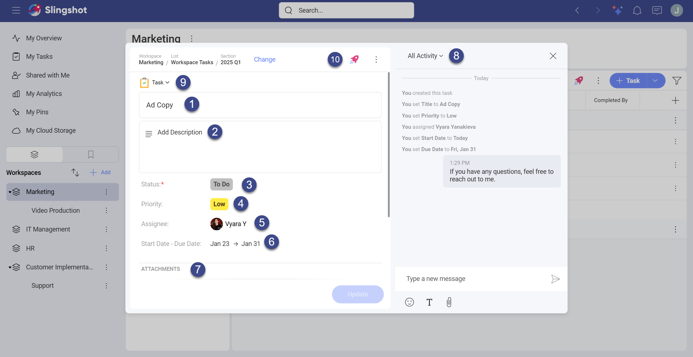

1.	**Task Title**: Set a clear title for your tasks. 

2.  **Description**: Add further details around your tasks so the assignee(s) can understand what needs to get done.

3.	**Status**: Set the status of the task such as In Review, In Progress or Completed.

4.	**Priority**: Set priorities for your teams so they can better manage their workloads effectively.

5.	**Assignee(s)**: Assign either one person, multiple, group or workspace to a task. 

6.	**Start Date & Due Date**: Set clear expectations on deadlines with start and due dates.  

7.	**Attachments**: Add documents and files (for example, URLs, dashboards or data sources) to the task. 

8.	**Activity**: Have threaded conversations around your tasks in context.

9. **Convert To**: Change the [type](./task-types.md) of the task.

10. **Productivity Boost**: Pin the task, start a chat or discussion directly from the [Productivity Boost](productivity-boost.md) icon.

If you want to add subtasks or dependencies to the task, you can scroll down in the task card.

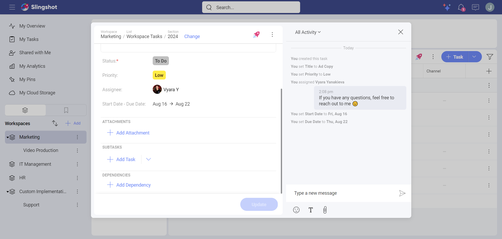

### Default Task Fields

For better organization of your tasks, you can use default task fields. To open the list of default task fields, you can click/tap on the **plus** button in the top right corner of a task list.

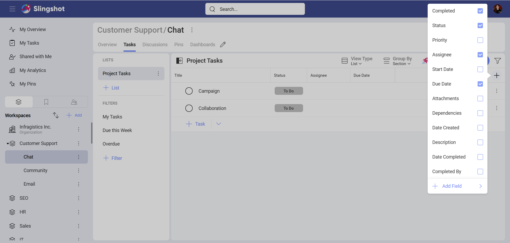

Here you can choose from the following fields: *Completed, Status, Priority, Assignee, Start Date, Due Date, Attachments, Dependencies, Date Created, Description, Date Completed*, and *Completed By*.

### Custom Task Fields 

With Custom Fields, you can shape your tasks to better match your internal work processes. To find out more about custom fields, click/tap [here](custom-fields.md).

### Task Description

 In the task description section, you can add additional details around your tasks with the help of different text formatting tools. You can also add URLs, as well as emojis.

  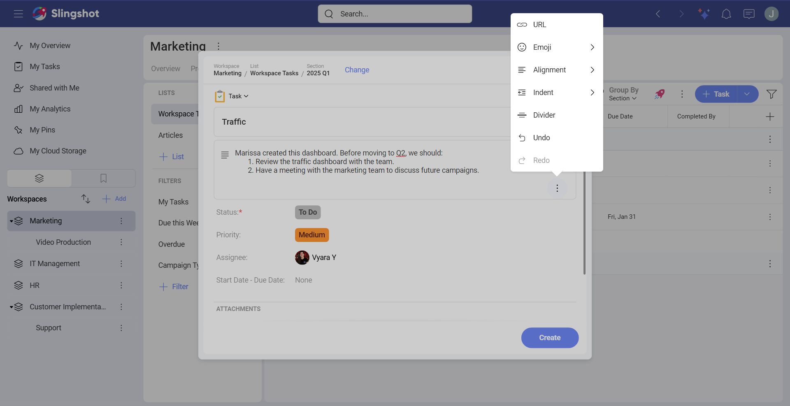

Note that currently these options are available only for macOS Monterey.

## Task Duplication

Instead of creating a whole new set of tasks, you can save some time and be more productive by duplicating a task with the steps mentioned below. 

If you decide to duplicate a parent task, you can duplicate  all the subtasks associated with it. 

1.	Open the task list where the parent task is located.

2.	Click on the overflow menu of the task. 

3.	Choose **Duplicate**.

 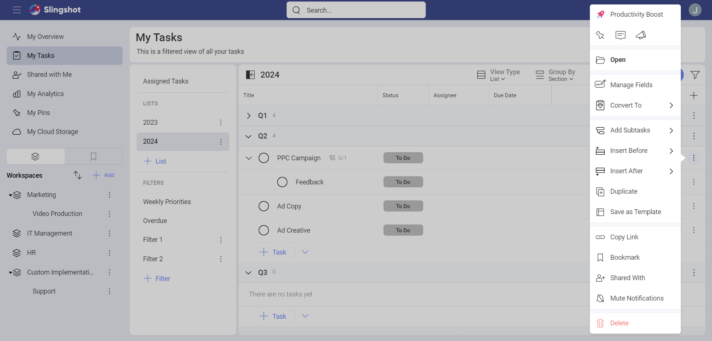

4.	A dialog will open, where you can choose what you want to keep when you duplicate the task. You can also change the title of the task. If you decide to keep the same assignees, you’ll be presented with the option to notify them once the task is created.

 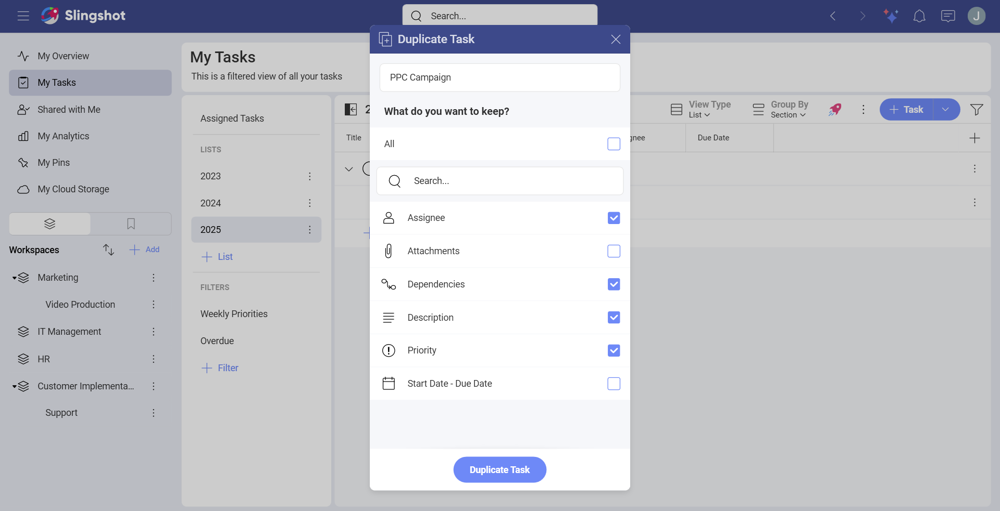

5.	Once you’ve saved your preferences, you will see the task card where you can make changes. 

 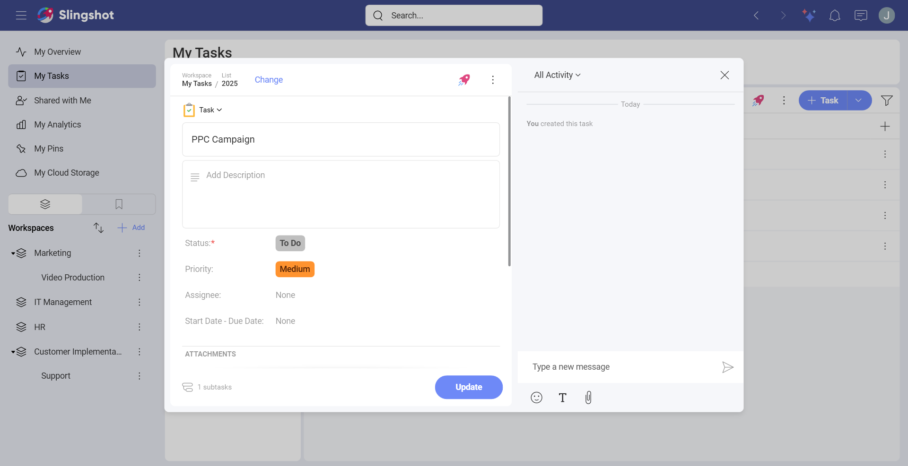

6.	When you are ready, you can click on **Update**. You can find the task with the subtasks in the specific location that you have saved it. 

 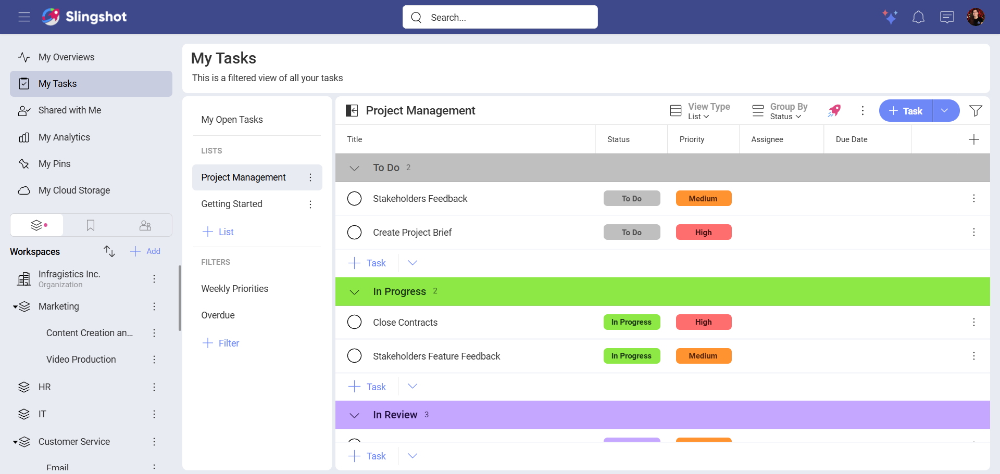

## Organizing Tasks  

You can organize your tasks into lists to further group them together. Within lists, you can also add sections to categorize your lists further. Tasks are movable with drag and drop or the change button within your task card between lists and sections.  

## Task Views

You can choose between four views (Calendar, List, Kanban, Timeline) to take advantage of a different layout to maximize utility. Use the **View Type** drop-down menu to switch between views.  

Within each of the task views you can filter the tasks in a way that best suits your teams' goals.

### Calendar  

View your tasks on the calendar in order to have a better overview of your teams' schedules and their progress on tasks.

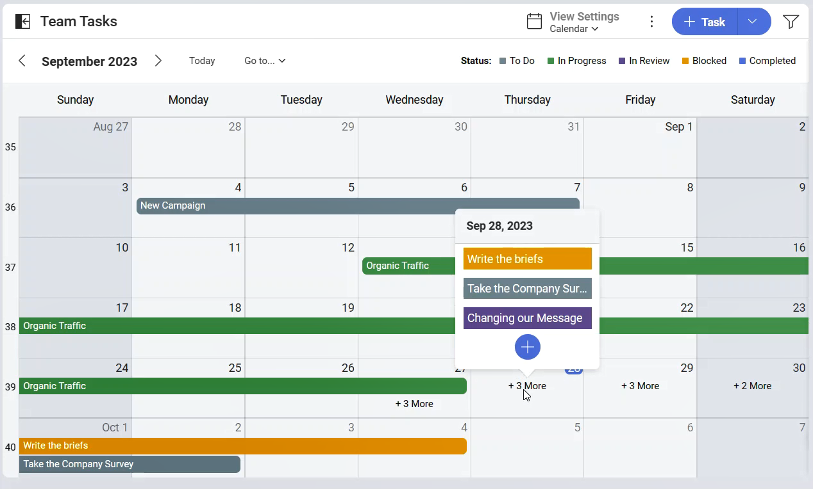

Use Calendar view if you want to: 

- Change the *Start Date* and the *Due Date* with a simple drag and drop.

- Pick a single date for a task with just one click.

- Have a quick glimpse of unscheduled tasks. (To view your unscheduled tasks, click/tap on the three dot menu next to the View Type and choose **Show Unscheduled Items**.)

### List

Project manage and update tasks faster from within your list view.  

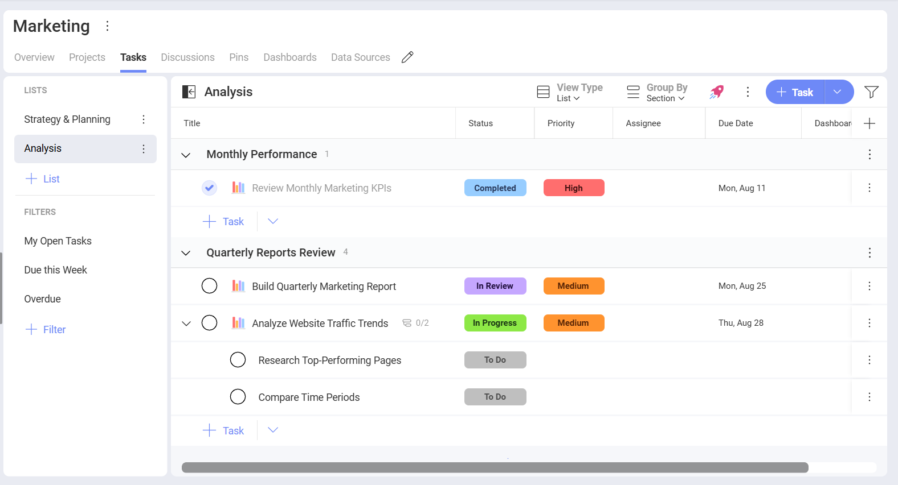

Use List view if you want to: 

- Easily visualize subtasks and the task hierarchy. 

- Sort or group tasks by any criteria. 

- Organize tasks using sections.

### Kanban

View your tasks as cards within columns that represent different stages of the Status workflow. You can drag and drop your tasks between columns to change their status.

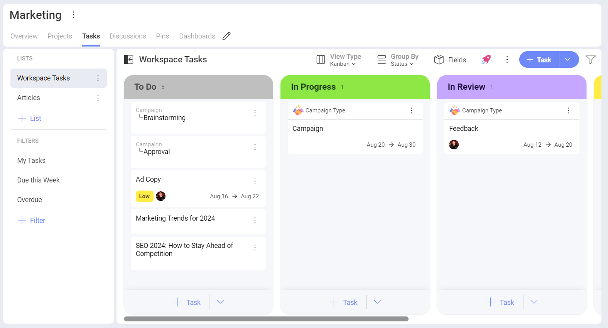

Use Kanban view if you want to:  

- Focus on the status workflow and visualize it in a graphical way. 

- Quickly get a glance of the overall status of a list of tasks. 

### Timeline

See a clear path for project completion and dependencies by using timeline view. Zoom in or out to see your timeline by days, weeks or months.

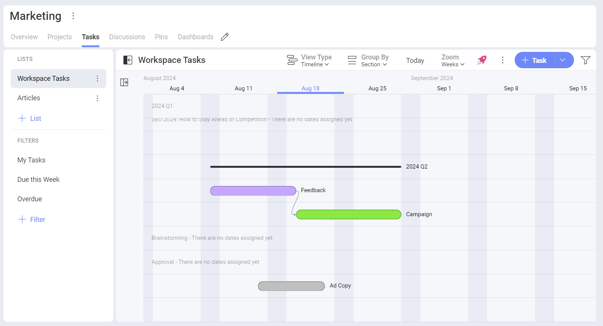

Use Timeline view if you want to: 

- Visualize several task dependencies at once. 

- Frame tasks in time in a graphical way. 

### Default Task Views

If you want your team members in a workspace or a project to land on task list, organized in a specific way, you can:

1. Open the oveflow menu next to the *Productivity Boost*. 

2. Click/tap on **Save as Default View** to choose a default view. 

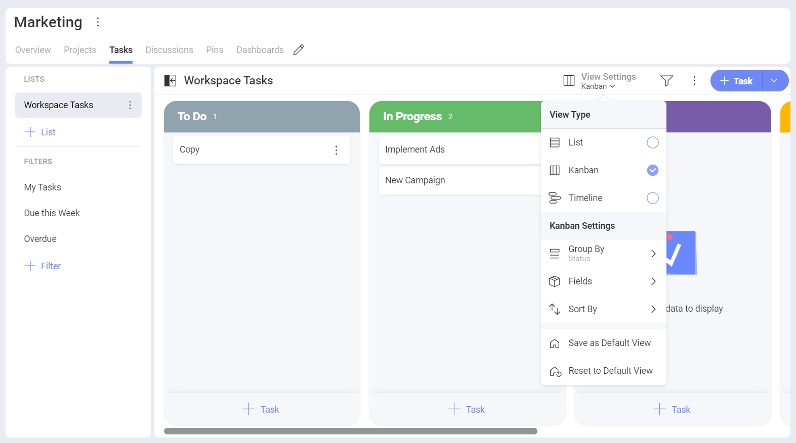

You can always reset the settings to their original state when you choose **Reset to Default View**.

>[!NOTE] Only an **owner** of a workspace or a project can set a default task view. 

### Task Dependencies

Using the timeline view, you can visualize the dependencies between tasks.

Two or more tasks may depend on each other's completion. Slingshot helps you keep everyone informed about those relationships with task dependencies.

There are two types of dependency: 

- **Waiting On** - this means your task can't be started before another task is finished. 

- **Blocking** - other tasks can't start before this task is completed. 

## Task Filters  

Using filters allows you to view a set of tasks that meet certain criteria. There are filters out-of-the-box and you can also save filters to use them later. 

### Out-of-the-box Filters

Slingshot includes several pre-defined filters which are very useful to quickly find specific tasks.

These filters, which can’t be edited or deleted, are:

- **My Tasks** – Each task assigned to you within the current Workspace. 

- **Due this Week** – Each task with Due Date set for the current week. 

- **Overdue** – Each task whose Due Date expired before today. 

### Creating Filters

In order to create a new filter, you can:

1. Click/tap on **+Filter** under *Filters*.

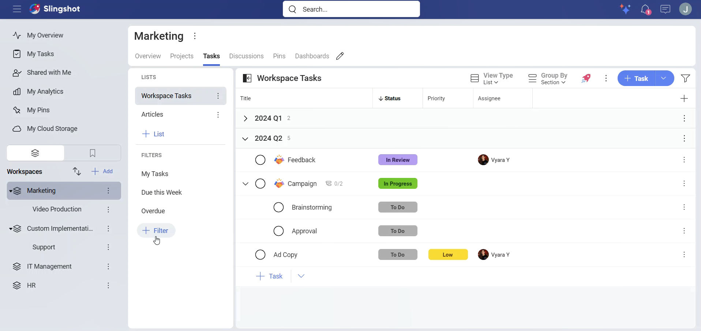

2. Add the name of the filter and choose what to include in it.

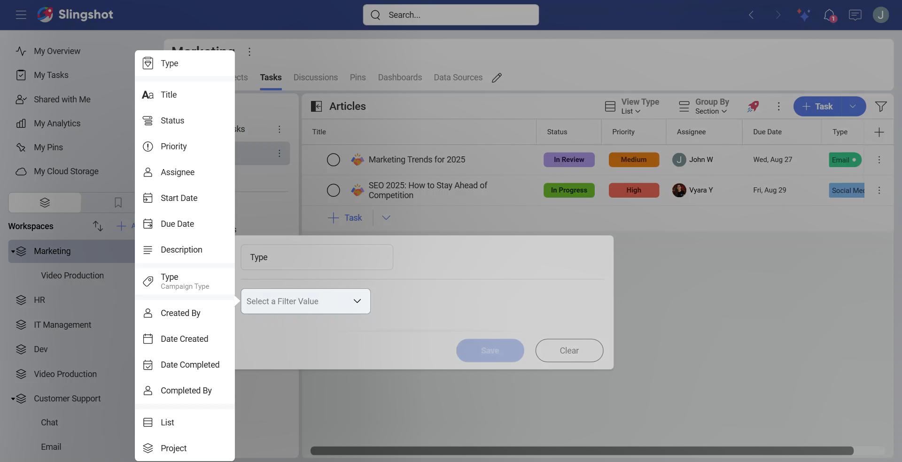

3. Click/tap on **Save**.

4. You will see the new filter in the filters list.

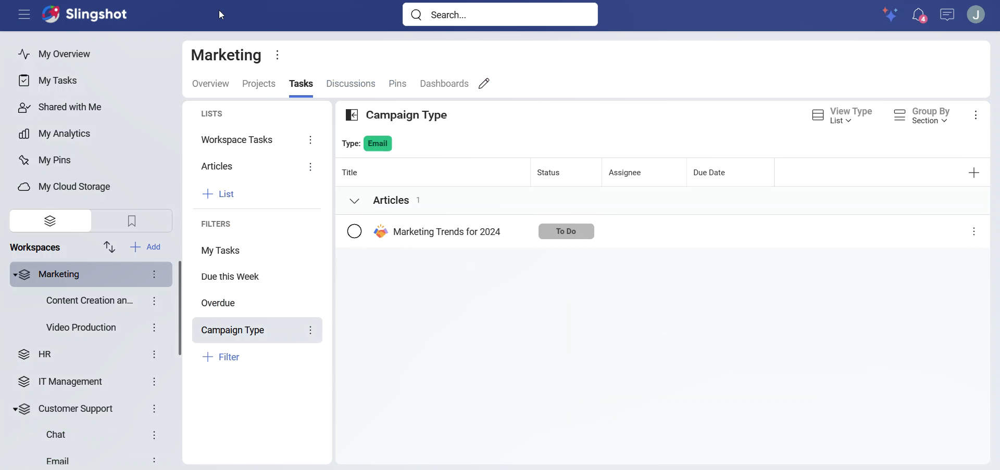

If you want to change the way tasks are being filtered, you can make different adjustments to your filter. For example, if you want to filter only by the status **In Progress**, you can:

1. Click/tap on the overflow menu next to the chosen filter.

2. Choose **Edit**.

3. Change the status to **In Progress**.

4. Select **Save** to save your changes. 

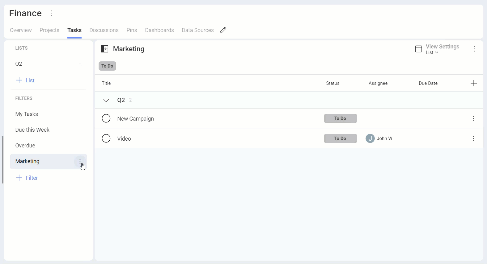

>[!IMPORTANT] **Slingshot Tip**: For those times that you can't find a specific task, try expanding collapsed panels, removing existing filters, and/or adding filters using the properties of the task you want. Remember that the icon changes to help you identify when you have active filters or not.

You can also add more rules to the filter from the **+Rule** button.

For example, we wanted to create a filter for John Williams’ tasks that have a *Release* [field](custom-fields.md) with the year *2024* as a value. 

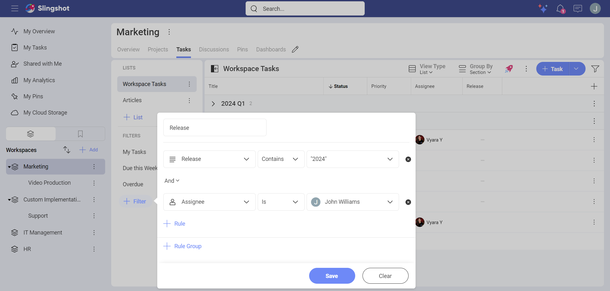

### Dynamic Me Filter

With the *Dynamic Me* filter, each user can see the tasks only relevant to them as the filter will adjust to the user viewing it.

For example, you, as a Team Lead, want to have a filter that is used by the entire team to filter out their current tasks for a specific release. You can create a *Release* task filter with an *Assignee* set to **Dynamic Me**. When a team member views this filter, they will see only their tasks for that specific release. 

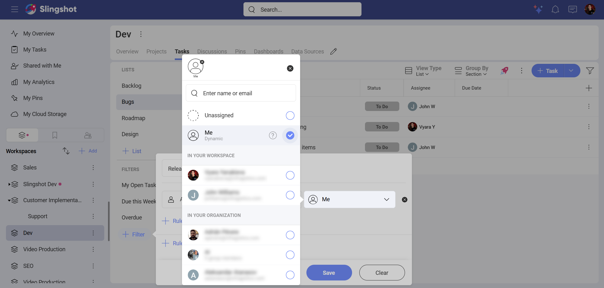

You can use *Dynamic Me* for the following field values: *Assignee*, *Created By*, *Completed By*, as well as the *People* [custom field](custom-fields.md).

>[!Note]
>You can also create a Dynamic Me Filter for [Dashboards](./analytics/dashboards/creating-dashboards.md) and [Data Sources](./analytics/datasources/overview.md). You can choose *Dynamic Me* when you filter by *Created By* and *Modified By*.
