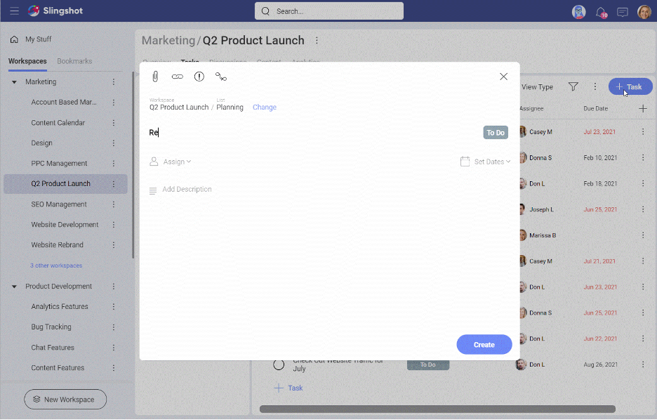

# Tasks

When it comes to running a successful project – task management is at the heart of that. You need everything organized in one place to manage tasks through out the full lifecycle of the project. Setting deadlines, dependencies, and priorities, are all essential to ensure the project stays on track and gets completed in time.   

You have a task tab available within your workspaces and projects.

Learn more about all Slingshots project management features in our short tutorial video:  

**Video that is too big:**

> [!Video https://www.youtube.com/embed/D1yqDISM5PM]

---

**Alternative video:**

---

**Another alternative:**

## What are Tasks?  

Tasks within Slingshot is a visual representation of work that needs to get done.  

Within tasks you can store relevant documents, set clear ownership of responsibility, and have threaded conversations so everything is transparent in one place.  

## How to Create a Task  

There are multiple ways that you can create a task in Slingshot. From inside the task tab of your workspace you can create a task from:  

1.	The blue + task button  
2.	The bottom of your section or list  
3.	The overflow menu to insert a task   

>[!IMPORTANT] **Slingshot Tip**: You can also create tasks directly from a conversation, pin or dashboard in Slingshot. Check out more productivity flows from within Slingshot to enhance your productivity.

## Task Fields  

Since tasks are very important in driving the productivity of your teams, it is essential they come with all the fields you need. Your task card has the following information:  

1.	**Task Title**: Set a clear task title for your tasks.  
2.	**Assignee(s)**: Assign either one person, multiple, group or workspace to a task.  
3.	**Start Date & Due Date**: Set clear expectations on deadlines with start and due dates.  
4.	**Status**: Keep up to date with the status of your tasks.  
5.	**Attachments**: Add documents and files directly from your cloud providers or using drag and drop.  
6.	**URLs**: Attach URLs to your tasks for reference.  
7.	**Priority**: Set priorities for your teams so they can better manage their workloads effectively.  
8.	**Task Dependencies**: Set clear paths to success for your projects with accountability to users tasks.  
9.	**Description**: Add further details around your tasks.  
10.	**Conversation**: Have threaded conversations around your tasks in context.  
