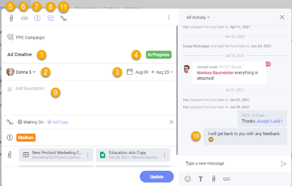
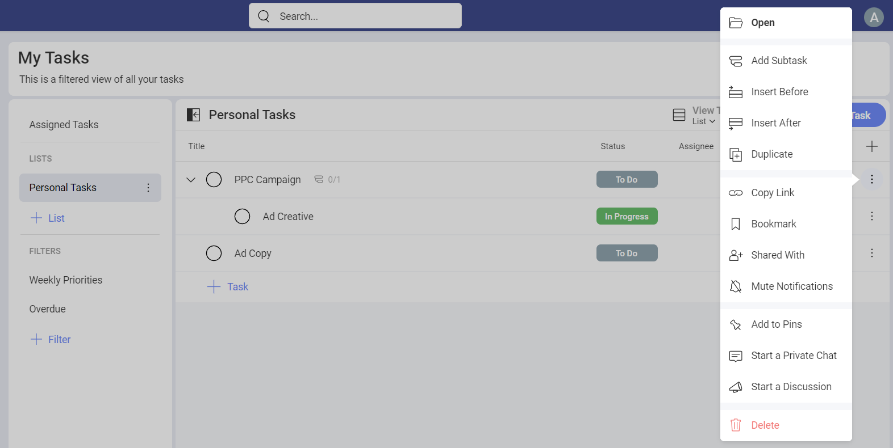
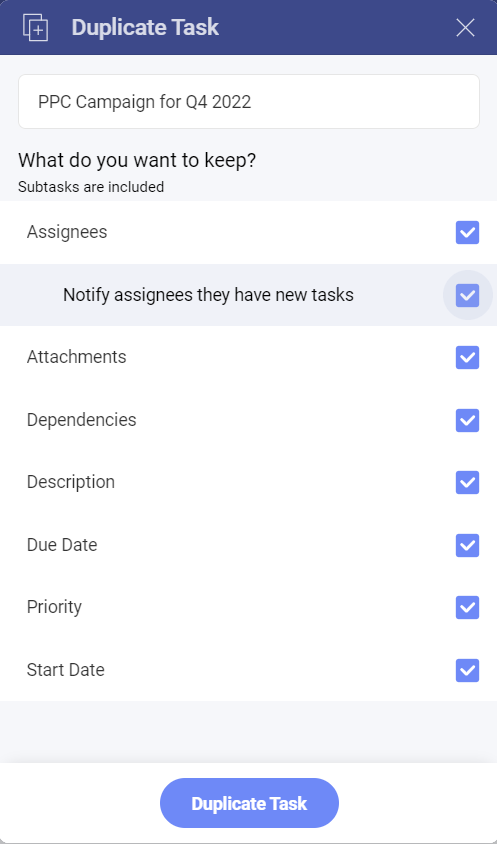
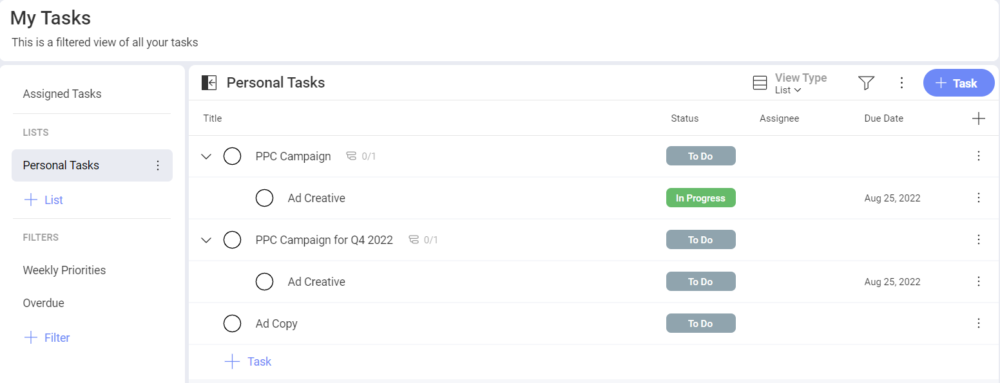
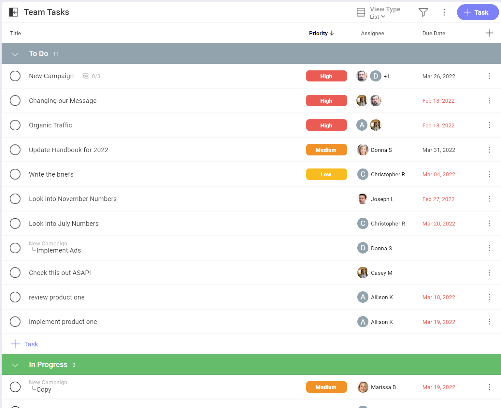
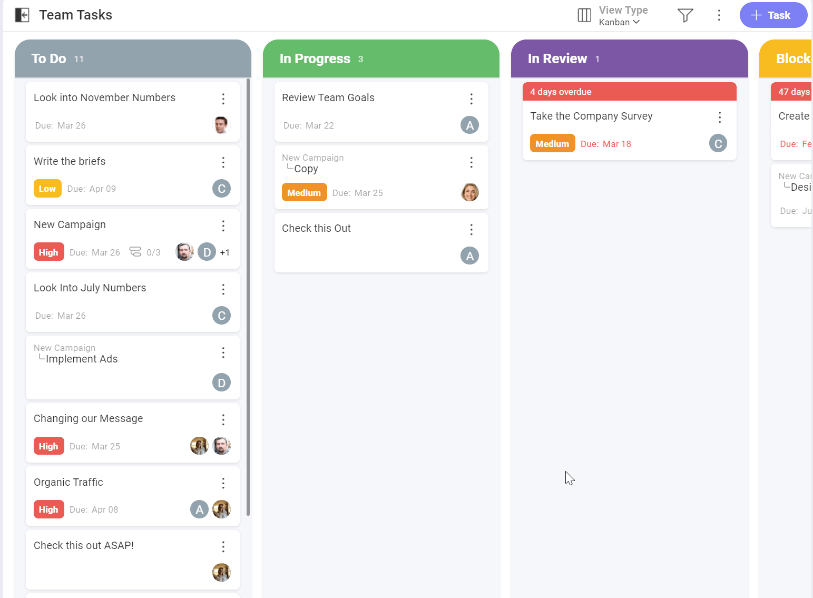
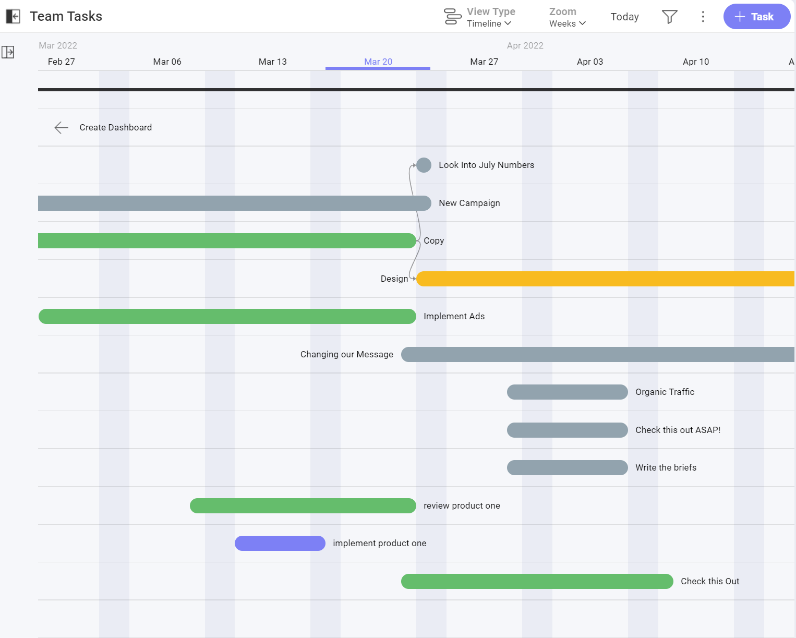
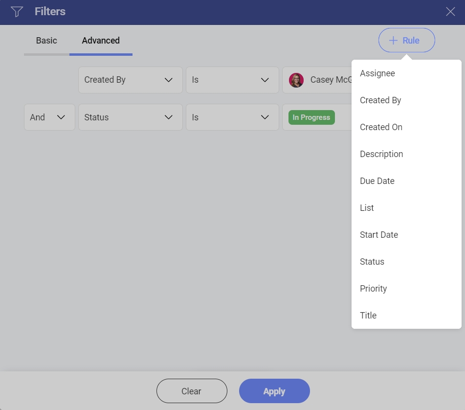

# Tasks

When it comes to running a successful project – task management is at the heart of that. You need everything organized in one place to manage tasks through out the full lifecycle of the project. Setting deadlines, dependencies, and priorities are all essential to ensure projects stay on track and get completed on time.   

There is a task tab available within your workspaces and projects, listing all the tasks assigned to everyone in those workspaces and projects. You can view your own tasks assigned to you with in the My Tasks section.

Learn more about all Slingshots project management features in our short tutorial video:  

> [!Video https://www.youtube.com/embed/D1yqDISM5PM]

## What are Tasks?  

Tasks are a visual representation of work that needs to get done. Within tasks you can store relevant documents, set clear ownership of responsibility, and have threaded conversations so everything is transparent in one place.  

## How to Create a Task  

There are multiple ways to create a task in Slingshot:  

- Using the "+ Task" button will add a task to the bottom of your list.
- If you are using sections, you can quickly add a task to a section using the inline "+ Task".  
- If you want to insert a task right above or below another, you can do so from that task overflow menu.

Subtasks can be created from inside the task card or from the parent task's overflow menu.

>[!IMPORTANT] **Slingshot Tip**: You can also create tasks directly from a chat, pin or dashboard in Slingshot. Check out more productivity flows from within Slingshot to enhance your productivity.

## Task Fields  

Tasks are very important for driving the productivity of your teams and projects. Your task card has the following fields:  

1.	**Task Title**: Set a clear title for your tasks.  
2.	**Assignee(s)**: Assign either one person, multiple, group or workspace to a task.  
3.	**Start Date & Due Date**: Set clear expectations on deadlines with start and due dates.  
4.	**Status**: Set the status of the task such as In Review, In Progress or Completed.
5.	**Attachments**: Add documents and files directly from your cloud providers or using drag and drop.  
6.	**URLs**: Attach URLs to your tasks for reference.  
7.	**Priority**: Set priorities for your teams so they can better manage their workloads effectively.
8.	**Subtasks**: Create subtasks to slice your work better.
9.	**Description**: Add further details around your tasks so the assignee(s) can understand what needs to get done.
10.	**Activity**: Have threaded conversations around your tasks in context. 
11.	**Task Dependencies**: Set clear paths to success for your projects with accountability to user's tasks. 

## Task duplication

Instead of creating a whole new set of tasks, you can save some time and be more productive by duplicating a task with the steps mentioned below. Keep in mind that only a parent task can be duplicated and will duplicate all the subtasks associated with it. 

1.	Open **My Tasks**.

2.	Click on the overflow menu. 

3.	Choose **Duplicate**.

 

4.	A dialog will open, where you can choose what you want to keep when you duplicate the task. You can also change the title of the task. If  you decide to keep the same assignees, you’ll be presented with the option to notify them once the task is created.

 

5.	Once you’ve saved your preferences, you will see the task field where you can make changes. 
6.	When you are ready, you can click on **Update**. You can find the task with the subtasks in the **My Tasks** section. 

 

## Organizing Tasks  

You can organize your tasks into lists to further group them together. Within lists you can also add sections to categorize your lists further. Tasks are movable with drag and drop or the change button within your task card between lists and sections.  

## Task Views

The default view for your tasks is a List. You can choose between three views (List, Kanban, Timeline) to take advantage of a different layout to maximize utility. Use the View Type drop down (top right of the task list) to switch between views.  

Within each of the task views you can filter, choose which task fields you want to show and group by status, priority, assignee, or sections.  

### List

Project manage and update tasks faster from within your list view.  

Use List view if you want to: 

- Easily visualize subtasks and the task hierarchy. 

- Sort or group tasks by any criteria. 

- Organize tasks using sections.

### Kanban

View your tasks as cards within columns that represent different stages of the Status workflow. You can drag and drop your tasks between columns to change their status.

Use Kanban view if you want to:  

- Focus on the status workflow and visualize it in a graphical way. 

- Quickly get a glance of the overall status of a list of tasks. 

### Timeline

See a clear path for project completion and dependencies by using timeline view. Zoom in or out to see your timeline by days, weeks or months.

Use Timeline view if you want to: 

- Visualize several task dependencies at once. 

- Frame tasks in time in a graphical way. 

#### Task Dependencies

Using the timeline view, you can visualize the dependencies between tasks.

Two or more tasks may depend on each other's completion. Slingshot helps you keep everyone informed about those relationships with task dependencies.

There are two types of dependency: 

- **Waiting On** - this means your task can't be started before another task is finished. 

- **Blocking** - other tasks can't start before this task is completed. 

## Task Filters  

Using filters allows you to view a set of tasks that meet a certain criteria. There are filters out-of-the-box and you can also save filters to use them later. 

### Out-of-the-box Filters

Slingshot includes several pre-defined filters which are very useful to quickly find specific tasks.

These filters, which can’t be edited or deleted, are:

- **My Tasks** – Each task assigned to you within the current Workspace. 

- **Due this Week** – Each task with Due Date set for the current week. 

- **Overdue** – Each task whose Due Date expired before today. 

### Creating Filters

To access the Filters editor just click/tap the filter icon (top right of the screen), next to the overflow. 

In the Filters editor you can create Basic or more Advanced rules. The Basic rules will be enough most of the time, Advanced rules are recommended in the case that you really need to define more complex conditions in your filter. 

To stop filtering tasks, click/tap the filter icon to open the Filters dialog. Then, select the Clear button at the bottom to remove the current filters, and Apply to save your changes. 

>[!IMPORTANT] **Slingshot Tip**: For those times that you can't find a specific task, try expanding collapsed panels, removing existing filters, and/or adding filters using the properties of the task you want. Remember that the icon changes to help you identify when you have active filters or not.

### Saving Filters

Sometimes you might want to save a filter to use it again in the future. With Slingshot you can save specific filters and later edit them if needed, very useful to keep at hand a list of tasks relevant to you already filtered. 

### Advanced Filtering

Basic filtering will be sufficient most of the time but you also have additional filtering options with the Advanced rules.  

When the time comes that you need to craft complex filters, you will be able to: 

- Apply conditions based on fields like Is, Is Not, Is Before, is After, etc. 

- Use operators like And, Or. 

As an example, the following rules could be created to get all John Williams’ tasks, that were created by other team members (not him), in which the due date is Jun 30, 2022 or before that date, and the description includes the word “Marketing”. 

