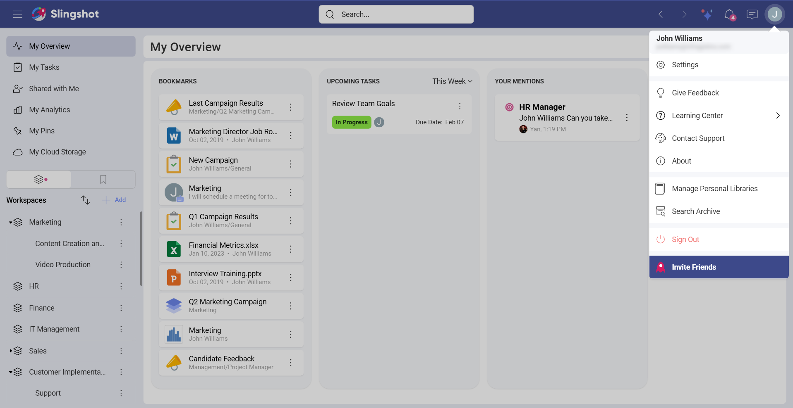
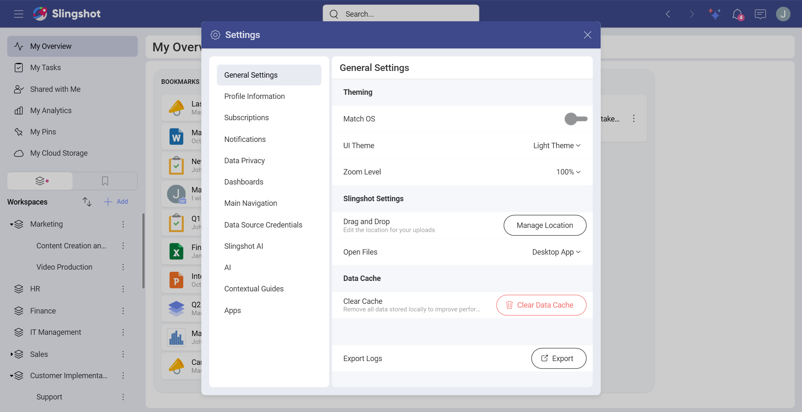

# User Account & Settings

In short, user accounts allow you to sign in and be recognized by an application or device. A user account can also be described as a virtual identity created for any digital technology.
User accounts normally include both username and password, no surprises here. But that's not all, they also store a collection of settings and profile information associated with the specific user.

It is a common practice to tailor the digital experience for different users. You can have one or more types of users (e.g., administrator, standard user and guest), with different privileges and capabilities. Another frequently used technique is to assign different roles to the same user account, switching between different privileges and capabilities depending on the context.

## What is a User Account in Slingshot?

It's the virtual representation of a user, including a set of credentials, profile information, settings and content owned by the user. Seems familiar, right?

As a Slingshot user you own different types of content, like the files you upload, the messages you write and the dashboards you create. All those are part of your Slingshot account and are associated with you as a user. And you do have full control over the content you own.
For more information about security and data privacy within Slingshot, go to [Security & Privacy](security.md).

## Be Proactive About Your Profile Information and Settings

The app behavior and overall experience can be greatly modified by tweaking your profile information and settings. As a good practice, try customizing your experience to better suit your needs. To do this, navigate to **Settings**.

Now feel free to explore the different settings and make Slingshot feel like home:

- Interested in a dark or light theme?

- Want to reduce the zoom level to fit more in your screen or enlarge it to better see the words and images?

- Are you often using drag & drop to upload files and want to change the default destination?

- When opening files (e.g., Word and Excel documents), would you like to use a native app or open in a browser?

- Do you want to clear the data cache?

- Do you want to export your logs?

In addition, it's a good idea to complete your *profile information* as it will make you recognizable when collaborating with others. Your name, photo, title, etc. are all part of your virtual identity, and they add value to the Slingshot's experience. 

## Make the Most of the In-app Interactions

With the Slingshot AI, you can get personalized tips to help you get stuff done faster. As this has a direct effect on your experience, you can choose how often you get messages. [Here](getting-started-slingshot.md) you can find out more information about what types of tips you can get.

Notifications will keep you updated on any changes to workspaces, tasks, new messages, etc. You can learn, among others, that a task was assigned to you, that you are removed from a workspace, or that someone sent a message in a discussion thread you're following.
Follow the link for more information about [Notifications](notifications.md).