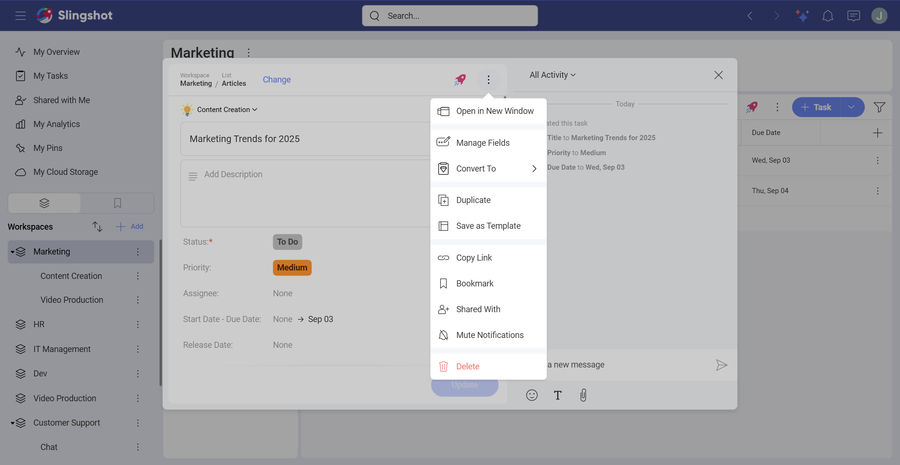
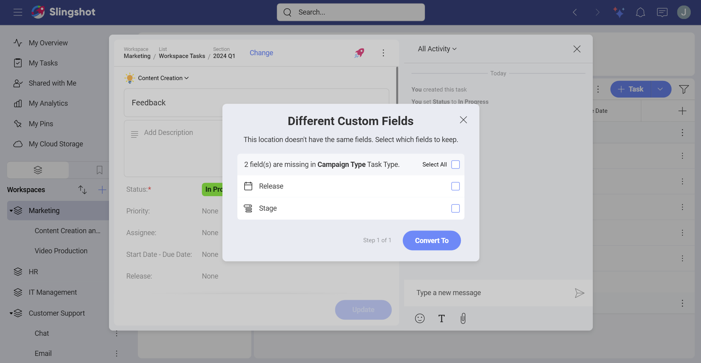
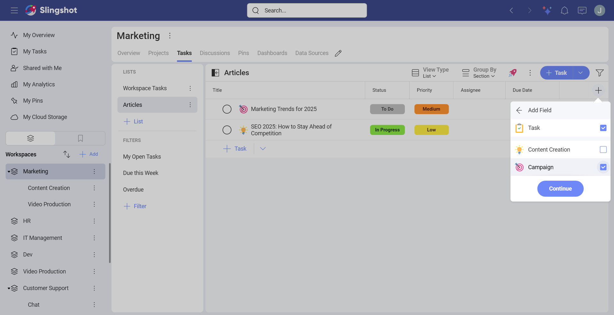
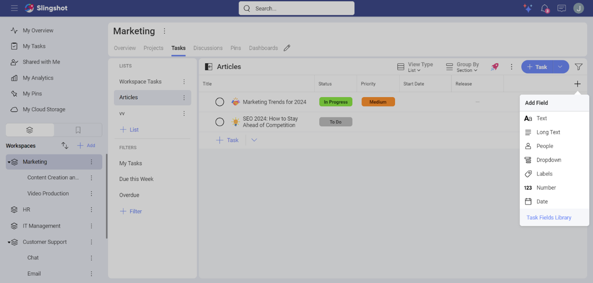
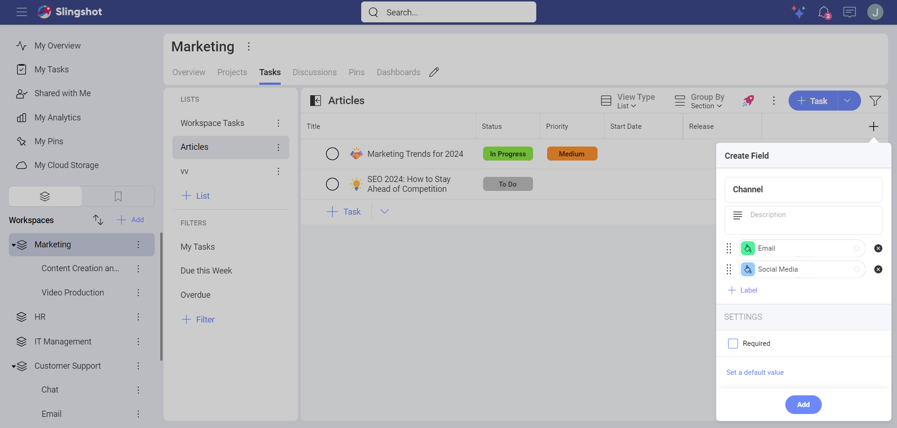

# Using Custom Fields and Task Types 

When you create a field for a task with a [specific type](task-types.md), all the other tasks from that type will be updated to reflect the changes. 

To add a custom field to a task, you can either: 

1. Open the overflow menu of the task. 

2. Choose **Manage Fields**. 

3. Click/tap on **+ Field**. 

4. You will see a list of different types of custom fields. Choose the one that best fits your goals. In our case we wanted to create a field for our releases. 

5. When you are ready, click/tap on **Done** and then **Update** to add the field. 

## Changing the type of a task 

Sometimes you might want to switch the type of certain tasks with another type that has custom fields that better reflect the changes in your company’s internal processes.  

To change the task type, you can: 

1. Open a task. 

2. Open the overflow menu and choose **Convert To**. 

3. Select the new task type. 

4. You will be prompted to choose which fields to transfer to the new type. When you are ready, click/tap on **Convert To**. 

You can also change the task type when you:

1. Click/tap on the **+** field button in the task list in the top right corner. 

2. Here you can toggle on/off existing fields or create new fields in the task list. To create a custom field, click/tap on **+Add Field**. 

3. Choose the task type you want to add a new custom field to. 

4. From here on, you can pick a type of field and customize it. 

5. When you are ready, click/tap on **Add**. 

