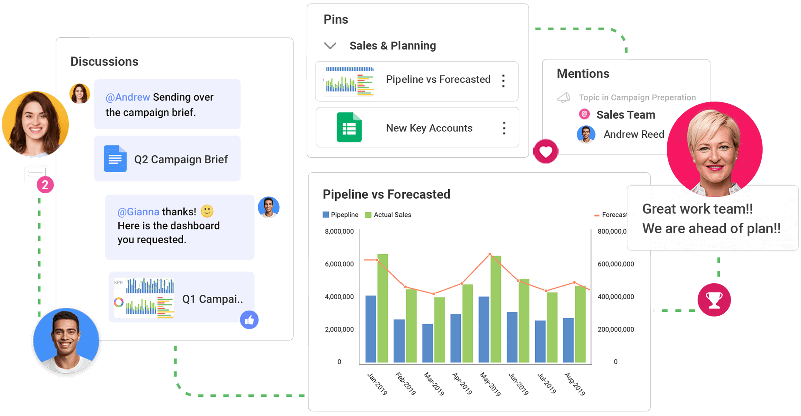
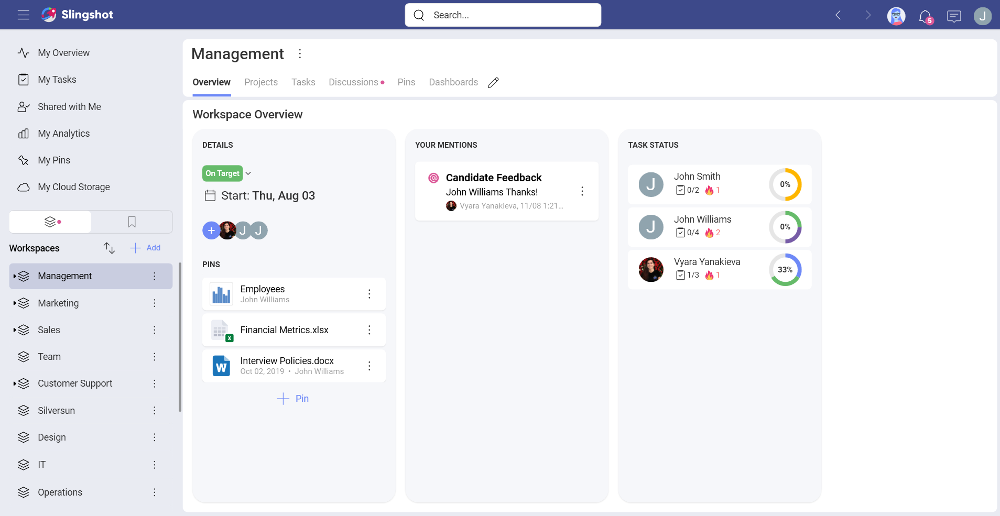
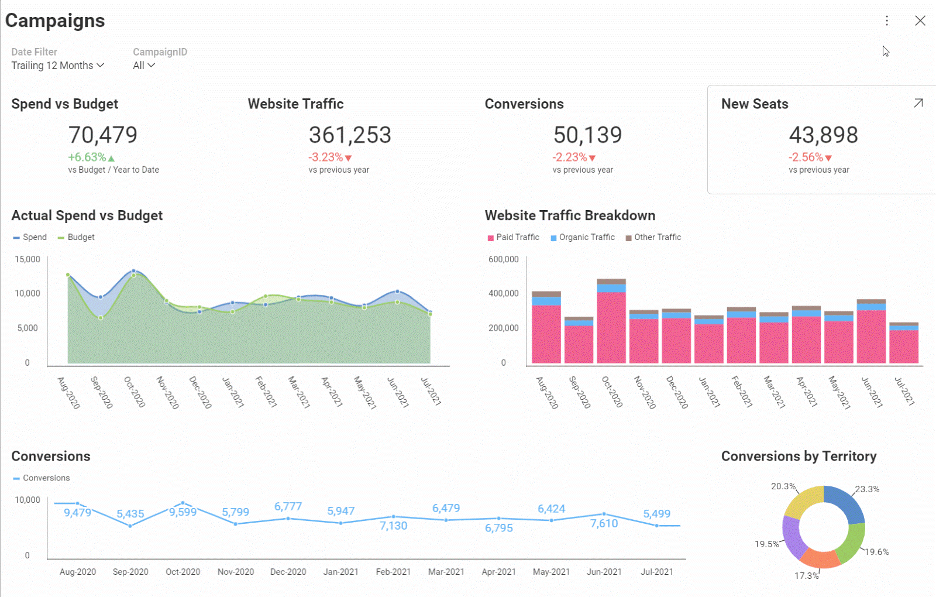
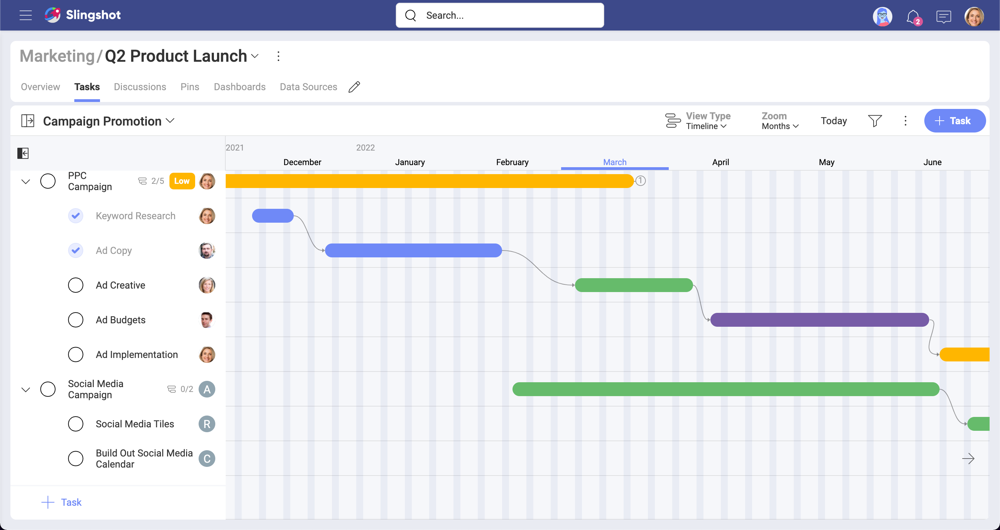

# Welcome to the Slingshot Help Center

Slingshot is the only digital workplace that connects everyone you work with to data – organizes projects, content and chats – to unleash the power of your team.

So, how can Slingshot do all that for you? Take a look below...

## Slingshot Highlights

##### *Create calm and efficiency across teams, departments, and external clients by making it easier to find and access information*.

With Slingshot you can eliminate the need to constantly switch between multiple applications to find the information you are looking for. Only Slingshot truly aggregates data analytics, project and information management, chat, and goals-based strategy benchmarking – all in one, intuitive app with the people that you work with every day.

##### *Leverage actionable insight by making it easier for your team to utilize data to improve productivity*.

Slingshot comes packed with a full self-service business intelligence solution. Connect to your data quickly and create beautiful dashboards, so you can share insights with your team. And it doesn't stop there, dashboards work seamlessly with Slingshot's Tasks and Collaboration features, making it easier than ever to truly turn insights into action.  

##### *Achieve better results when everyone is focused and engaged on the same objectives and strategies*.

When everyone is aligned on the same goals, teams can work more strategically to achieve better results and ultimately exceed your business goals.

##### *Design a culture of ownership and responsibility with better workflow transparency*.

When deadlines, conversations, and data are transparent for everyone to see, accountability will drive projects to be completed on time, so you can illuminate paths to success with smarter insights.

## How Can I Get Slingshot?

Slingshot is available on any platform with a seamless experience no matter what device you are on – without sacrificing features. Get Slingshot on the Web, macOS, Windows, iOS and Android today.  

 
 

  

    
<noscript></noscript>

    <h3 class="font-weight-bold">Mobile</h3>
    
Add and manage tasks on-the-go

    
<a href="https://apps.apple.com/us/app/id1457353858" class="trackCTA" aria-label="Download Slingshot on iOS" data-xd-ga-action="Download" data-xd-ga-label="Slingshot iOS" target="_blank" rel="noopener"><noscript></noscript></a> 
    <a href="https://play.google.com/store/apps/details?id=com.infragistics.slingshot" class="trackCTA" aria-label="Download Slingshot on Android" data-xd-ga-action="Download" data-xd-ga-label="Slingshot Android" target="_blank" rel="noopener"><noscript></noscript></a>

    

  

  

    
<noscript></noscript>

    <h3 class="font-weight-bold">Desktop</h3>
    
Launch Slingshot from your dock

    
<a href="https://apps.apple.com/us/app/id1457353858" class="trackCTA" aria-label="Download Slingshot on Mac OS" data-xd-ga-action="Download" data-xd-ga-label="Slingshot Desktop macOS" target="_blank" rel="noopener"><noscript></noscript></a> 
    <a href="https://dl.infragistics.com/products/Infragistics/Slingshot/desktop/Slingshot.appinstaller" class="trackCTA" aria-label="Download Slingshot on Windows" data-xd-ga-action="Download" data-xd-ga-label="Slingshot Desktop Windows">Download for Windows</a>

    

  

  

    
<noscript></noscript>

    <h3 class="font-weight-bold">Web</h3>
    
Manage your tasks from any browser

    
<a href="https://my.slingshotapp.io" class="trackCTA" data-xd-ga-action="Download" data-xd-ga-label="Slingshot Web" target="_blank" rel="noopener">Go to Web App</a>

    

  

>[!NOTE] Slingshot is compatible with the two most recent versions of macOS.

## Supported Languages

<ul class="horizontal">
<li>Chinese (Simplified)</li>
<li>Chinese (Traditional)</li>
<li>Dutch</li>
<li>English</li>
<li>French</li>
<li>German</li>
<li>Italian</li>
<li>Japanese</li>
<li>Korean</li>
<li>Malay</li>
<li>Portuguese</li>
<li>Russian</li>
<li>Spanish</li>
</ul>

>[!NOTE] In case a device is set to a language that is not in the list, the default language will be English. 

