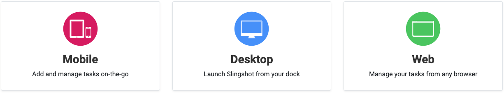

# Welcome to the Slingshot Help Center

Slingshot is the only digital workplace that connects everyone you work with to data – organizes projects, content and chats – to unleash the power of your team.

For details about the available platforms and how to install Slingshot, go [here](#how-can-i-get-slingshot).

So, how can Slingshot do all that for you? Take a look below...

## Slingshot highlights

##### *Create calm and efficiency across teams, departments, and external clients by making it easier to find and access information*.

With Slingshot you can eliminate the need to constantly switch been multiple applications through out the day to find the information you are looking for. Only Slingshot truly aggregates data analytics, project and information management, chat, and goals-based strategy benchmarking – all in one, intuitive app with the people that you work with everyday.

##### *Leverage actionable insight by making it easier for your team to utilize data to improve productivity*.

Slingshot comes pack with an entire business intelligence engine right inside. That enables you to connect to your data quickly and create beautiful dashboards. However, it doesn’t stop there. Dashboards work seamlessly with all the other Slingshot features making it easier that ever to truly turn insights into action.  

##### *Achieve better results when everyone is focused and engaged on the same objectives and strategies*.

When everyone is aligned on the same goals, teams can work more strategically to achieve better results and ultimately exceed your business goals.

< GIF to be added >

##### *Design a culture of ownership and responsibility with better workflow transparency*.

When deadlines, conversations and data are transparent for your different teams to see accountability projects get completed on time, and you can start to illuminate the paths to success with smarter insights.

## How can I get Slingshot?

Slingshot is available for you on any platform with a seamless experience no matter what device you are on – without sacrifices features. Get Slingshot on the Web, MacOS, Windows, iOS and Android <a href="https://www.slingshotapp.io/download-apps" target="_blank"><b>here</b>.</a>

Below you can find the versions supported for each platform:

| PLATFORM | SUPPORT |
| --- | --- |
|**Android**|Android 6.0 (Marshmallow) or higher (except the Kindle Fire).|
|**Desktop**| Windows 10 or higher. |
|**IOS**|iOS 13 or higher.|
|**Web**|Chrome, Firefox, Microsoft Edge (excluding Microsoft Edge Legacy), Safari. Web browsers are not supported on mobile devices.|
