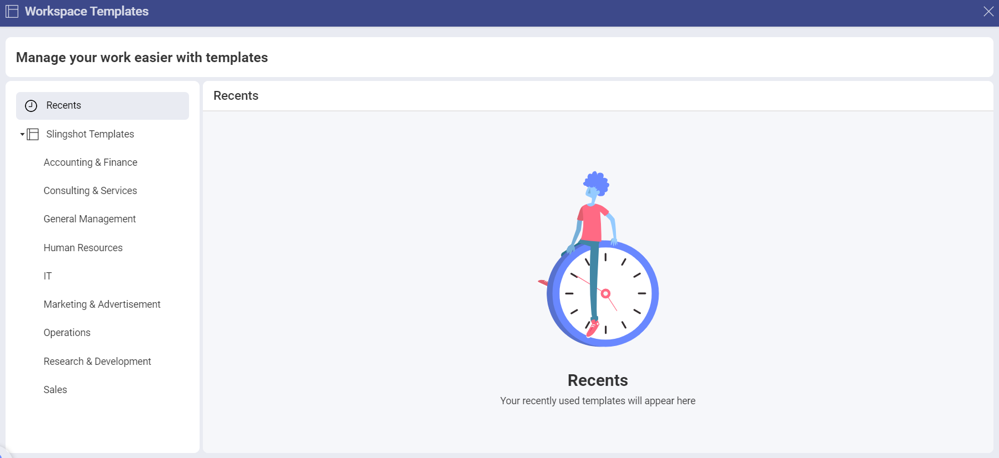

# Workspace Templates 

With Workspace Templates, you can quickly create workspaces for your teams - with just a few clicks. 

## How can I access different Workspace Templates lists?

To access the predefined Slingshots templates, you can:

1.	Click/tap on the **+Add** button next to **Workspaces** in the left panel.

2.	Click/tap on **See All Templates**.

3.	The following dialog will pop up:

In the left panel you can:

- Check/use the templates that you have recently used.

- Check/use a template from the *Slingshot Templates*.

## How can I use a Workspace Template?

The Slingshot templates are organized based on different industries/departments. To use a template, you need to: 

1.	Open one of the lists in the left panel.

2.	Click/tap on a template that best fits your needs. 

3.	You will be presented with a preview of how the workspace will look like. In this case we chose the **Recruiting** template.

4.	Here you find a brief description of what’s inside the template, what it includes and who created it. You can also use the left/right arrows to see the thumbnails of each component (in this case *Tasks* and *Discussions*). This can give you a better overview of how your workspace will look like. When you are ready, click/tap on **Use Template**.

6.	You will be presented with a dialog, where you can change the title of your project and change the description by clicking/tapping on each text box. You can also set the starting date for the workspace from the drop-down menu. The starting date will also be used for configuring the task dates. 

7.	When you are ready, click/tap on **Create**.

If you want to find more information about how you can create and use workspaces, head [here](./workspaces.md).

