# Workspace Templates 

With Workspace Templates, you can quickly create workspaces for your teams - with just a few clicks. 

## How can I access different Workspace Templates lists?

To access the out-of-the-box Slingshots templates, you can: 

1.	Click/tap on the **+Add** button next to **Workspaces** in the left panel.

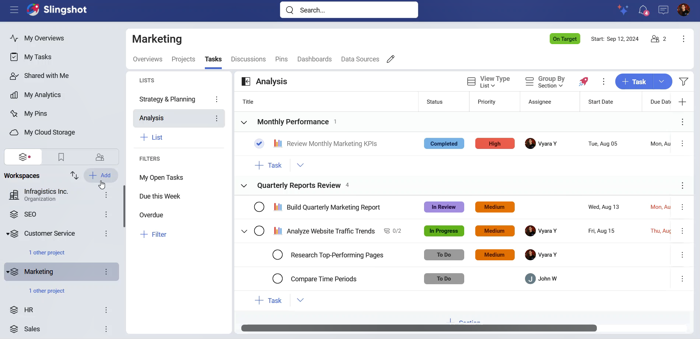

2.	Click/tap on **See All Templates**.

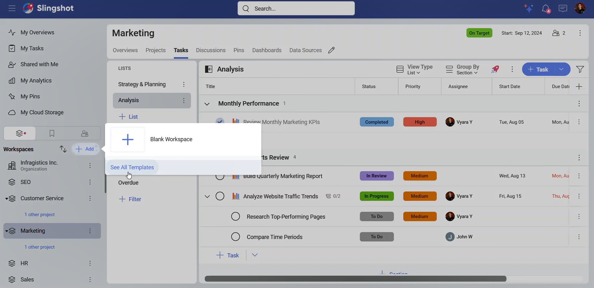

3.	The following dialog will pop up:

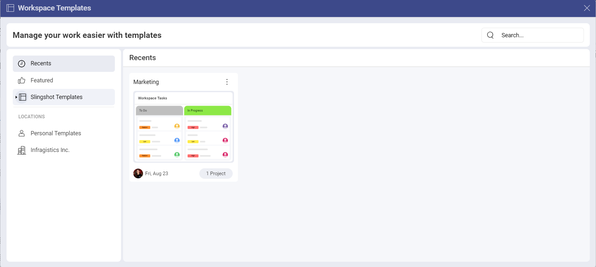

In the left panel, you can do the following:

- Check the templates that you have recently used.

- View all the featured templates.

- Use a template from the *Slingshot Templates*.

- Browse templates based on their stored location.

## How can I use an out-of-the-box Workspace Template?

The Slingshot templates are organized based on different industries/departments. To use a template, you need to: 

1.	Open one of the lists in the left panel.

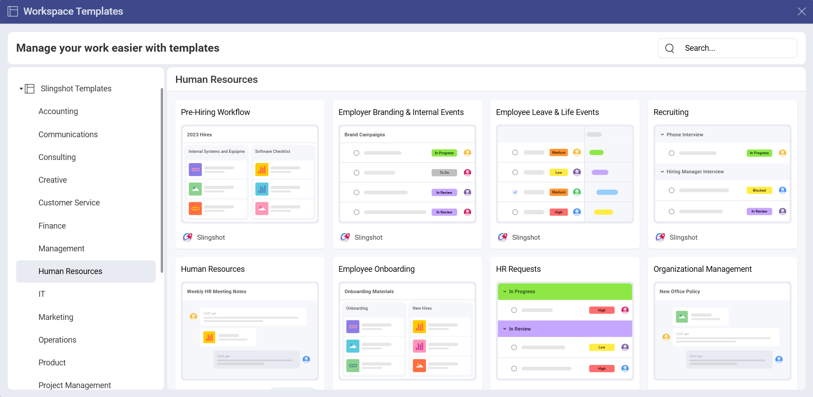

2.	Click/tap on a template that best fits your needs. In this case we chose the **Recruiting** template.

3.	You will be presented with a preview of how the workspace will look like. Here you find a brief description of what’s inside the template, what it includes and who created it. You can also use the left/right arrows to see the thumbnails of each component (in this case *Tasks* and *Discussions*). This can give you a better overview of how your workspace will look like. When you are ready, click/tap on **Use Template**.

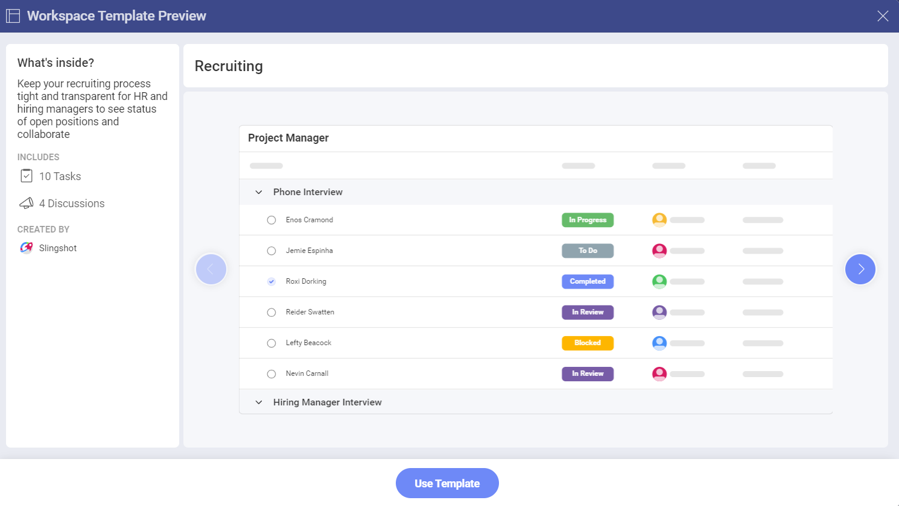

4.	You will be presented with a dialog, where you can change the title of your project and change the description by clicking/tapping on each text box. You can also set the starting date for the workspace from the drop-down menu. The starting date will also be used for configuring the task dates. When you are ready, click/tap on **Create**.

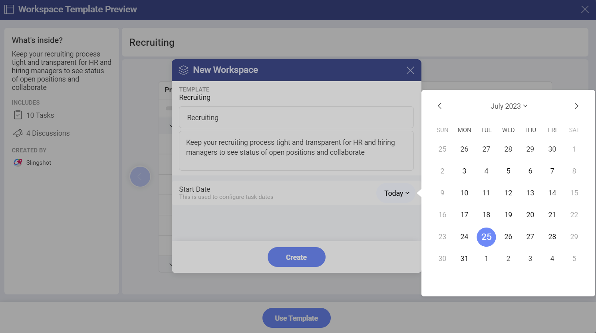

>[!Note] If you are a part of an organization, you will also see an option to make the workspace public or keep it private.

## How can I create a custom Workspace Template? 

>[!Note] The option to create custom workspace templates is available to Slingshot and Slingshot Enterprise users.

Only workspace owners can create custom workspace templates. 

In order to create a custom workspace template, you need to:

1.	Open the overflow menu next to the workspace you want to use as a template. In our case, we wanted to have a Marketing workspace template.

2.	Click/tap on **Save as Template**.

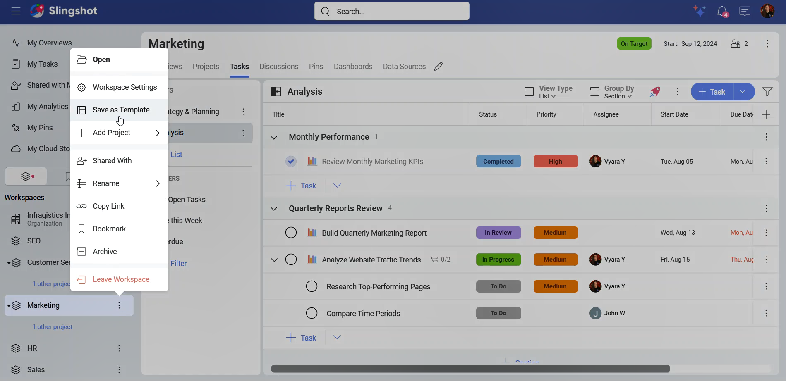

3.	The following dialog will open up. Here you can:

- Change the title and the description of the template.
  
- Keep the members of the workspace and its projects.

- Choose a thumbnail. This way you can quickly browse through different templates and get an overview of what a specific template includes.

- Keep  all the tasks or only the tasks structure. If you decide to keep the tasks, you can:

    - Save the [field](custom-fields.md) values.

    - Include the weekends.

    - Set the Schedule Type.

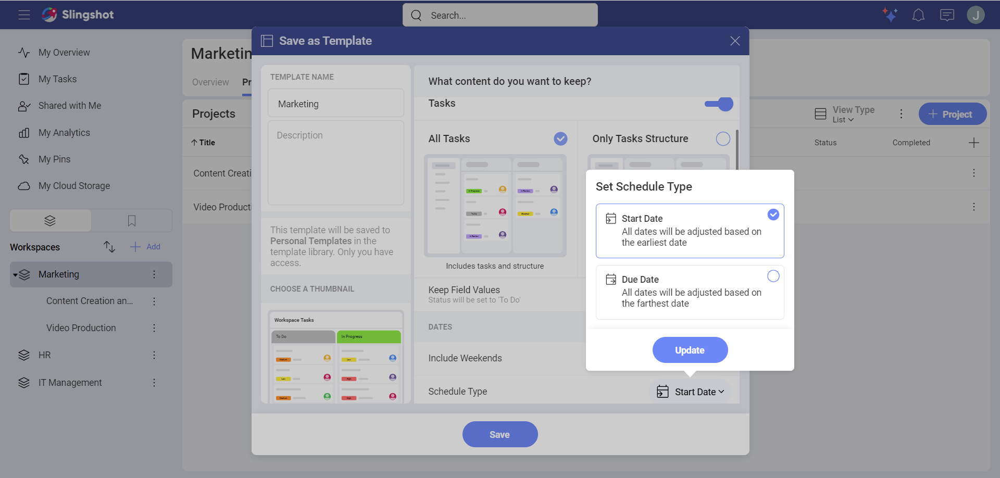

If you decide to keep only the structure of the tasks, you won't be able to see the tasks and their fields.

When you scroll down, you can also choose what to keep from the additional content, such as dashboards, pins, or discussions.

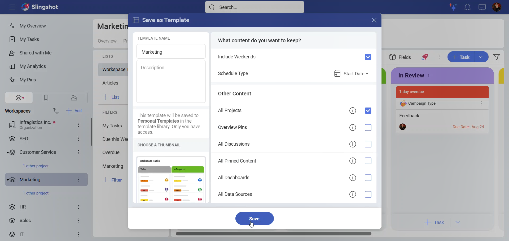

Choose what to keep from the workspace in order to use it for the template. When you are ready, click/tap on **Save**.

4.	Once you have created the template, you can find it in the *Workspace Templates lists* under **Locations**. There you can find a list of all the templates that you have created. If you are part of an organization, you can also  browse through the templates stored in it.

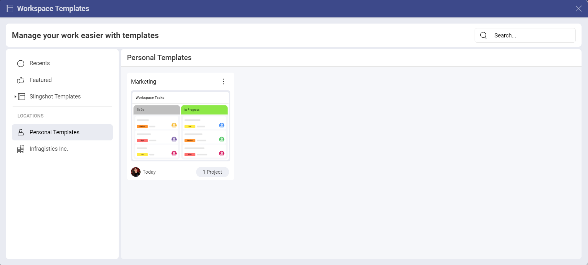

Besides this, you can also open the overflow menu on the right side of the workspace template, that you have created, and take the following actions:

- Open the template.

- Copy the link to the template.

- Add the template to *Bookmarks* or remove it from there.

- Delete the template.

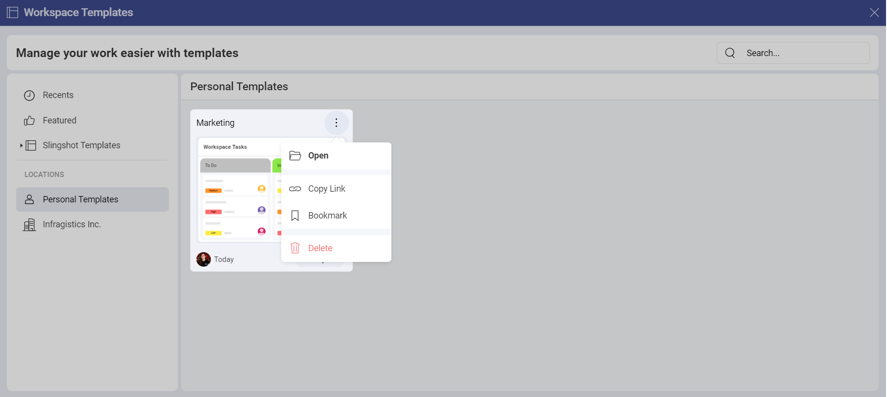

If you want to find more information about how you can create and use workspaces, head [here](./workspaces.md#creating-a-workspace).

