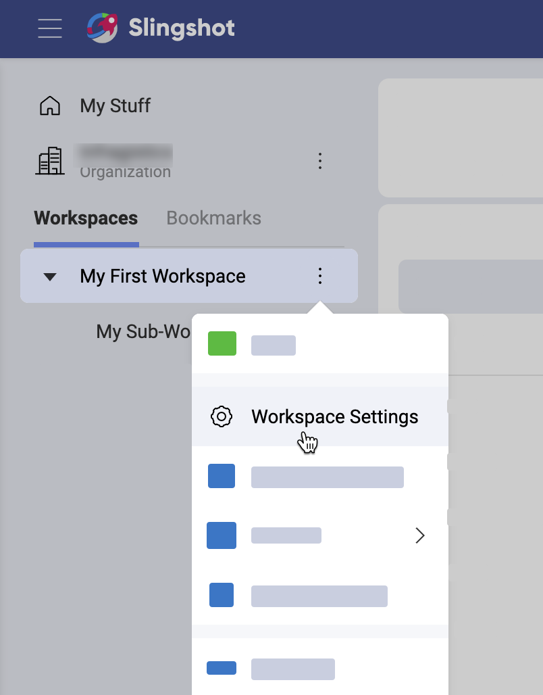

# Workspaces

## Workspaces in Slingshot
A Workspace in Slingshot can be defined as a digital area where groups of people - within or outside your organization - gather to work on a common objective. Workspaces allow you to collaborate, prioritize work, share content and knowledge and even gleam insights from data in a transparent way.

## What’s In a Workspace?

We know that in order to run a high performing team you need to have everything in one app for a seamless workflow. Below are all the amazing features that you have within your Slingshot workspace:
- **Overviews**: Each workspace has an overview which contains details of the workspace such as status, dates, and key content that is pinned there. At a quick glance you can see any mentions you have missed, and the status of all tasks broken down by member. The Overview is designed to give you a high-level view on the current state of that project or initiative – making it easier to identify roadblocks before they become a problem. [Check out the Overviews](overviews.md) topic for more information.  

- 	**Workspaces**: A Workspace can be a single flat space or hierarchy to further breakdown and organize key initiatives, projects, and processes for a group of people. If you have sub workspaces within your top-level workspace you can see them all from this tab along with the status of each. This is a great view for team leaders trying to see everything happening at once.

- **Tasks**: Tasks are how you can ensure that everyone is aligned and moving towards deadlines and goals. Each workspace allows you to create as many tasks as you need. Tasks are organized via Sections and Lists, which enables you to be even more organized! You can also view the tasks in different ways such as Grid view, Kanban and Gantt view. [Read more about tasks, lists, sections and views here!](tasks.md)  

- **Discussions**: Discussions ensure that collaborate between workspace members and groups is visible and transparent. Everyone can contribute to the discussion and stay abreast of what is going on within a workspace. Discussions can be organized in topics to prevent conversations from getting lost. You can mention members and groups here to ensure that nobody misses anything, or you can also ensure that members are notified when you create the topic. [Navigate here for more information on Discussions!](discussions-faq.md)

-	**Content**: Content takes the chaos of sharing and finding files and restores calmness. In a matter of clicks you can access OneDrive, GoogleDrive, SharePoint, DropBox and Box to pin files in context of your workspace. Upload local files and turn them into shared files magically. Pin important URLs you need everyone to have quick access to. Ensure that all documents and files that are relevant to each workspace is available to all members. [For more information on Content, click here](content-boards.md).

- **Analytics**: How else can you make data driven decisions without Analytics? Each workspace allows you to create or share dashboards which are visible by all members. Connect directly to your data sources, bringing them all together in one view to ensure you can always make an informed decision. [Check out the Analytics topics as what you can do here is limitless!](analytics/index.md)

## Workspace Hierarchy

Now that you understand all the possibilities within a workspace you should have a better idea how to organize around key projects. Workspaces can be a single flat space or have hierarchy to further breakdown and organize key initiatives. We understand that everyone organizes differently, so Slingshot is designed to allow you full flexibility. For more ideas on organizing your data, check out our Solutions page!
There are pros and use cases for each of these approaches when you are creating your workspace.

### Workspaces with Hierarchy

A perfect example of when you want a hierarchy within your workspaces is when you are a group of people that works together every day on several different projects or are responsible for several different things. Think about your traditional Marketing team – you have SEO, Paid Advertising initiatives, and many more – and separate professionals working on those specific responsibilities. You have launches for your product or service – all of which have their own tasks, content, data, and conversations that need to occur at a specific moment in time.

Here are some additional features of workspaces in hierarchy:
- You can organize all your team’s projects and initiatives so everyone can intuitively find information.
- You can set start dates and due states at the sub-workspace level.
- You can set a status on your sub-workspaces.
- All your subtasks roll up to the parent workspace so you can easily run your team scrums
- You can share sub-workspaces with users outside of the parent workspace for them to have access only to that content.

### Single Workspace

Single workspaces are great for bringing people together for a single purpose. An example of a workspace that doesn’t need hierarchy would be something like Sales Enablement. Here, you need to include a lot of different people, from different departments in the organization to have access for this specific reason
With the ability to turn tabs within workspaces on and off you can customize them so they fit their uses cases perfectly. [Learn more about turning workspace tabs on and off here](#customizing-a-workspace).

## Workspace Settings and Properties

You can set Information for each workspace such as:
- **Description**: It is best practice to add a description to your workspace so new and even existing members are clear on the purpose.
- **Start Date & End Date**: for projects that have a clear start and end date set them so everyone is aligned on expectation. These are not required for when you have a workspace that is a continuous process.
- **Status**: Give everyone working in this workspace a clear indication on if you are On Target, At Risk or In Danger of completing at the deadline. Status is also not required.
- **Organization**: {pending}
- **Privacy**: {pending}

You can also manage your members and their roles from within the workspace setting. [Learn more about workspace permission levels here](#workspace-permissions).

Looking to create beautiful maps within your dashboards for key insights into locational data? You can also set up your Image Tile provider under the workspace settings.

Accessing the Settings of the workspace can be done via the overflow menu next to the Workspace name.

## Working with Workspaces

When a Workspace is shared with you, it will automatically appear in your navigation side bar. You will also get a notification that a Workspace is shared with you so you can begin collaborating based the notification settings you have set.

### Creating a Workspace

Creating a new workspace in Slingshot can be done is just a few easy steps!
1.	To start creating a new workspace Click the “+ New” button in the left navigation at the top of your workspace list.
2.	From the “Join or Create a Workspace” modal dialog that pops up, click “+ Create Workspace” button. Here is where any public workspaces within your organization would appear for you to join as well.
3.	From the “Create Workspace” modal dialog that pops up, enter the information for your workspace, turn off any tabs that don’t fit the workspace use case, then click the “Create” button.
4.	Next, on the “Who is collaborating in this workspace” screen you can start adding members to your workspace. If you choose to do so at a later date, you can simply close this modal.

And that’s it! You have successfully created your first workspace and shared it with members to begin collaborating.

### Creating Sub Workspaces
You can add sub workspaces from the workspace tab using the blue “+ Workspace” button. From here, you will follow the same steps as Creating a Workspace.

>[!NOTE] Keep in mind that all members of the parent Workspace will have access to the sub workspace also. However, you can share a sub workspace with people external to the parent or even your organization. They will only have access to that sub workspace and not the parent.

### Joining a Workspace

You can join public Workspaces within your organization.
1.	Click the “New Workspace” button in the bottom left of the application.
2.	From the “Join or Create a Workspace” modal dialog that pops up, click the “Join” button on the public Workspace that you want to join.
3.	Once you have joined the Workspace, it will turn green with a “Joined” notification replacing the “Join” button.
4.	As this is a public Workspace it will automatically appear in your navigation side bar. The owners of the Workspace will receive a notification that you have joined.

You are now able to collaborate on that joined Workspace.

### Leaving a Workspace

Once your contribution to a project is completed or if priorities shift, you can easily leave a Workspace. This can be achieved by navigating to the overflow icon next to the Workspace name, and selecting “Leave Workspace”. You will not receive anymore notifications for this Workspace, and you will no longer be able to access any of the content such as tasks or discussions.

### Deleting a Workspace

There will be situations where the objective of the Workspace is achieved, no longer needed or you are reorganizing. When this occurs, you can delete the workspace. Only a member with Owner permissions can delete a Workspace. You can delete a Workspace by:
1.	Select Workspace Settings from the overflow button next to the Workspace name.
2.	From the “Edit Workspace” modal dialog that appears, select the overflow button in the top right.
3.	Select “Delete Workspace”.

>[!NOTE] When a Workspace is deleted, all data is deleted permanently. Another option instead of deleting a Workspace is to archive the Workspace [ coming soon].

### Customizing a Workspace

By default a Workspace is created with all tabs, which are described in the above section What’s in a Workspace. We know though that all these tabs may not be necessary for your project and just add clutter. For example in an HR Organization Management workspace which would be used to share all employee related content, Tasks and Discussion tabs wouldn’t be required.

Slingshot allows you full flexibility in customizing these tabs for your project’s requirements.
1.	Select the Pen icon displayed next to the Tabs
2.	In the Edit Tabs modal dialog that pops up, select the tabs you want to hide.
3.	Click the ‘Save’ button

>[!NOTE] Hiding a tab only removes it from appearing, it doesn’t delete any of the data that is associated with those tabs. Once they are visible again, that data is restored.

## Workspace Permissions

Within Workspaces, there are two types of permissions:
- **Owner** – By default the person who created the Workspace is set as the owner. Only the owner can change permissions of members within the Workspace. An owner has full access to manage the Workspace. They can add / remove members and also delete the Workspace.
- **Member** – with this level of permission, you can create, edit and share. You can’t add new members or delete the Workspace.
