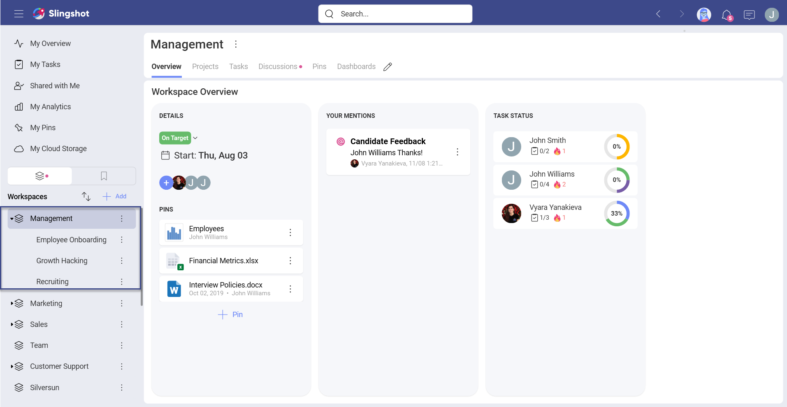
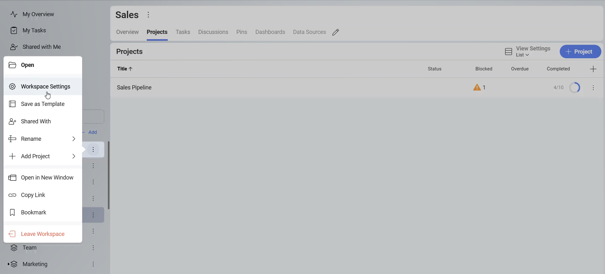
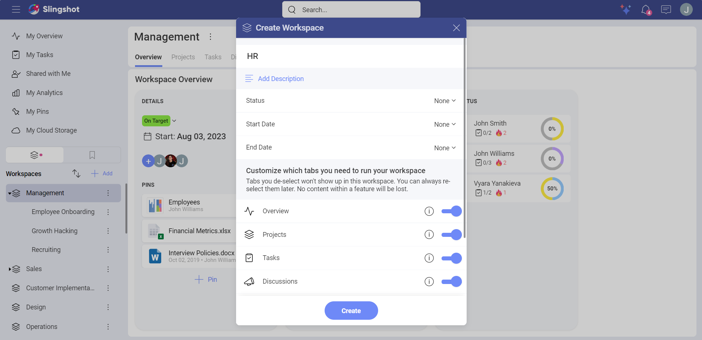
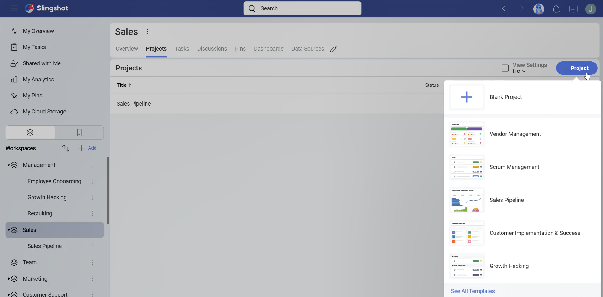
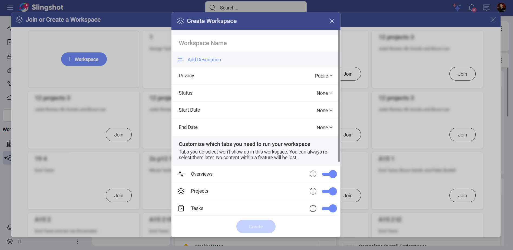
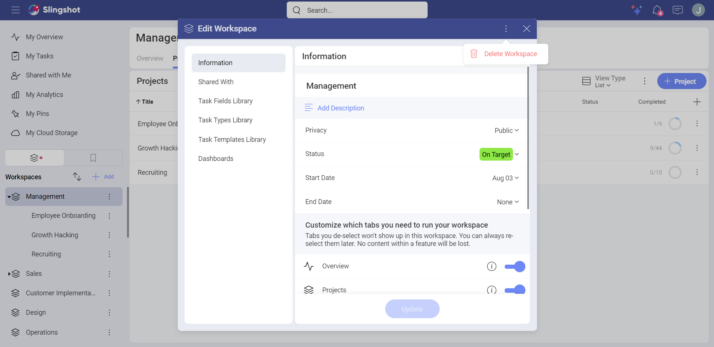
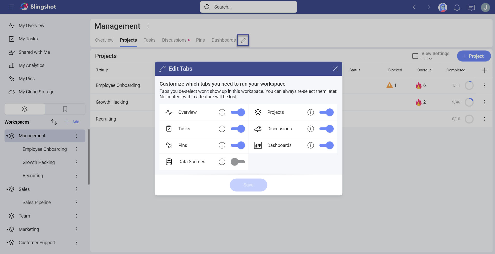

# Workspaces

A workspace in Slingshot can be defined as a digital workplace where groups of people - within or outside your organization - gather to work on a common objective. Workspaces allow you to collaborate, prioritize work, share content and knowledge and even gleam insights from data in a transparent way.

## What’s In a Workspace?

In order to run a high performing team, you need to have everything in one app for a seamless workflow. Below are all the amazing features that you have within your Slingshot workspace:

- **Overviews**: Each workspace has an overview which contains details of the workspace such as status, dates, and key content that is pinned there. At a quick glance you can see any mentions you have missed, and the status of all tasks broken down by member for that workspace and all projects within it. The Overview is designed to give you a high-level view on the current state of that project or initiative – making it easier to identify roadblocks before they become a problem. [Check out the Overviews](overviews.md) topic for more information.  

- **Projects**: Projects allow you to further breakdown and organize key initiatives, projects, and processes for a group of people. You can get a quick glimpse of all projects and their status from this tab. This is a great view for team leaders trying to see everything happening at once. 

- **Tasks**: Tasks are how you can ensure that everyone is aligned and moving towards deadlines and goals. Each workspace and project allow you to create as many tasks as you need. Tasks can be organized even more into Sections and Lists. You can also view the tasks in different ways such as List view, Kanban and Gantt view. [Read more about tasks, lists, sections and views here!](tasks.md)  

- **Discussions**: Discussions ensure that collaboration between workspace members and groups is visible and transparent. Everyone can contribute to the discussion and stay abreast of what is going on within a workspace or project. Discussions can be organized in lists to prevent conversations from getting lost in endless threads. You can mention members and groups here to ensure that nobody misses anything, or choose to notify users when you create the discussion. [Navigate here for more information on Discussions!](discussions-faq.md)

-	**Pins**: The Pins area takes the chaos of sharing and finding files and restores calmness. In a matter of clicks you can access OneDrive, GoogleDrive, SharePoint, DropBox and Box to pin files in context of your workspace and projects. Upload local files and turn them into shared files magically. Pin important URLs you need everyone to have quick access to. Pull together files, URLs, dashboards, tasks and more into your content lists to keep resources that are relevant to each workspace or project. [For more information on Pins, click here](pins.md).

- **Dashboards**: How else can you make data driven decisions without analytics? Each workspace allows you to create or share dashboards which are visible by all members. Bring multiple data sources into one dashboard to ensure you have all the information to make data-driven decisions [Navigate here for more information on Dashboards](./analytics/dashboards/overview.md).

- **Data Sources**: Connect directly to your data sources, for your workspace and project members to have quick access too. Make everyone in your organization a data scientist! [Check out the Analytics topics, as what you can do here is limitless!](./analytics/my-analytics.md)

## Workspace Hierarchy

Now that you understand all the possibilities within workspaces and projects, you should have a better idea how to organize around key initiatives. Workspaces can be a single flat space or have hierarchy to further breakdown and organize into projects.

We understand that everyone organizes differently, so Slingshot is designed to allow you full flexibility. For more ideas on organizing your data, check out our Solutions page <a href="https://www.slingshotapp.io/solutions" target="_blank">Solutions page</a>! There are pros and use cases for each of these approaches when you are creating your workspace.

### Workspaces with Projects

A perfect example of when you want a hierarchy within your workspaces is when you are a group of people that works together every day on several projects - such as a Marketing team. Within a Marketing workspace, you can have SEO, Paid Advertising initiatives, and many more projects happening all at once, all of which have their own tasks, content, data, and conversations that need to occur at a specific moment in time.

Here are some additional features of workspaces with projects:

- You can organize all your team’s projects and initiatives so everyone can intuitively find information.

- You can set start dates and due states at the project level.

- You can set a status on your projects.

- All your project tasks roll up to the workspace so you can easily run your team scrums.

- You can share projects with users outside the workspace for them to have access only to that content.

### Workspace without Projects

Single workspaces are great for bringing people together for a single purpose. An example of a workspace that doesn’t need projects would be something like Sales Enablement. Here, you need to include a lot of different people from different departments in the organization to have access for this specific reason.
With the ability to turn tabs within workspaces on and off you can customize them so they fit their uses cases perfectly. [Learn more about turning workspace tabs on and off here](#turning-tabs-on-and-off).

## Workspace and Project Settings and Properties

You can set information for each workspace and project such as:

- **Description**: It is best practice to add a description to your workspace so new and even existing members are clear on the purpose.

- **Start Date and End Date**: Set start and end dates so everyone is aligned on expectations. These are not required for when you have a workspace that is a continuous process.

- **Status**: Give everyone working in this workspace a clear indication on if you are On Target, At Risk or In Danger of completing at the deadline. Status is not a required field.

- **Organization**: Lets you know if the workspace belongs to an organization and which one.

- **Privacy**: Decide if your workspace will be public for your organization or private. Public workspaces can be discovered and joined by anyone within your organization. Private workspaces require an invitation to join.

You can also manage your members and their roles from within the workspace setting. [Learn more about workspace permission levels here](#workspace-and-project-permissions).

Accessing the *Settings* of the workspace can be done via the overflow menu next to the workspace name.

## Working with Workspaces and Projects

When a workspace or project is shared with you, it will automatically appear in your navigation sidebar. You will also get a [notification](notifications.md) as long as you didn't turn off the alerts.

### Creating a Workspace

Creating a new workspace in Slingshot can be done in just a few easy steps!

1.	To create a new workspace, click/tap on the **+ Add** button in the left navigation at the top of your workspace list. You can then create a workspace from scratch or use one of the [Slingshot workspace templates](workspace-templates.md).

2. Enter the information for your workspace, turn off any tabs that don’t fit the workspace use case, then click/tap on the **Create** button. Keep in mind that you can also set up the privacy of your workspace if you are part of an organization. 

3.	Next, add members to your workspace. You can also do this later by closing the dialog box.

And that’s it! You have successfully created your first workspace and shared it with members to begin collaborating.

### Creating Projects

You can add projects from the project tab using the blue **+ Project** button. From here, you will follow the same steps as [Creating a Workspace](#creating-a-workspace).

>[!NOTE] Keep in mind that all members of the Workspace will have access to the projects within it. However, you can share a project with people external to the workspace or even your organization. They will only have access to that project and not the workspace.

### Searching and Joining Workspaces

You can join public workspaces within your organization.

1.	Click/tap on the **+ Add** button in the left navigation at the top of your workspace list.

2.	Search for the workspace you want to join in the **Join or Create a Workspace** modal dialog that pops up.

3.  Then click the **Join** button on the public workspace of your choice.

4.	Once you have joined the workspace, it will turn green with a **Joined** notification replacing the **Join** button.

5.	As this is a public workspace, it will automatically appear in your navigation sidebar. The owners of the workspace will receive a notification that you have joined and you are now able to collaborate on that workspace.

### Leaving a Workspace

Once your contribution to a project is completed or if priorities shift, you can easily leave a workspace.

This can be achieved by navigating to  the overflow icon next to the workspace name, and selecting **Leave Workspace**. You will not receive notifications for this workspace anymore, and you will no longer be able to access any of the content such as tasks or discussions.

### Deleting a Workspace

There will be situations where the objective of the workspace is achieved, it is no longer needed or you are reorganizing. When this occurs, you can delete the workspace. Only a member with [Owner](#workspace-and-project-permissions) level permissions can delete a workspace.

You can delete a workspace by going to the workspace settings and clicking the overflow in the top right. From there, you can click/tap on **Delete Workspace**.

### Turning Tabs On and Off

By default, a workspace is created with all tabs, but you can turn tabs on and off if they are not necessary.
Slingshot allows you full flexibility in customizing these tabs for your project’s requirements.

If you need to turn on/off a tab, you can easily do so from the pencil icon on the tab menu.

>[!NOTE] Hiding a tab only removes it from appearing, it doesn’t delete any of the data that is associated with those tabs. Once they are visible again, that data is restored.

## Workspace and Project Permissions

Within Workspaces, there are three types of permissions:

- **Owner** – By default the person who created the workspace or project is set as the owner. Only the owner can change permissions of members within the workspace/project. They can also remove members from the workspace or project.

- **Contributor** – with this level of permission, you can create, edit, delete and share anything with the workspace or project, but you can’t add new members or delete the workspace/project.

- **Viewer** – can only view and share items from within a workspace or project.  