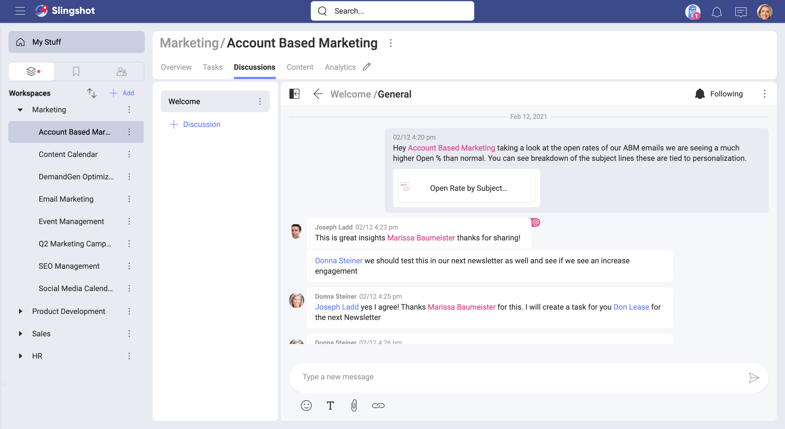
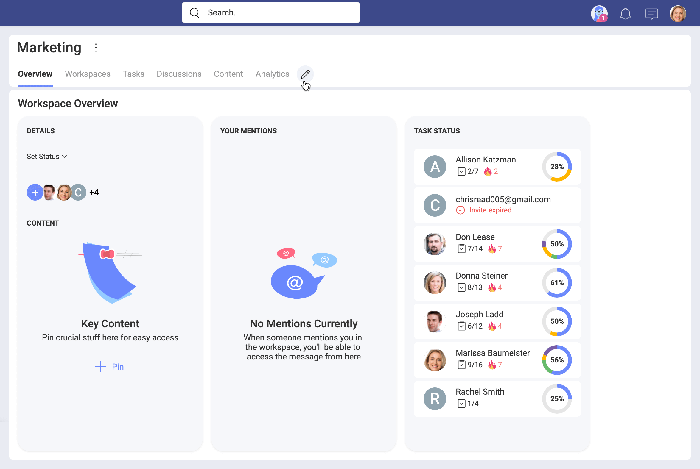

# Workspaces

A *workspace* can be defined as the area where you engage in physical or mental activities to achieve a result. Nowadays, your workspace can be your office, desk, a coffee shop, or even your home. In IT, "workspace" is often used to refer to a computer screen or application where you work and the way it is arranged. A common trait to all workspaces is that they meet a set of requirements that help you do your work efficiently. Of course, those requirements vary greatly depending on each specific scenario. 

## So, what's a Slingshot workspace?

It’s the virtual area where you get your work done within Slingshot. Very close to the IT definition of workspace, right?  It's also very close to the traditional understanding as it delivers an area where you can communicate and collaborate with others. 

And Slingshot is all about team collaboration and supporting each other towards common objectives. It can be said that good teams understand each other and work well together. But Slingshot's workspaces do not only gather together good teams. By providing a combination of tools that enable solid leadership, good communication, and access to the right resources, the workspaces dramatically improve productivity and collaboration. Just the right recipe to make good teams great!

## Providing tools for effective communication

Your workspace in Slingshot is intended to facilitate your collaboration with others. Being part of a team means fluid communication. That's why you can use different types of communication like workspace discussions, task activity comments, notifications, or even a general chat.

The most effective way to involve everyone in a discussion and maintain high transparency in the workspace, is to create a topic in the workspace discussions (see below). 

You can also communicate with any Slingshot user (or group of users) through the **private chat**.

Communication is not limited to writing. You can also attach files, use emojis, and react to messages.

## Ensuring collaboration fluency 

To support each other, the members of a workspace can get a sense of the workspace status at a glance. Using the workspace *overview* you can keep yourself informed about all members and their tasks, helping you proactively contact those in need. You can, for example, start a discussion to get a team member's attention. And they will receive a notification to alert them that they were mentioned.

When you work towards a common objective, using shared resources is required. One of the best practices in Slingshot is to organize your content in *Boards*. Designed to manage your personal or workspace content, boards are just containers. They keep connections to cloud storages, where you hold your resources.

## Using workspaces within the workspace

More often than not, you will collaborate with different people in your workspace  that work on  separate tasks. Sometimes even people from outside the workspace might join to work on a specific project. For example, if you are part of a Marketing workspace, you may want to separate the marketing campaigns. All collaborators will benefit from tracking the progress on each campaign more easily, to communicate faster and to get data about the campaign success rate *from Slingshot's Analytics*. 

It's always important to organize the different groups and projects within the workspace in a way that fosters productive collaboration and best practices. By giving you the ability to create workspaces within another workspace, Slingshot empowers solid leadership, good communication, and access to the right resources for each group of collaborators. 

>[!NOTE] For this guide's purposes, the term **sub-workspace** will be used to refer to a workspace within the workspace. The main workspace that contains sub-workspaces will be sometimes called a **parent workspace**.  

A sub-workspace provides you, by default, with the same collaboration tools as the parent workspace. Let's look at a quick list!

- *Overview* - provides a quick snapshot of what's going on: overall status (*On Target, At Risk, Danger, Completed*), start and due dates, crucial resources, everyone's progress on tasks and all mentions directed at you. 
- *Tasks* - all the tasks associated with the sub-workspace are tracked and organized in lists.   
- *Content* - helps you share and organize neatly all resources required to collaborate.   
- *Discussions* - you can communicate with a focus on your sub-workspace's shared objective.

### Customize main navigation tabs for improved productivity

What if you don’t use discussions for your project or don’t need Analytics in the preparation phase? No matter how good a tool is, it still can be unnecessary or inappropriate for your work. If you are the owner of the workspace, to improve productivity and decrease clutter, you can hide one or more of the six main navigation tabs. 

To customize which tabs you need to run your workspace, you can simply use the *pencil* icon next to the *Analytics* tab (see below). 

Use the toggles to hide/show tabs. All tabs are shown by default. When you disable a tab, you simply hide it. This means, that if you decide to show the tab again all its previous content will be recovered and also shown. 

>[!NOTE] Contents from **the hidden tabs** will still appear in other parts of Slingshot. For example, if you have shared a task in a discussion or a chat before hiding the Tasks tab, the task will remain visible in the discussion/private chat. Also, it will appear as a [search](search.md) result.

### Want to know more about workspaces?

Continue [here](workspaces-faq.md)!

