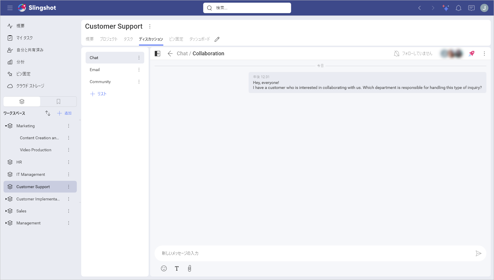

## Discussions

Communication is simply the act of sending information from one place, person, or group to another. This is done by using mutually understood signs, symbols, and also semiotic rules that bind cultures and societies together. It sounds simple, but as you know communication is actually very complex. Like planning estimation, and many other complex activities, communication can always be improved...

While collaborating in teams or projects, people from different teams or even from outside the organization work together. Communication here is crucial to get things done in a productive way. Slingshot's approach with discussions was designed with all this in mind.

### So, What's a Slingshot Discussion?

It's a way of communication used by members of an Organization, Team, or Project. Being organized in different threads, discussions ensure all your communication, and collaboration tools are in one place, making remote teams stay productive no matter where they are.

You can have multiple discussions going on at the same time, while mixing in text formatting, attachments, emojis, and links. Plus you can react to conversations and even create tasks from messages.

### As many Discussions as Different Topics

Discussions are organized in different threads, ensuring side conversations are under control. The main discussion remains healthy and does not lose focus, as there is a place for every conversation.

Unlike lengthy email chains, members can follow or unfollow discussions. This is tied to notifications, as you get informed when someone sends a message to a discussion you follow.

### Getting Notifications

With Slingshot notifications, you can get informed when someone sent a message to you or in a discussion thread you're following. You can check the current Notification settings for Discussions and tweak them as needed.  
Follow the links for further details about [notifications](notifications.md).
