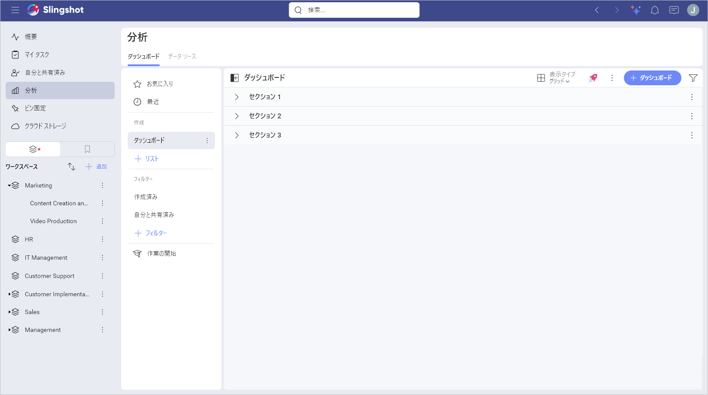
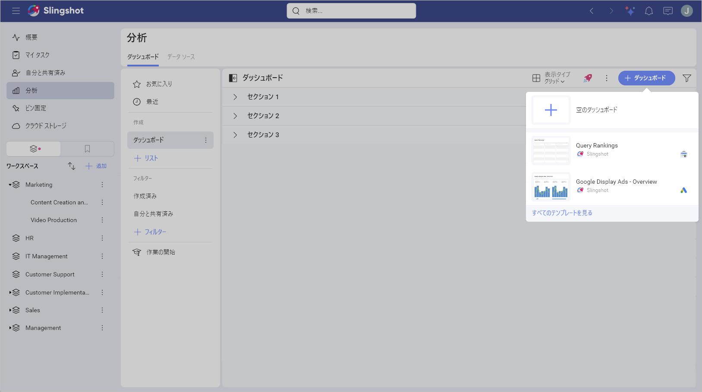
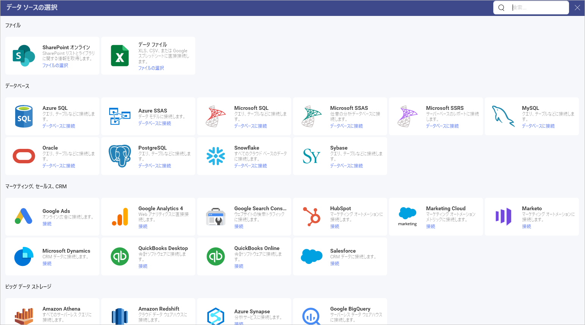
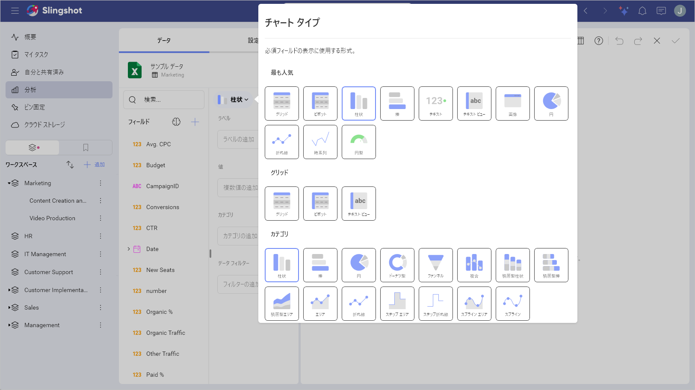
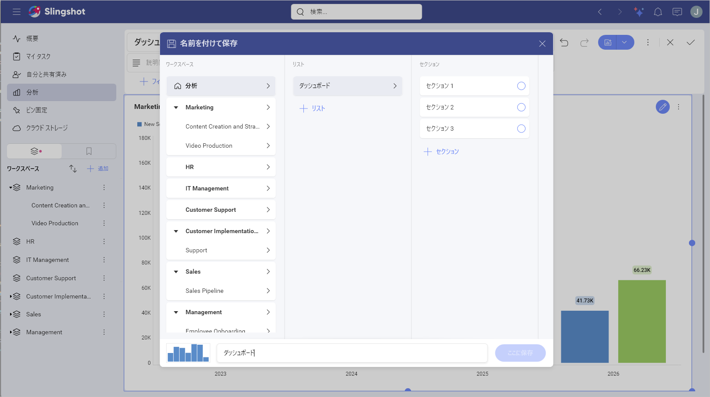

# ダッシュボードの作成

Analytics のダッシュボード作成には以下のオプションが含まれます:

1.  [ダッシュボード作成メニューにアクセス](#ダッシュボード作成メニューにアクセス)

2.  [データ ソースの追加](#データ-ソースの追加)

3.  [表示形式の変更](#表示形式の変更) (オプション)

4.  [ダッシュボードの保存](#ダッシュボードの保存)

## ダッシュボード作成メニューにアクセス

ダッシュボードを作成するには: 

1. ダッシュボード リストの **[+ ダッシュボード]** ボタンをクリックまたはタップするか、**[はじめに]** セクションの **[ダッシュボードの作成]** 青いボタンをクリックまたはタップします。

2. [ダッシュボード テンプレート](../../dashboard-templates.md) ([すべてのテンプレートを見る] ボタン) を使用するか、新しいダッシュボードを作成するかのオプションが表示されます。ダッシュボードを作成するには、**プラス アイコン**をクリックまたはタップします。 

3. **[新しい表示形式]** ダイアログが表示されます。データ ソースを使用しながら表示形式を作成することができます。

## データ ソースの追加

データ ソースがデータ ソース リストにない場合は、右上隅にある **[+ データ ソース]** ボタンを選択します。新しいダイアログが表示され、すべてのデータ ソース カテゴリと使用可能なデータ ソースが表示されます。必要なデータ ソースが表示されるまで、上下にスクロールしてください。

データ ソースがコンテンツ マネージャーのスプレッドシートの場合、表示形式で使用する特定のシートを選択できます。

### 使用可能なコンテンツ

Analytics では [Dropbox](../datasources/supported-data-sources/dropbox.md)、[OneDrive](../datasources/supported-data-sources/onedrive.md)、[Box](../datasources/supported-data-sources/Box.md)、[Google Drive](../datasources/supported-data-sources/google-drive.md) などの複数のコンテンツ ソースを追加でき、それらの使用可能なフォルダー、ファイル、スプレッドシートを閲覧できます。

さらに、[SharePoint](../datasources/supported-data-sources/sharepoint.md) データ ソースを追加することもできるため、リストまたはライブラリにアクセスする機能が使用可能です。

## 表示形式の変更

データ ソースを追加した後、**[表示形式エディター](../data-visualizations/visualization-editor.md)**が表示されます。デフォルトでは、柱状表示形式が選択されます。

Analytics では、情報を可覚化する方法をカスタマイズするためのいくつかのオプションがあります。上部バーの**ピボット アイコン**を選択してオプションにアクセスできます。

表示形式にラベルと値を追加し、右側のペインでプレビューします。必要に応じて、表示形式設定を変更してフィルターを追加できます。

表示形式を変更した後**ダッシュボード エディター**に移動されます。右上側に **[元に戻す]**、**[やり直し]**、および **[+ 追加]** の分割ボタンが表示されます。これらのボタンの横には、ダッシュボードのオーバーフロー メニューもあります。これらのボタンの横にはダッシュボードのオーバーフロー メニューもあり、次の操作を実行できます:

- ダッシュボードのテーマを変更します。

- ダッシュボードを更新します。

- ダッシュボードを貼り付けます。

- **自動レイアウト**のオン/オフを切り替えます。

- ダッシュボードを**エクスポート**します。

- ダッシュボードを**保存**します。

- 学習センターで Slingshot ダッシュボードの詳細情報を参照できます。

表示形式の右上隅にあるオーバーフロー メニューを使用して、次の操作を実行することもできます:

- 表示形式の名前を変更します。

- 表示形式を編集します。

- 表示形式を**コピー**します。

- 表示形式を**複製**します。

- 表示形式を削除します。

>[!NOTE]
>表示形式のコピーと複製の違いは、複製は同じダッシュボード内でのみ機能し、コピー オプションを使用すると、表示形式を同じダッシュボードまたは異なるダッシュボードに配置できることです。

表示形式をコピーした後、表示形式を貼り付けるダッシュボードのオーバーフロー メニュー内の **[貼り付け]** オプションを見つけます。

## テーマの適用

ダッシュボードに進むと、次の操作を実行できます:

1. オーバーフロー メニューを開きます。

2. **[テーマ]** をクリックまたはタップします。 

3. 以下に示すように、*Mountain テーマ*、*Ocean テーマ*、*Aurora テーマ*を切り替えます。

## ダッシュボードの保存

ダッシュボードの準備ができたら、次の操作を実行できます:

1. ダッシュボードの右上隅にある**チェック アイコン**をクリックまたはタップするか、オーバーフロー メニューから **[名前を付けて保存]** を選択します。

2. ダッシュボードの名前を選択します。

3. ダッシュボードの場所を選択します。**[分析]** ⇒ **[ダッシュボード]** の下にダッシュボードを保存するか、参加しているワークスペースまたはプロジェクトを選択することもできます。

4. 準備ができたら、**[ここに保存]** をクリックまたはタップします。

> [!Note]
> **[名前を付けて保存]** ダイアログで、右上隅にある **[+ リスト]** ボタンと **[+ セクション]** ボタンをクリックして、リストとセクションを作成し、スペースを整理することができます。
