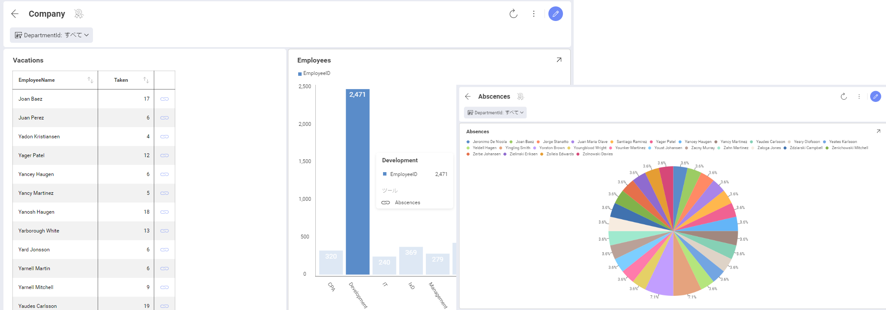
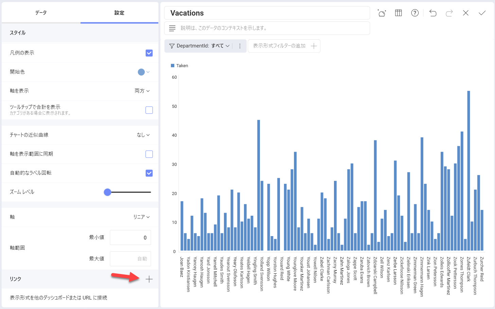
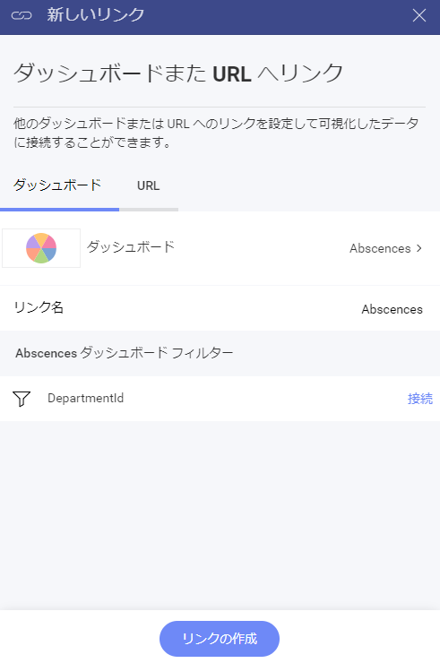
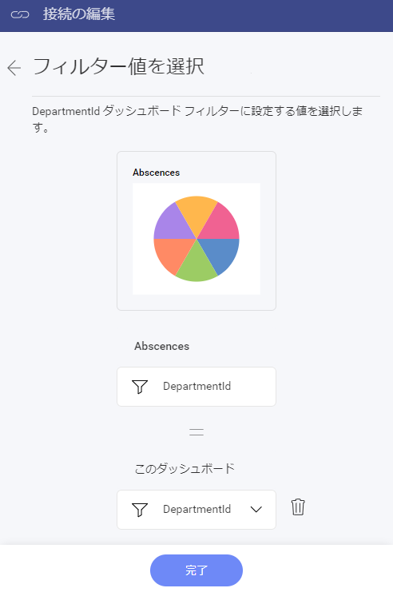
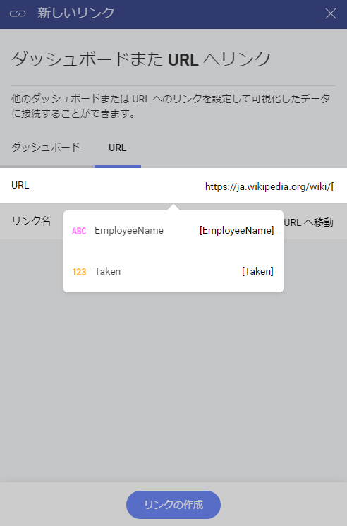
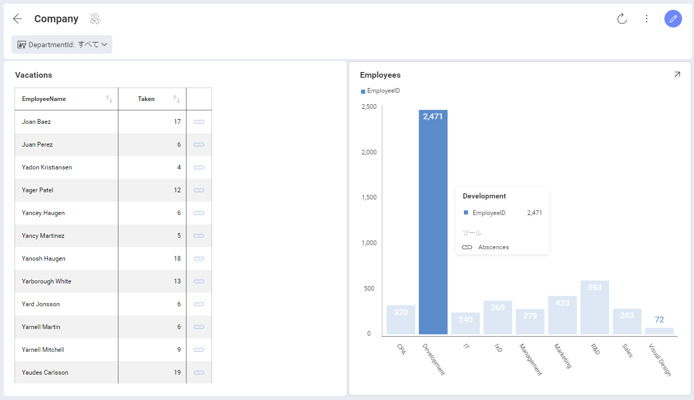
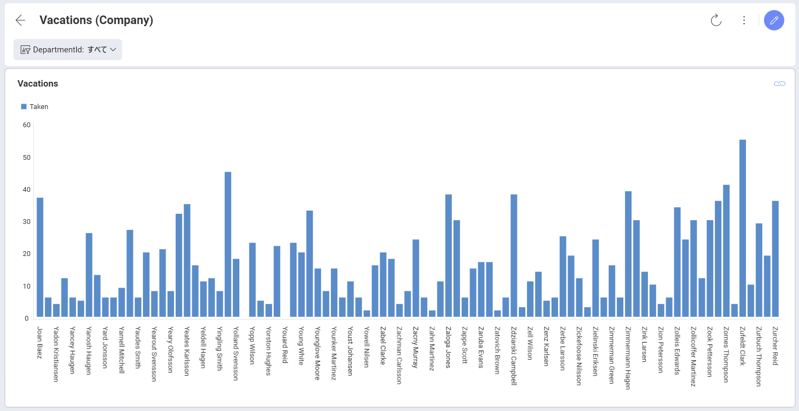

# ダッシュボード リンク

Slingshot はダッシュボード リンクをサポートしています。これは、表示形式のグリッド行またはチャート列が選択されたときにトリガーされます。この機能は、高度なドリル ダウン ナビゲーションが可能です。表示形式により詳細な情報を表示したい場合、新しいダッシュボードを使用して目的を達成できます。この機能はトップダウン分析パスでとても役立ちます。ビジネスのハイレベルな概要から特定の詳細情報まで簡単にナビゲーションができます。

Company ダッシュボード (以下を参照) を見てみましょう。このダッシュボードは、各エリアの KPI (キー パフォーマンス インジケーター) を提供します。ダッシュボードを開くと、1 つ以上の表示形式に**リンク記号**が表示されます。 

リンク記号をクリック/タップすると、以下を開くことができます: 

* **別のダッシュボード** (以下のスクリーンショットを参照)。表示形式またはその中の値に関連するより具体的な情報を提供します。
* ダッシュボード ナビゲーションの一部としてサードパーティ ウェブ アプリケーションとのインタラクションなど拡張性を有効にする **URL**。

## リンクの追加 

リンクを構成するには、表示形式エディターの **[設定]** セクションに移動し、**[リンク]** の [+] をクリック / タップします。または、**[表示形式を他のダッシュボードまたは URL に接続]** を選択することもできます。

追加されたリンクは、ダッシュボードが**ビュー モード**の場合、構成されている表示形式にリンク記号として表示されます。

### 別のダッシュボードへのリンク

別のダッシュボードにリンクすると、あるダッシュボードの特定のポイントから別のダッシュボードに移動することができます。このポイントは、選択したリンク トリガーに応じて、表示形式または表示形式の特定の値になります ([以下](#トリガーの選択)を参照)。

ダッシュボードを別のダッシュボードにリンクするには、以下の手順を実行する必要があります。

1. リンク先のダッシュボードを**準備します**。2 つのダッシュボードの関係を注意深く検討してください。

  メイン ダッシュボードと同じように、リンク先のダッシュボードに予め**フィルターの追加**をしておくと、共通のフィールドでこの 2 つのダッシュボードを接続できます。このフィールドは、2 番目のダッシュボードではフィルターとして、最初のダッシュボードでは測定されたカテゴリとしてのロールを果たします。

2. リンク先のダッシュボードを準備してから、リンクを追加するダッシュボードを開きます。リンク記号を表示する表示形式を選択し、**表示形式エディター**で開きます。

3. **[設定]** に移動し、**[リンク]** の [+] を選択して、**[新しいリンク]** ダイアログが開きます。

  

  ここでは、2 つのパラメーターを構成する必要があります:

  * リンク記号をクリックすると開く**ダッシュボード**。

  * グリッド行またはチャート要素を選択した場合にユーザーに表示されるタイトルである**リンク名**。

ターゲット ダッシュボードにダッシュボード フィルターを追加した場合は、リンクを追加する表示形式のデータセット内の対応するフィールドにダッシュボード フィルターを接続する必要もあります (以下を参照)。

  

**[完了]** をクリックして戻ります。

4. **[リンクの作成]** 青いボタンをクリックします。

ダッシュボードへのリンクは、[設定] の [リンク] の下に表示されます。

ダッシュボードへのリンクは、**表示形式エディター**の **[リンク]** の下に表示されます。別の設定も表示されます - [トリガー]。[トリガーの選択](#トリガーの選択)の詳細については、以下を参照してください。

### URL の追加

URL の追加は、[新しいリンク] ダイアログのもう 1 つのオプションです。設定した URL をデバイスのブラウザで開くことができます。

2 つのパラメーターを定義する必要があります:

  - 表示形式が指す **[URL]**。リンク記号が選択されると、そこにリダイレクトされます。
  
  - グリッド行またはチャート要素を選択した場合にユーザーに表示されるタイトルである **[リンク名]**。

URL の場合は、**変数**を含めることもできます。これにより、表示形式フィールドの値に基づいて、ユーザーにリンクされる URL が動的に作成されます。たとえば、以下の表示形式リンクを見てみましょう:

  

URL は <http://ja.wikipedia.org/wiki> に設定されており、この場合は **EmployeeName** 変数を選択しました。したがって、表示形式で **Navigate to Wiki** (Wiki へ移動) リンクを選択したユーザーは次のように表示されます:

    http://www.ja.wikipedia.org/wiki/[EmployeeName].htm
`EmployeeName` は、**EmployeeName** フィールドの値によって異なります。

>[!NOTE]
> 例のテスト: 変数の追加がどのように機能するかをテストするには、**Marketing Dashboard** を使用します。_CampaignID_ データ フィールドを含む _Conversionsby Campaign_ 表示形式を選択し、スクリーンショットに示すように URL を追加します。表示形式を保存し、ダッシュボード編集モードで、ファネル表示形式のさまざまな部分をクリックして、リダイレクト先の URL がどのように変更されるかを確認します。

## トリガーの選択

表示形式に最初のリンクを追加すると、[設定] の [リンク] の下に [トリガー] が表示されます。ここでは、トリガー オプションとして [値は選択されました] と [表示形式が最大化されました] のどちらかを選択できます。
表示形式には必要な数のリンクを追加できますが、それらはすべて同じトリガーが有効になります。

### [値は選択されました] トリガー

このオプションを選択すると、柱状、棒、円スライスなどのチャートのデータ項目がクリック/タップされるたびに、リンク記号の付いたツールチップが表示されます。グリッド チャートでは、リンク記号が右側の最後の列に表示されます (以下を参照)。

  

*EmployeeName* を使用してダッシュボード フィルターをターゲット ダッシュボードに追加した場合、上のスクリーンショットに示すように、グリッド内のリンク記号をクリックすると、*Joan Baez* 値が事前に選択された *EmployeeName* フィールドでフィルターされた別のダッシュボードが開きます。このように、ターゲット ダッシュボードには、選択した値の分析のみが表示されます。

選択した値に URL がリンクされている場合は、リンク記号をクリック/タップすると、追加した URL が開きます。この機能を最大限に活用するために、フィールドを[変数](#variable)として URL に追加することもできます。

### [表示形式が最大化されました] トリガー 

このオプションを選択すると、**ダッシュボード ビュー** モードで表示形式の右上隅にリンク記号が表示されます。したがって、表示形式を最大化する代わりに、右上隅を選択すると、別のダッシュボードまたはリンク先の URL が開きます。

  
