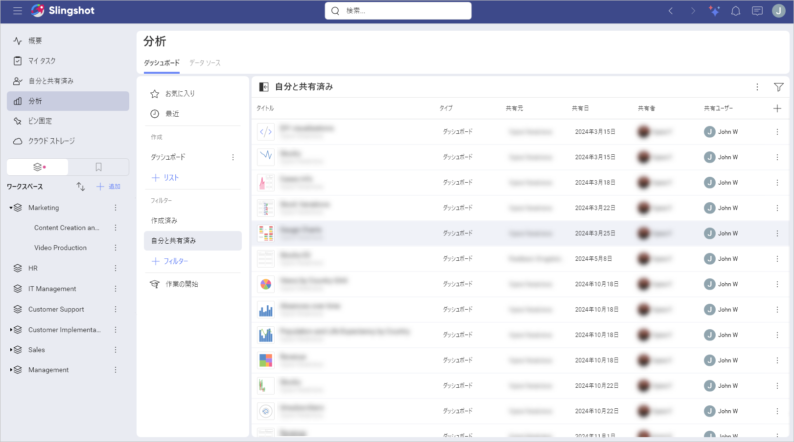
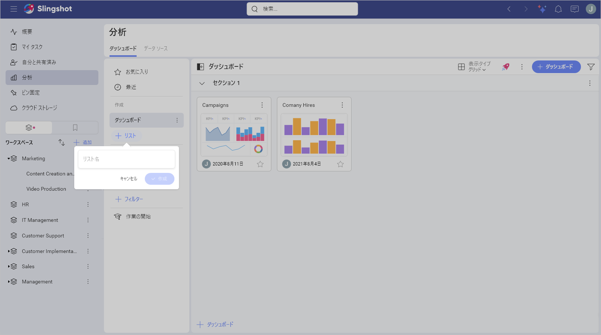
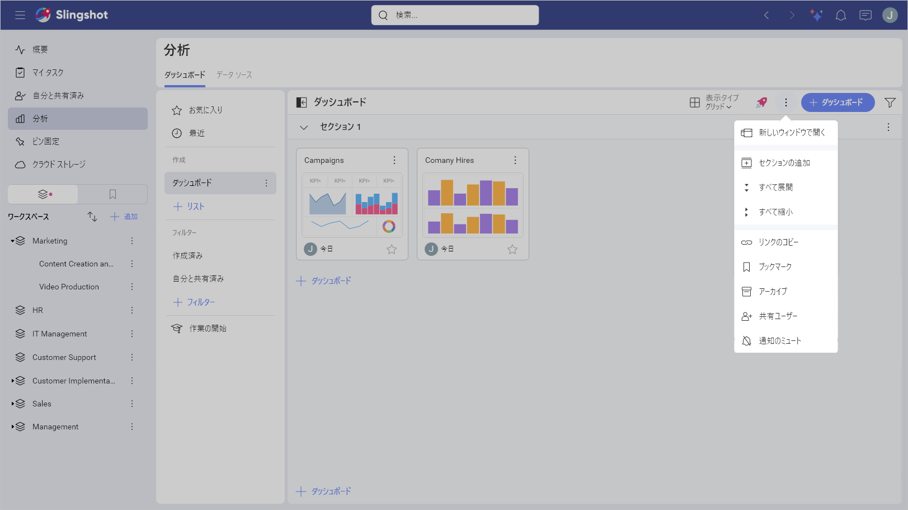
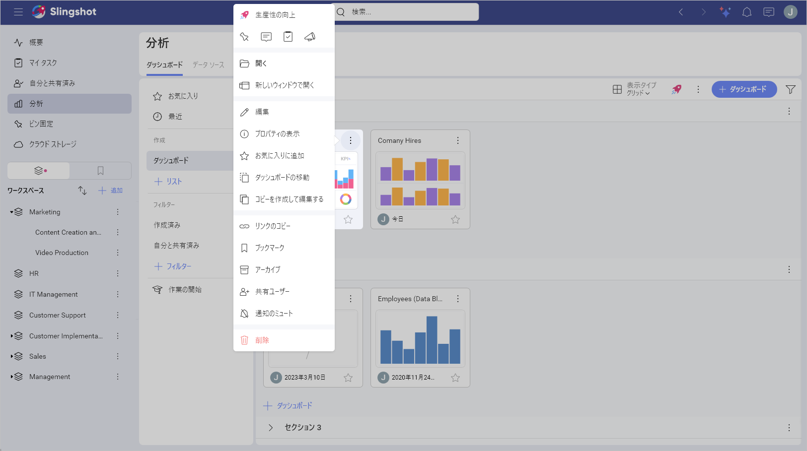
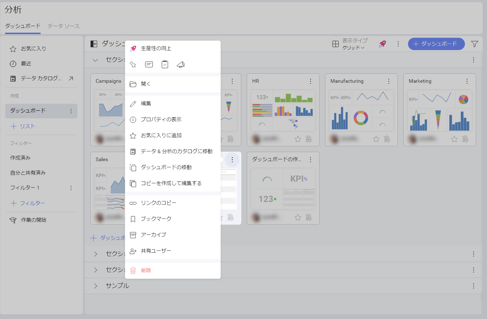
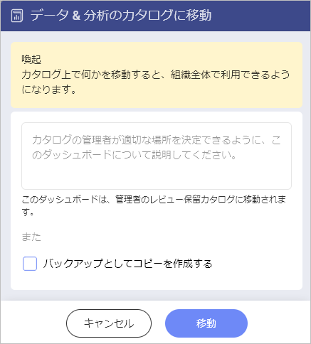

# ダッシュボードの管理

個人用スペースまたはワークスペースでダッシュボードを管理しようとしているかどうかにかかわらず、**[作成済み]** または **[自分と共有済み]** のいずれかをいつでも選択できます。

## ダッシュボードの整理

Analytics を使用すると、ダッシュボードをさまざまな**リスト**および**セクション**に保存および整理できます。セクションはリストを分割したものです。リストには 1 つ以上のセクションを含めることができます。

次の手順でリストを作成できます:

1. **[+ リスト]** ボタンをクリックまたはタップします。

2. リストに名前を付けます。

3. **[作成]** をクリックまたはタップします。

4. リストに名前を付けたら、**[+ ダッシュボード]** ボタンでダッシュボードの追加を開始できます。

次の手順でセクションを作成できます:

1. ダッシュボード リストを開きます。

2. **[+ ダッシュボード]** ボタンの横にある **オーバーフロー** メニューを開きます。

2. **[セクションの追加]** を選択します。 

3. 名前を付けて、**[作成]** をクリックまたはタップします。

4. セクションに名前を付けたら、**[+ ダッシュボード]** ボタンでダッシュボードの追加を開始できます。

## ダッシュボードの移動またはコピー

ダッシュボードのオーバーフロー メニュー アクションを開き、ダッシュボードをコピーするか、**セクション**や[**ワークスペース**](../../workspaces.md)の間で移動するかを選択します。

組織に所属している場合は、ダッシュボードを**データ & 分析のカタログ**に移動することもできます。そのためには、以下の手順を実行します:

1. ダッシュボードのオーバーフロー メニューを開きます。

2. **[データ & 分析のカタログに移動]** をクリックまたはタップします。

3. 次のダイアログが表示され、組織の管理者にダッシュボードをカタログに追加するように要求できます。

4. 要求を承認すると、組織全体でダッシュボードを見ることができるようになります。
