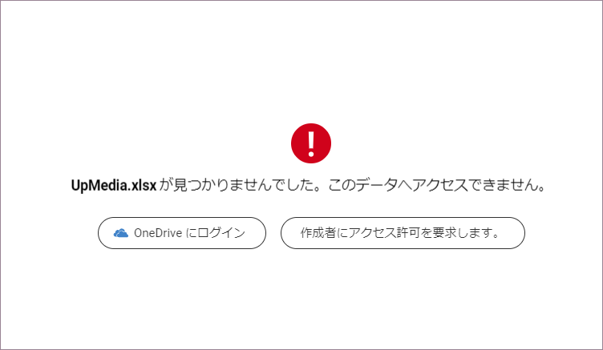
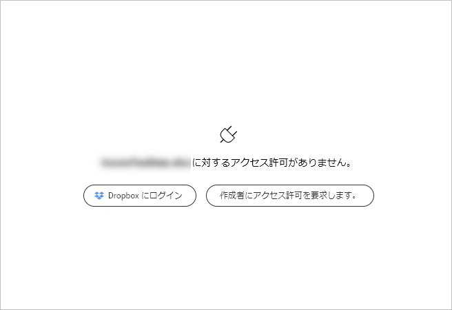
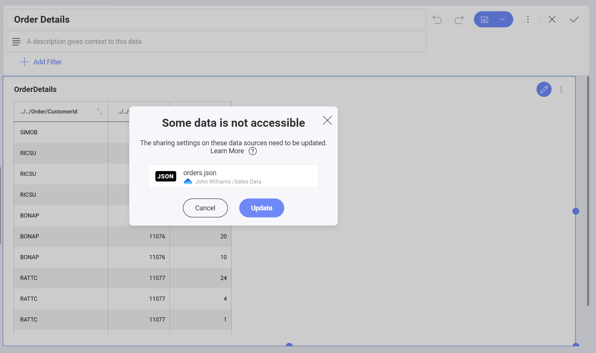

# クラウド ファイルを使用した共有ダッシュボードへのアクセスのリクエスト

共有されているダッシュボードを開こうとすると、次のいずれかの理由により、そのコンテンツを表示できない場合があります。

  - データ ソースとして使用されているクラウド ファイルがクラウド サービスから**削除されました**。

  - ダッシュボードの管理者が、データ ソースとして使用されるクラウド ファイルへのアクセス**許可を取り消しました**。

ファイルが**削除されている**場合、共有ダッシュボードをクリックすると、Analytics は次のメッセージを表示します。

ファイルへのアクセス許可が**取り消された**場合は、次のように表示されます。

## 権限の取り消されたデータ ソース ファイルへのアクセス許可

データ ソース ファイルへのアクセスを回復するには、**[作成者にアクセス許可を要求する**] をクリックまたはタップして、アクセスが拒否されたことをダッシュボードの管理者に通知します。メール通知も送信されます。

**管理者**が (アプリまたはメールを介して) 通知を開くと、次のダイアログが表示され、データ ソースへの共有設定を更新するように求められます。

<!---  --->

管理者が **[更新]** をクリックまたはタップすると、アクセスが正常に修正されたかどうかを通知するメッセージが表示されます。
