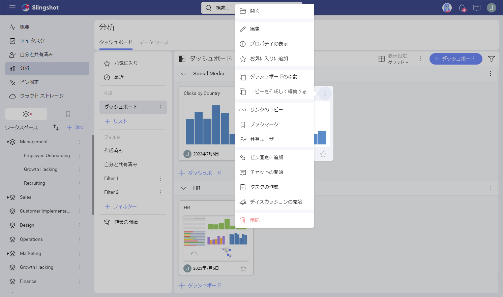
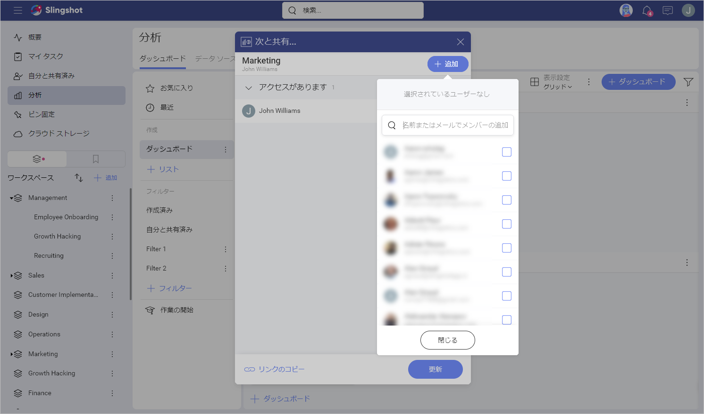
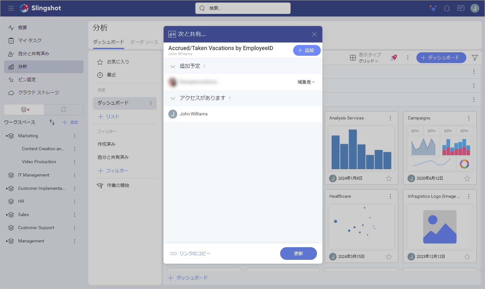
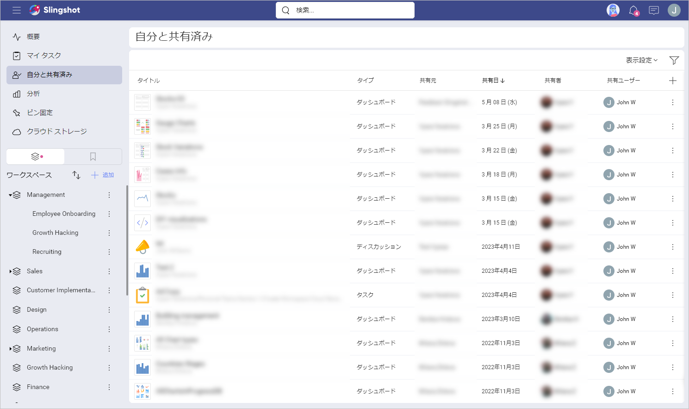
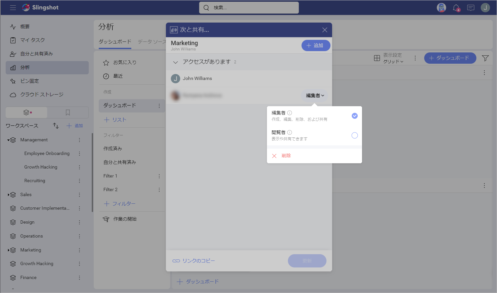

# ダッシュボードの共有

共有ダッシュボードは、チーム間のコラボレーションに最適です。Analytics での共有に関しては、非常に多くの利用シナリオが考えられます。

ここでは、アクセス許可のロールと利用可能な共有シナリオに関する詳細を確認できます:

  - [独自のダッシュボードを他のユーザーと共有する](#独自のダッシュボードを他のユーザーと共有する)

  - [ワークスペースのダッシュボードを他のユーザーと共有する](#ワークスペースのダッシュボードを他のユーザーと共有する)

  - [ワークスペース全体とダッシュボードを共有する](#ワークスペース全体とダッシュボードを共有する)

> [!NOTE]
> **フォルダーを共有**。この記事のダッシュボード共有のルールは、共有フォルダーにも適用されます。

## 独自のダッシュボードを他のユーザーと共有する

作成したダッシュボードを個人ユーザーと共有するには、次のことを行う必要があります。

1. ダッシュボードのオーバーフロー メニューから **[共有ユーザー]** を選択します。

  

2. メール アドレスまたは名前を入力して、ダッシュボードを共有するユーザーを選択します。準備ができたら、**[閉じる]** をクリックまたはタップします。

3. ユーザーを選択したら、**[更新]** をクリックまたはタップします。選択したユーザーが[組織](../../../security.md)に所属している場合、ダッシュボードは自動的に共有されます。他のユーザーは、招待を受け入れると、**[自分と共有済み]** セクションでダッシュボードを表示できるようになります。

4. フォルダーを他のユーザーと共有すると、ファイルは左側のパネルの **[自分と共有済み]** セクションに表示されます。または、**[分析]** を開き、**[フィルター]** の下にある **[自分と共有済み]** をクリックまたはタップしてファイルを見つけることもできます。
  

**ダッシュボードの管理者は**、**[共有ユーザー]** メニューにアクセスして、**いつでもユーザーのアクセス レベルを変更できます**。ダッシュボードを共有したすべてのユーザーとそのアクセス レベルのリストが表示されます。名前の横にあるドロップダウン メニューから新しいアクセス レベルを選択して、アクセス レベルを変更できます。

**ダッシュボードの管理者は**、**[次と共有...]** ダイアログにアクセスし、メンバーの名前の横にあるドロップダウン メニューから **[削除]** を選択することで、**いつでもダッシュボードの共有を解除できます**。

一般に、ユーザーは次の権限のいずれかを持つことができます:

  - **管理者**権限 - ユーザーは作成、編集、共有、および削除できます。

  - **編集者**権限 - ユーザーは作成、編集、共有 (管理者の承認を得て)、および削除できます。ユーザーは、共有された項目 (ダッシュボード / ダッシュボード リスト) を削除できないことに注意してください。

  - **閲覧者**権限 - ユーザーはダッシュボードを表示できます。また、管理者の承認後に別のユーザーと共有することもできます。

## ワークスペースのダッシュボードを他のユーザーと共有する

ワークスペースのメンバーは、ワークスペースのダッシュボードを他のユーザーと共有できます。そのためには次の手順を実行します。

1. **[ワークスペース]** タブに移動します。

2. **[ダッシュボード]** セクションからダッシュボードを選択します。 

3. [自分のダッシュボードを他のユーザーと共有する](#独自のダッシュボードを他のユーザーと共有する)の手順に従います。メンバーが他のメンバーとダッシュボードを共有するには、まずワークスペースの管理者がリクエストを承認する必要があることに注意してください。

## ワークスペース全体とダッシュボードを共有する

アクセス権のあるダッシュボードは、ワークスペース メンバーごとに個別に共有するのではなく、ワークスペースと共有できます。

これを行うには、**[分析]** または **[ワークスペース]** タブの **[ダッシュボード]** セクションからダッシュボードを選択します。次に、[自分のダッシュボードを他のユーザーと共有する](#独自のダッシュボードを他のユーザーと共有する)の手順に従います。

>[!NOTE]
>ダッシュボードは、メンバーであるかどうかに関係なく、[メイン組織に属する](../../../security.md)任意の公開ワークスペースと共有できます。自分がメンバーになっている非公開のワークスペースと共有することもできます。

## 関連項目

クラウド サービスにあるデータ ソース ファイルを使用してダッシュボードを作成した場合、ダッシュボードを共有するには、このファイルへのアクセスを許可する必要があります。詳細については、[クラウド ファイルをデータ ソースとするダッシュボードを共有する](sharing-dashboards-datasource-files-cloud-provider.md)トピックをご覧ください。
