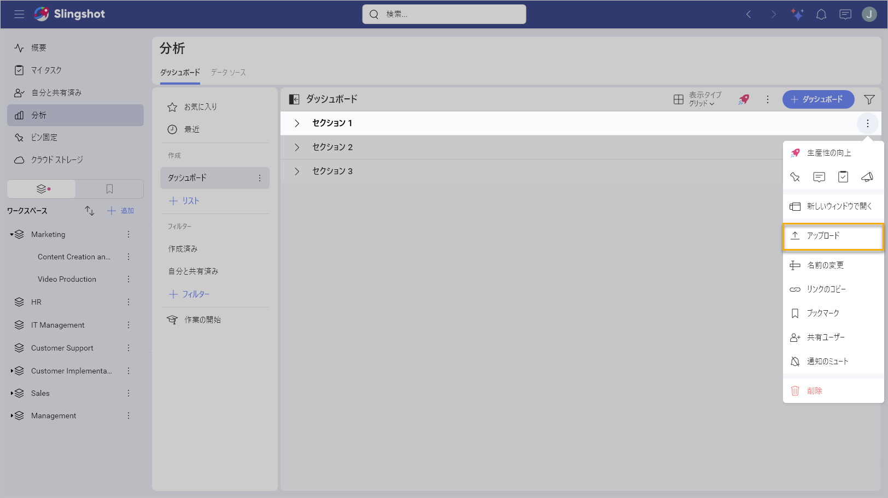

# ダッシュボードのアップロード

Slingshot では、直接アップロードしてコンピューター/デバイスに保存されたダッシュボードを操作することもできます。これを行うには、次のステップを実行します。

1. **[分析]** に移動します。

2. ダッシュボードを保存するダッシュボード セクションを開きます。

3. オーバーフロー メニューから **[アップロード]** を選択します。

    

2.  ローカル ファイルを表示するダイアログが開きます。アップロードするダッシュボードをダブルクリックまたはタップします。Reveal ダッシュボードのファイル拡張子は **.rdash** です。

    >[!NOTE]
    >**ReportPlus ダッシュボードのアップロード**。[分析] では、ReportPlus で作成されたダッシュボードをアップロードして操作することもできます。ReportPlus ダッシュボードのファイル拡張子は **.rplus** です。

これでダッシュボードがアップロードされ、編集して他のユーザーと共有する準備が整いました。
