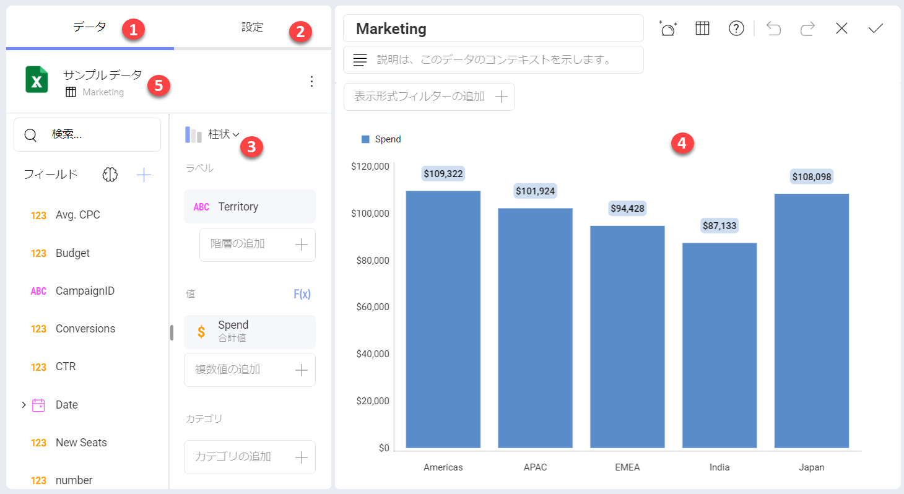

# 表示形式エディターの作業

**表示形式エディター**は、Analytics で表示形式を作成および編集する場所です。ここでは、データセットからのデータが集約されて使用できるように準備されているほか、それを使用して構築するためのさまざまな表示形式が表示されます。

## 表示形式の作成方法

表示形式は、ダッシュボードの基本要素です。したがって、表示形式の作成を開始するときに、開始点には ２ つの選択肢があります。

* **新しいダッシュボードを作成する**ことから始めます。このダッシュボードでは、新しい表示形式が最初または唯一の表示形式になります。これを行うには、**[分析]** またはワークスペースに移動し、**[+ ダッシュボード]** の青いボタンをクリックまたはタップします。

* 既存のダッシュボードに**新しい表示形式を追加する**ことから始めます。これを行うには、ダッシュボードを[ダッシュボード編集](../dashboards/dashboards-interactions.md#ビュー--編集モード)モードで開き、**[+ 追加]** の青い分割ボタン (モバイルでは **[+]** 青いボタン) をクリックまたはタップします。

その後、新しいデータ ソースを追加するか、既存の[データ ソース](~/docs/analytics/datasources/overview.md)を選択するように求められます。

データ ソースを選択して構成すると、[表示形式エディター](../data-visualizations/visualization-editor.md)に移動し、表示形式の作成を開始できます。

表示形式エディターは、データを使用して最も望ましいビューを作成するのに役立ちます。

## 表示形式エディターにアクセスする

表示形式エディターには、次の 2 つの方法でアクセスできます:

***1. 表示形式作成プロセス***

データ ソースを選択して設定すると、**表示形式エディター**が自動的に開きます。

***2. ダッシュボード編集プロセス***

選択したダッシュボードを開き、**ダッシュボード編集**モードに入ると、表示形式のオーバーフロー ボタンから **[編集]** を選択して、**表示形式エディターにアクセス**できます。または、オーバーフロー メニューの横にある鉛筆アイコンをクリックまたはタップすることもできます。

## 表示形式エディターの概要

以下は、**エディター**のすべてのセクションとその機能のリストです。

1. **[データ] セクション** - このセクションには 2 つのパネルがあります。

  a. **[フィールド]** - データ ソース内で使用可能なすべてのフィールドが左側のパネルに表示されます。各フィールドには、フィールド タイプ (**日付**、**値**、**テキスト**) をユーザーに通知するインジケーターがあります。使用可能なフィールドが 10 を超えると、検索バーが表示されます。
       このパネルの [+] アイコンを使用すると、[データ ソースをブレンドする](~/docs/analytics/datasources/data-blending.md)か、[フィールドを計算](fields/calculated-fields/overview.html#事前計算フィールド)することができます。**脳**アイコンを使用すると、[BigQuery](~/docs/analytics/datasources/ml-integration/bigquery-machine-learning-models.md) または [Azure](~/docs/analytics/datasources/ml-integration/azure-machine-learning-models.md) の**機械学習モデル**のフィールドを表示形式に使用できます。BigQuery 機械学習モデルは、BigQuery データ ソースでのみ機能することにご注意ください。

  b.**表示形式フィールド** - ここでフィールドをドラッグアンドドロップするか、**[+]** マークをクリックして使用可能なフィールドから作成する表示形式に使用するフィールドを選択します。

1. **[設定] セクション** - このセクションでは、表示する内容をカスタマイズできます。各表示形式には独自の設定があります。

    **[設定]** セクションの下部に、リンクのオプションが表示されます。これは、ドリル ダウンを全く新しいレベルに到達させる強力な機能です。詳細については、[ダッシュボード リンク](~/docs/analytics/dashboards/dashboard-linking.md)トピックをご覧ください。

2. **表示形式ピッカー** - ここで目的の表示形式を選択して、最終結果をプレビューできます。ドロップダウン メニューでさまざまなチャートの種類を切り替えると、表示形式フィールドのセクションが変更されます。各表示形式のフィールドは異なりますが、入力するだけで自動的に変更されます。

3. **表示形式のワークスペース** - フィールドをドラッグアンドドロップしながら作成または編集している表示形式を確認できます。そのチャート タイプを作成するために必要なすべてのフィールドが揃うまで、表示形式は入力されません。

4. **データ ソース** - 現在使用しているデータ ソースがここに表示されます。クリックによってデータ ソース内のシート、テーブル、またはビューを変更し、またエディターを離れることなく、接続を新しいデータ ソースへ完全に変更できます。詳細については、[表示形式に使用するデータ ソースの変更](~/docs/analytics/datasources/changing-data-source-visualization.md)トピックを参照してください。

特に、次のことが可能になります:

  - [**データの並べ替え**](~/docs/analytics/data-visualizations/fields/sort-by-field.md)と[**フィルタリング**](~/docs/analytics/filters/visualization-filters.md)。

  - データ エディターで[**データの集計**](./fields/calculated-fields/aggregation.md)。

  - データの**検索**、**視覚化**、および[**書式設定**](~/docs/analytics/data-visualizations/fields/conditional-formatting.md)。

表示形式の作成を完了したら、**チェック** アイコンを選択して**ダッシュボード エディター**に戻ります。ダッシュボード エディターでは、表示形式をドラッグしてレイアウト、サイズ、配置を操作できます。ダッシュボードの書式設定とスタイル設定の準備ができたら、**チェック** アイコンをもう一度クリック / タップしてダッシュボードを保存します。
