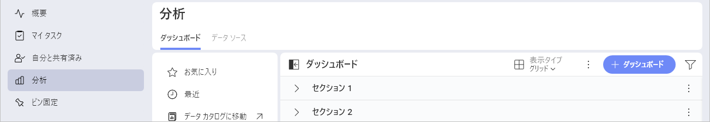
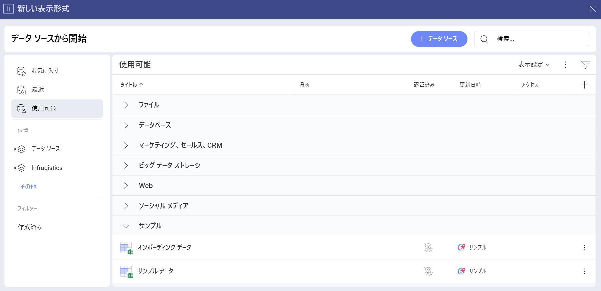
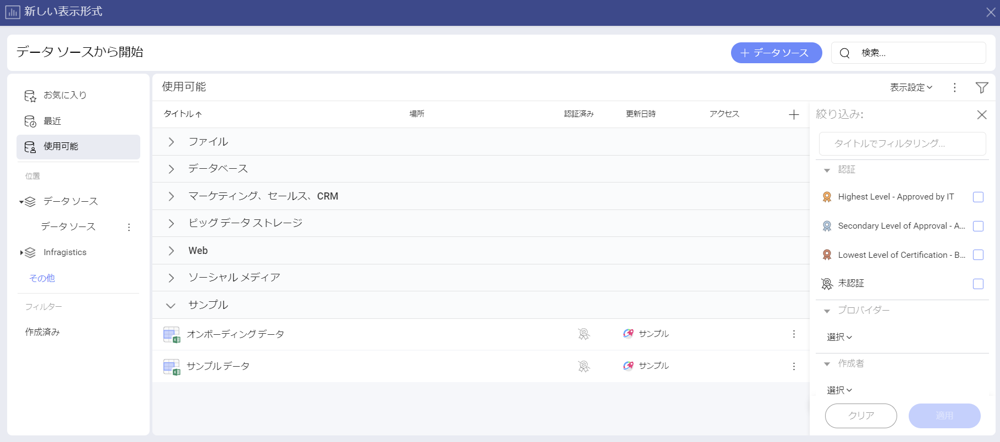

# データ ソース

データ ソースはデータの送信元です。Analytics は、さまざまなエンタープライズ データ ソースに接続する機会を提供します。分析ツール、コンテンツ マネージャー、クラウド サービス、CRM、データベース、スプレッドシート、および公開用のデータ ソースから選択できます。

## データ ソースに接続

データ ソースから情報を取得し、それを表示形式に使用するには、まずデータ ソースに接続する必要があります。データ ソースに接続すると、**[データ ソース]** メニューに保存され、次に必要になったときにすばやく選択できます。

データ ソースに接続するには、以下の手順を実行します:

1. **[分析]** またはダッシュボードを作成するワークスペースに移動します。
2. **[+ ダッシュボード]** の青いボタンをクリックまたはタップします。

   
3. **[データ ソース]** ダイアログに、最近使用したデータ ソースのリストが表示されます。新しい接続を作成するには、右上隅にある **[+ データ ソース]** ボタンを選択します。

   

データ ソース プロバイダーを選択すると、データ ソースを**設定**するように求められます。設定に関しては、選択したデータ ソースの設定に関する記事をご覧ください (以下のリストを参照)。

   - [Amazon Athena](~/jp/docs/analytics/datasources/supported-data-sources/athena.md)

   - [Amazon Redshift](~/jp/docs/analytics/datasources/supported-data-sources/redshift.md)

   - [Box](~/jp/docs/analytics/datasources/supported-data-sources/box.md)

   - [Dropbox](~/jp/docs/analytics/datasources/supported-data-sources/dropbox.md)

   - [Facebook](~/jp/docs/analytics/datasources/supported-data-sources/facebook.md)

   - [Google Ads](~/jp/docs/analytics/datasources/supported-data-sources/google-ads.md)

   - [Google Analytics](~/jp/docs/analytics/datasources/supported-data-sources/google-analytics.md)

   - [Google BigQuery](~/jp/docs/analytics/datasources/supported-data-sources/google-bigquery.md)

   - [Google Drive](~/jp/docs/analytics/datasources/supported-data-sources/google-drive.md)

   - [Google Search Console](~/jp/docs/analytics/datasources/supported-data-sources/google-search-console.md)

   - [Hubspot](~/jp/docs/analytics/datasources/supported-data-sources/hubspot.md)

   - [Instagram](~/jp/docs/analytics/datasources/supported-data-sources/instagram.md)

   - [LinkedIn](~/jp/docs/analytics/datasources/supported-data-sources/linkedin.md)

   - [Marketo](~/jp/docs/analytics/datasources/supported-data-sources/marketo.md)

   - [Microsoft Analysis Services](~/jp/docs/analytics/datasources/supported-data-sources/microsoft-analysis-services.md)

   - [Microsoft Azure Analysis Services](~/jp/docs/analytics/datasources/supported-data-sources/microsoft-azure-analysis-services.md)

   - [Microsoft Azure Synapse Analytics](~/jp/docs/analytics/datasources/supported-data-sources/microsoft-azure-synapse-analytics.md)
   
   - [Microsoft Azure SQL Database](~/jp/docs/analytics/datasources/supported-data-sources/azure-sql.md)

   - [Microsoft Dynamics CRM](~/jp/docs/analytics/datasources/supported-data-sources/microsoft-dynamics-crm.md)

   - [Microsoft Reporting Services (SSRS)](~/jp/docs/analytics/datasources/supported-data-sources/microsoft-reporting-services.md)

   - [Microsoft SQL Server](~/jp/docs/analytics/datasources/supported-data-sources/microsoft-sql-server.md)

   - [MySQL](~/jp/docs/analytics/datasources/supported-data-sources/mysql.md)

   - [OData フィード](~/jp/docs/analytics/datasources/supported-data-sources/odata-feed.md)

   - [OneDrive](~/jp/docs/analytics/datasources/supported-data-sources/onedrive.md)

   - [Oracle](~/jp/docs/analytics/datasources/supported-data-sources/oracle.md)

   - [PostgreSQL](~/jp/docs/analytics/datasources/supported-data-sources/postgresql.md)

   - [Quickbooks](~/jp/docs/analytics/datasources/supported-data-sources/quickbooks.md) 

   - [REST API](~/jp/docs/analytics/datasources/supported-data-sources/rest-api.md)

   - [Salesforce](~/jp/docs/analytics/datasources/supported-data-sources/salesforce.md)

   - [SharePoint](~/jp/docs/analytics/datasources/supported-data-sources/sharepoint.md)

   - [Snowflake](~/jp/docs/analytics/datasources/supported-data-sources/snowflake.md)

   - [Sybase](~/jp/docs/analytics/datasources/supported-data-sources/sybase.md)

   - [ウェブ リソース](~/jp/docs/analytics/datasources/supported-data-sources/web-resource.md)

   - [JSON ファイル](~/jp/docs/analytics/datasources/working-files/working-with-json-files.md)
   
   - [スプレッドシート](~/jp/docs/analytics/datasources/working-files/working-with-spreadsheets.md)

## データ ソースのフィルタリング

データ ソースをフィルターするには、右上隅にあるフィルター ボタンをクリックします。

   

## 関連トピック 

- まだ接続していないデータ ソースからのデータを使用するダッシュボードを受け取りましたか? [ダッシュボードをデータ ソースに接続](connect-dashboard-to-data-source.md)トピックで開く方法を参照してください。
- 表示形式の作成途中でデータ ソースを変更することにしましたか? 表示形式エディターで別のデータ ソースに接続する方法については、[表示形式に使用するデータ ソースの変更](changing-data-source-visualization.md)を参照してください。
- 複数のデータ ソースからのデータを表示形式に使用しますか? [データ ソースを 1 つの表示形式に統合](data-blending.md)を参照してください。
