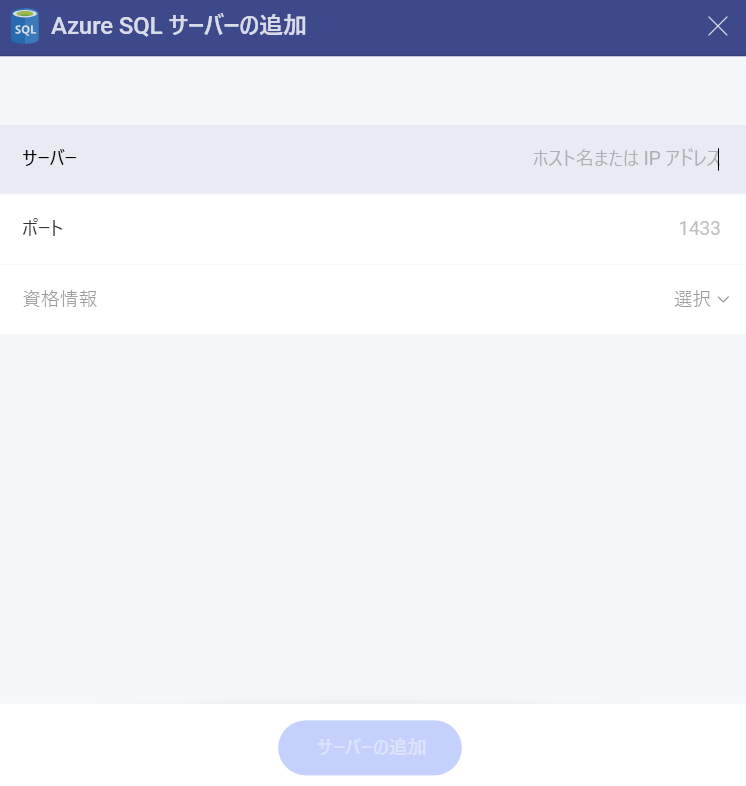

# Azure SQL

> [!NOTE] 
>**Web の制限**。*Analytics Web* アプリでは、公的にアクセス可能な Azure SQL アドレスにのみ接続できます。Azure SQL アドレスが一般公開 (プライベートまたは会社のイントラネットでホストされているなど) に制限されている場合は、*Analytics Desktop*、*iOS*、または *Android* を使用して接続できます。Analytics を実行しているデバイスは、SQL Server アドレスにアクセスできる必要があります。この制限は、*Analytics Embedded* には適用されません。

## Azure SQL への接続

Azure SQL データ ソースを構成するには、以下の情報が必要です。

1.  **[サーバー]**: コンピューター名またはサーバーを実行しているコンピューターに割り当てられた IP アドレス。

2.  **[ポート]**: 該当する場合、サーバー ポートの詳細。情報が入力されない場合、Analytics はデフォルトでヒント テキスト (1433) のポートに接続します。

3.  **[資格情報]**: [資格情報] を選択した後、Azure SQL の資格情報を入力するか、既存の資格情報 (適用可能な場合) を選択できます。

  - **[ユーザー名]**: Azure SQL のユーザー アカウントまたはドメインの名前。

  - **[パスワード]**: Azure SQL にアクセスするためのパスワード。

  - **データ ソースのエイリアス**: データ ソース名は、前のダイアログのアカウントのリストに表示されます。デフォルトでは、Analytics は *Microsoft Azure SQL Database* という名前を付けます。好みに合わせて変更できます。

準備ができたら、**[追加]** を選択してから **[サーバーの追加]** を選択します。

## 詳細情報

以下の詳細については、Analytics の両データ ソースは同様に機能するため、[**SQL Server**](microsoft-sql-server.md#サーバー情報を見つける方法) を参照してください。

  - サーバー情報を見つける方法

  - ビューの作業

  - 保管されたプロシージャの作業

