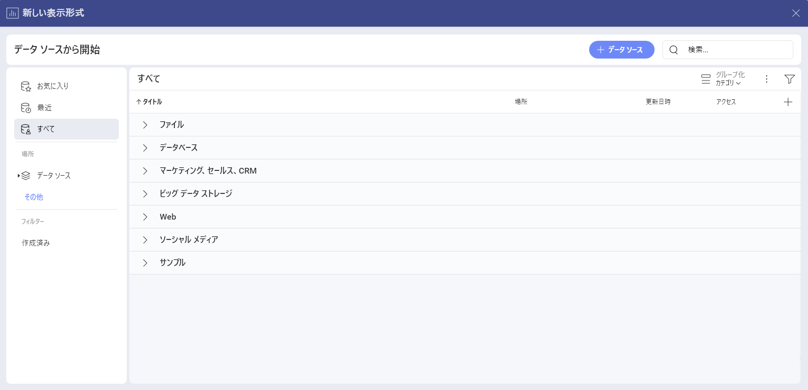
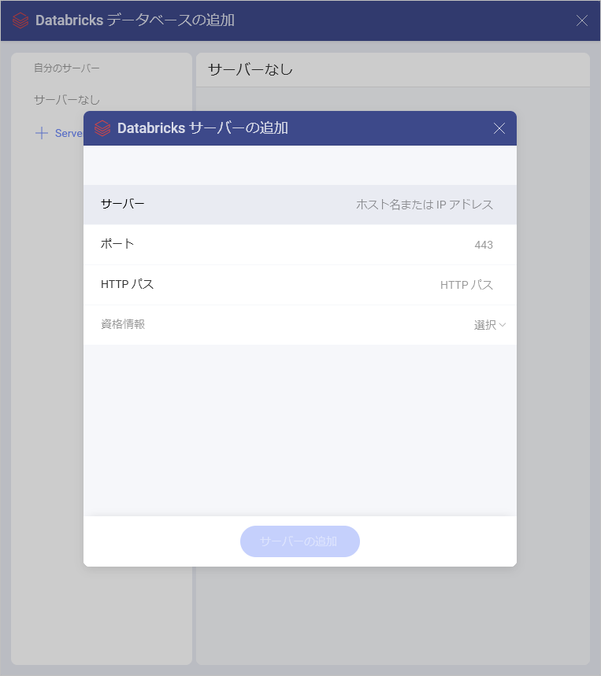
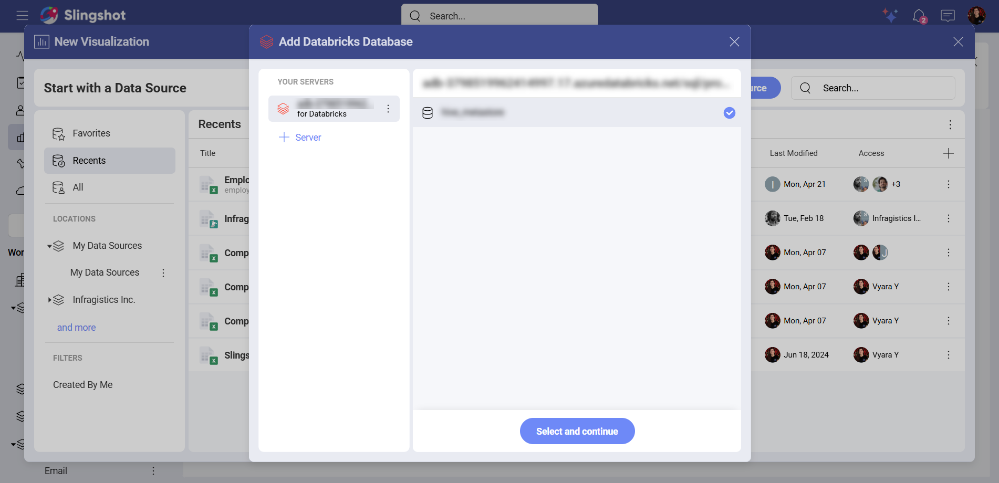
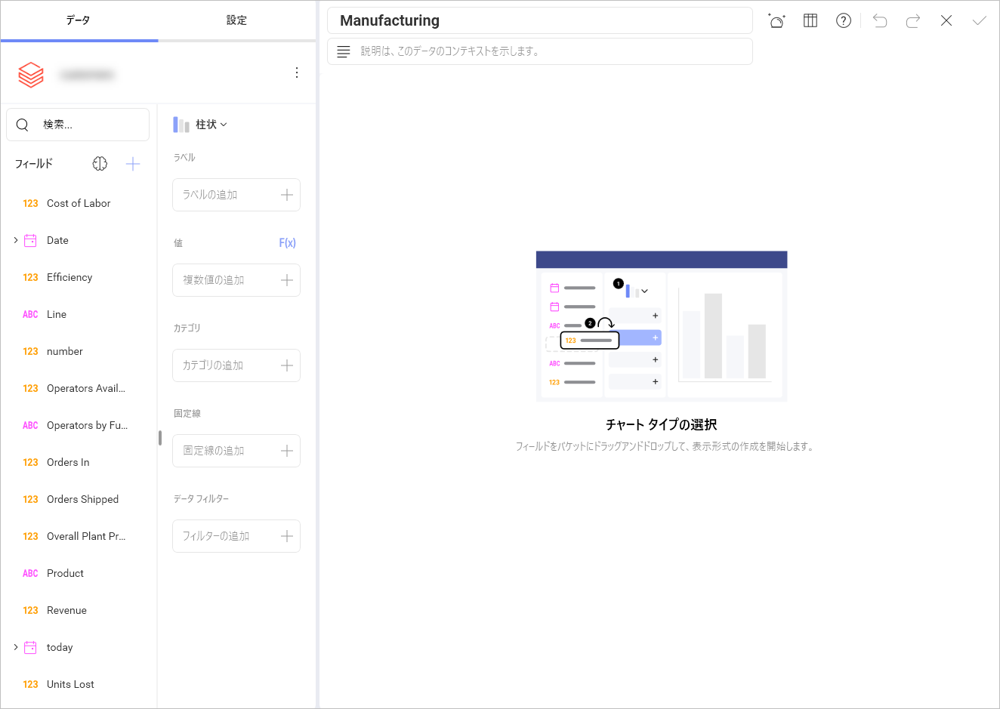
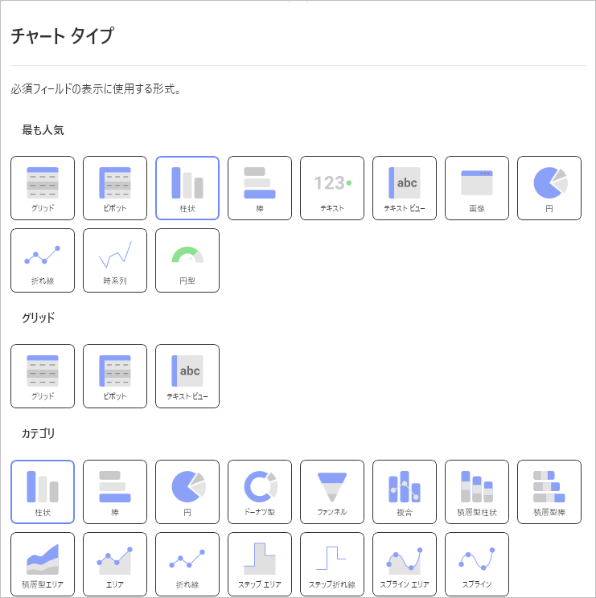
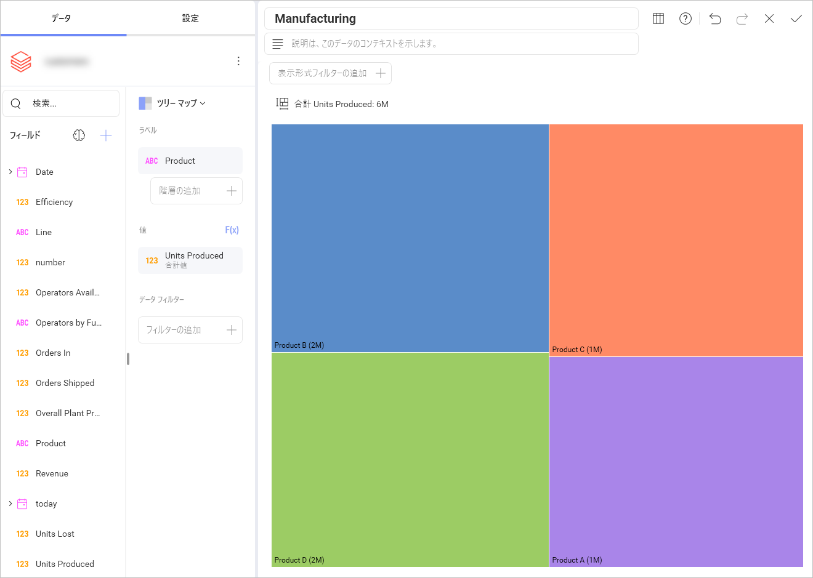

# Databricks

Slingshot の Databricks データ ソースを使用すると、洞察に富んだ表示形式を作成するために大量のデータにアクセスできます。

## Databricks への接続

**Databricks** に接続するには、次のことが必要です。

1.	ダッシュボード リストで **[+ ダッシュボード]** ボタンをクリックまたはタップします。

2. **[空のダッシュボード]** を選択します。

3.	**[+ データ ソース]** ボタンをクリックします。

4.  **[データ ソース]** リストから **[Databricks]** を選択します。

5.	以下の情報の入力が求められます:

- サーバー: これは Databricks ワークスペースのホスト名です。

- ポート: ここでサーバー ポートの詳細を入力できます。情報が入力されない場合、Analytics はデフォルトでヒント テキスト (443) のポートに接続します。

- HTTP パス: これは、サーバー内の Databricks リソースへのパスです。

- 資格情報: **[資格情報]** を選択した後、次の情報を入力する必要があります。

    - クライアント ID: これは OAuth アプリケーションのクライアント ID です。

   - クライアント シークレット: これは OAuth アプリケーションに関連付けられたシークレットです。

接続の詳細 (サーバー、ポート、HTTP パス) を取得する方法の詳細については、<a href="https://docs.databricks.com/aws/ja/integrations/compute-details" target="blank" rel="noopener">この</a>記事を参照してください。

クライアント ID とクライアント シークレットの詳細については、<a href="https://docs.databricks.com/aws/ja/dev-tools/auth/oauth-m2m" target="blank" rel="noopener">こちら</a>を参照してください。

## データの設定

Databricks データ ソース接続を構成した後、次のことができます。

1.	データベースを選択します。

<!--  -->

2.	テーブルを選択します。

<!--  -->

## 表示形式エディターでの作業

データ ソースを追加した後、[表示形式エディター](/docfx/jp/docs/analytics/data-visualizations/visualization-editor.md)が表示されます。ここでは、テーブル内のフィールドを使用してダッシュボードを作成できます。

デフォルトでは、**柱状**チャートが表示されます。それを選択して、別のチャート タイプを選択できます。

>[!NOTE] チャート タイプに応じて、さまざまな設定オプションがあります。

この例では、さまざまな製品の単価に関する階層データを表示したいと考えました。マップ表示形式を選択し、**[ラベル]** に *Product* を選択し、**[値]** に *Units Produced* を選択しました。

