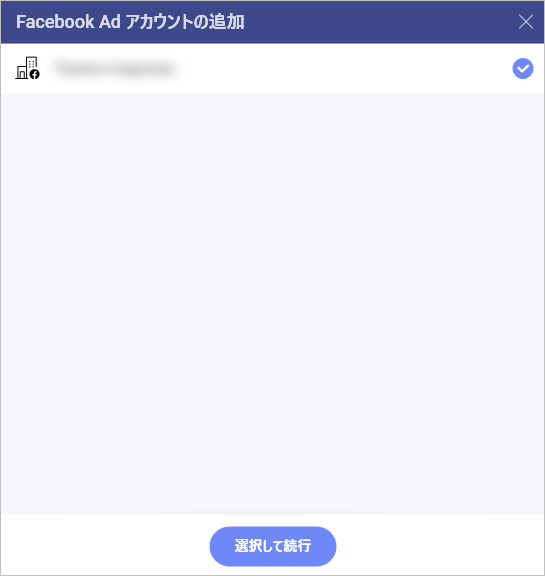
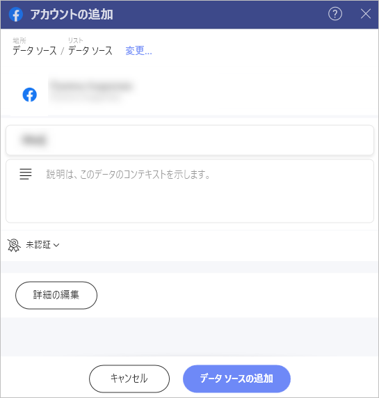
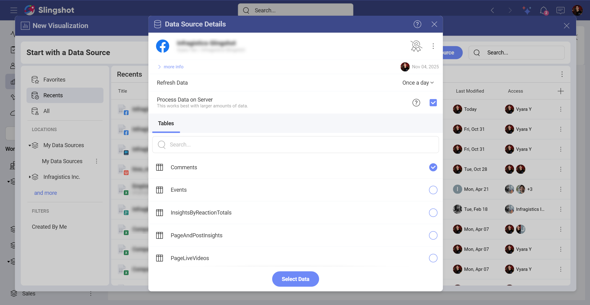
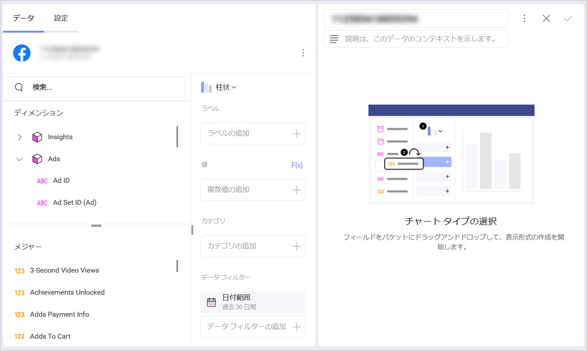

# Facebook Organic

Slingshot の Facebook Organic データ ソース コネクターを使用すると、無料のソーシャル メディア パフォーマンスに関するデータに基づいて表示形式を作成できます。

## 前提条件

Slingshot で *Facebook Organic* に接続するには、**ページ管理者**または**ビジネス管理者**である必要があります。または、Facebook ページに招待され、インサイトとページ コンテンツを表示するための適切な権限を持っている必要があります。

さまざまなページ権限レベルの詳細については、<a href="https://www.facebook.com/business/help/1101781386943864" target="blank" rel="noopener">こちら</a>を参照してください。

Facebook ユーザーをページに招待する方法の詳細については、<a href="https://www.facebook.com/help/187316341316631 " target="blank" rel="noopener">こちら</a>を参照してください。

## Facebook Organic への接続

**ページ管理者**または**ビジネス管理者**の場合は、以下の手順に従って Slingshot の Facebook Organic データ ソースに接続できます。

1.	ダッシュボード リストで **[+ ダッシュボード]** ボタンをクリックまたはタップします。

2. **[空のダッシュボード]** を選択します。

3.	**[+ データ ソース]** ボタンをクリックします。

4.	**[データ ソース]** リストで **[ソーシャル メディア]** の下にある **Facebook** を選択します。

5.	**Facebook プロファイル**でログインするように求められます。

<a href="https://www.facebook.com/help/1021117938014211" target="blank" rel="noopener">Facebook ページに招待された</a>場合は、まず招待を受け入れる必要があります。その後、上記の手順に従って Slingshot の Facebook Organic データ ソースに接続できます。

## データの設定

**Facebook Organic** に接続した後、次の操作を行う必要があります。

1.	アカウントを追加します。1 つ以上の Facebook Organic アカウントから選択できます。分析したいアカウントを選択し、**[選択して続行]** をクリックまたはタップします。

2.	**データ ソース**を追加します。データ ソースを追加する前に、アカウント名を変更し、適切な説明を追加し、データ ソースが認定済みかどうか (**Enterprise** ユーザー向け) を確認し、詳細を編集できます。適切な説明を追加すると、すべてのユーザーが長いリストをナビゲートし、検索しているデータ ソースを見つけるのに役立ちます。

3.	テーブルを選択します。

<!--  -->

## 表示形式エディターでの作業

テーブルを選択すると、**表示形式エディター**が表示されます。ここでは、テーブル内のデータを使用してダッシュボードを作成できます。

Facebook Organic データは、表示形式の作成に使用できる 2 つのカテゴリに分類されています。

- **ディメンション**には、質的データ ("Target"、"Message" など) が含まれます。

- **メジャー**は数値データで構成されます。

>[!NOTE] デフォルトでは、**柱状**チャートが表示されます。それを選択して、別のチャート タイプを選択できます。

**表示形式エディター**の準備ができたら、ダッシュボードを **[分析]** ⇒ **[ダッシュボード]**、特定のワークスペース、またはプロジェクトに保存できます。