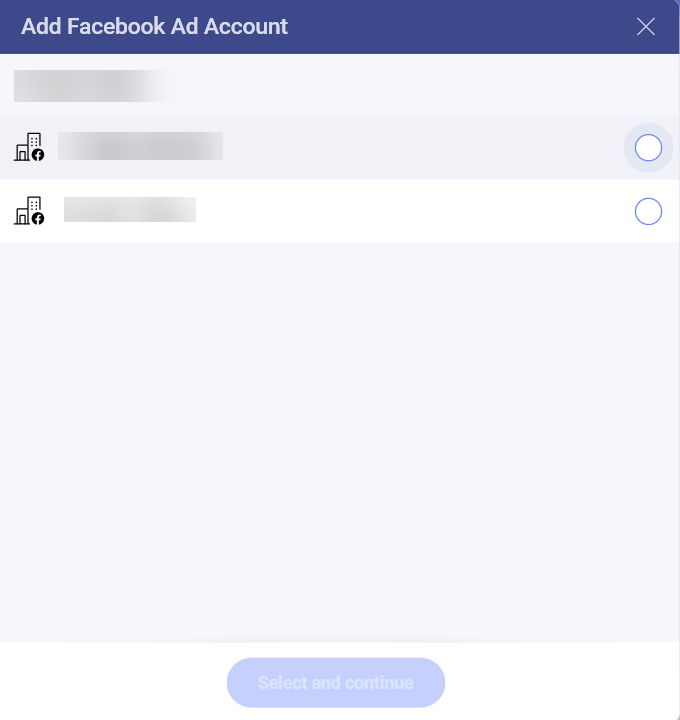
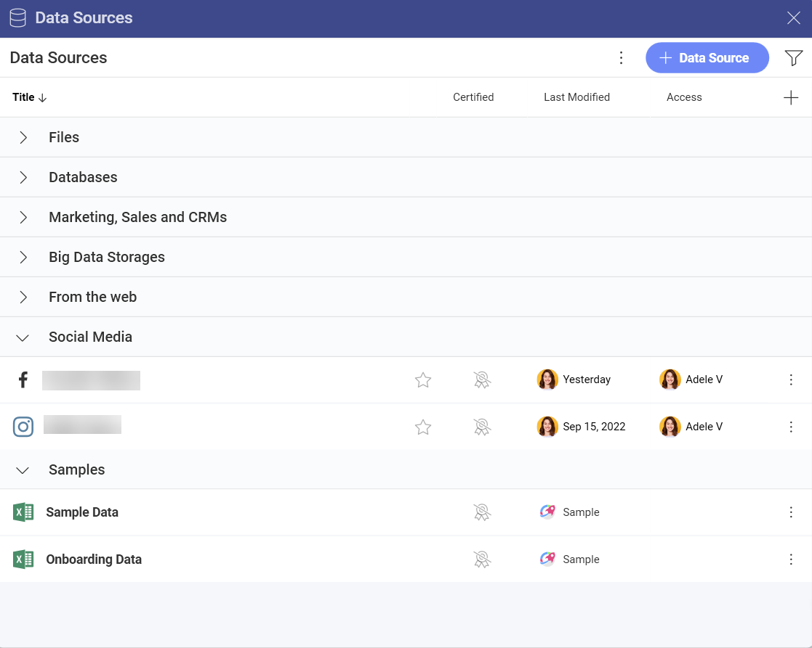
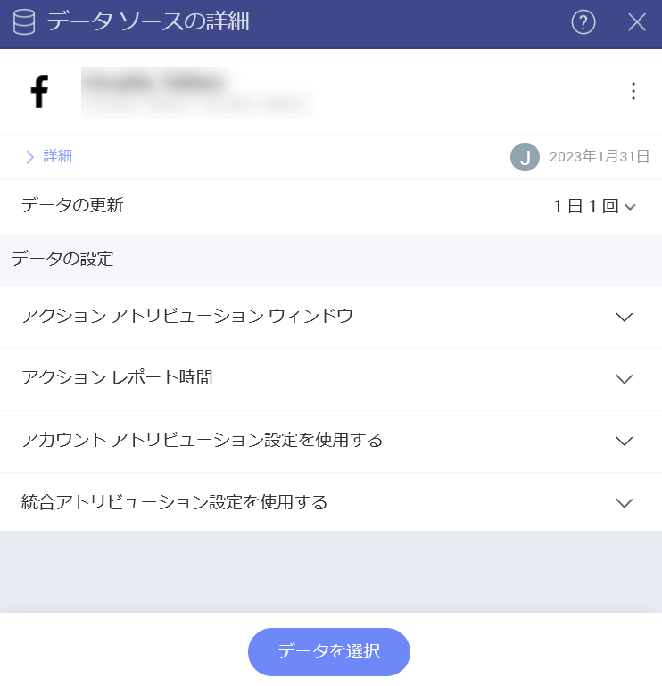
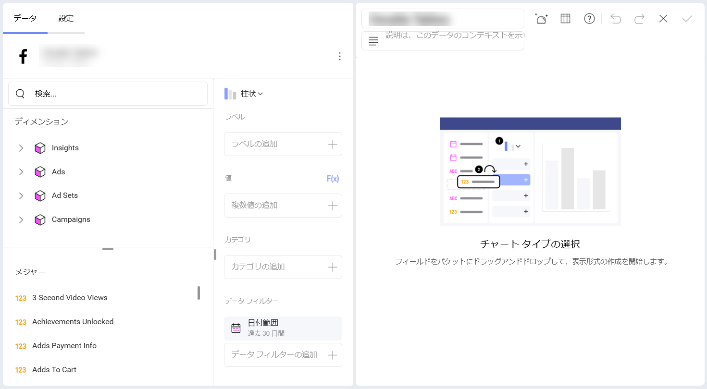

# Facebook 

[分析] の *Facebook* データ ソース コネクターを使用すると、Facebook のマーケティング データを Slingshot に取り込むことができます。**広告アカウント**のデータを使用して、インサイトに満ちたダッシュボードを作成し、ビジネスのソーシャル メディアのパフォーマンスを測定します。

## 前提条件

Facebook データ ソース コネクターは、Facebook **広告アカウント** データに接続します。分析で Facebook データ ソースを使用する前に、次のことを確認してください:

* [Meta for Business](https://ja-jp.facebook.com/business/help/) アカウントを使用すること。
* 広告マネージャで、接続するプロファイルまたは Facebook ページの[*広告アカウント*を追加、要求、または作成した](https://ja-jp.facebook.com/business/help/910137316041095?id=420299598837059)こと。
* 接続するプロファイル / ページの**広告アカウント**は無効化されていないこと。よくわからない場合は、この [Meta ヘルプ記事](https://ja-jp.facebook.com/business/help/1798922733589154)を使用して、必要に応じて広告アカウントを確認して再度アクティブにしてください。 

## 新しい Facebook データ ソース アカウントの追加

Facebook データ ソースを**データ ソース** リストにすでに追加している場合は、この部分をスキップして、[データの設定](#setting-up-your-data)に進むことができます。

*Facebook* データ ソースをリストに追加するには、以下の手順に従ってください:

1.	**[分析]** セクションの下にある **[+ ダッシュボード]** ボタンをクリックします。
2.	**[+ データ ソース]** ボタンをクリックします。
3.	**[データ ソース]** リストで **[ソーシャル メディア]** の下にある *Facebook* を選択します。
4. *Facebook* プロファイルでログインするように求められます。 

    >[!NOTE] **分析**で接続しようとしている Facebook プロファイルに関連付けられた**広告アカウント**が少なくとも 1 つ必要です。この [Meta ヘルプ記事](https://ja-jp.facebook.com/business/help/910137316041095?id=420299598837059)を読んで、Meta Business Manager で**広告アカウント**を追加、要求、および作成する方法を確認してください。

5. 次のダイアログでは、選択できる Facebook 広告アカウントが表示されます。分析するアカウントを選択し、**[選択して続行]** をクリックまたはタップします。

   

6. 開いた最後のダイアログで、広告アカウント名を変更し、適切な説明を追加できます。適切な説明を追加すると、すべてのユーザーが長いリストをナビゲートし、検索しているデータ ソースを見つけるのに役立ちます。**[データ ソースの追加]** を選択してプロセスを終了します。

   

以下に示すように、データ ソース リストの下部に新しい Facebook 広告アカウント接続が追加されます。

  

## データの設定

[データ ソース] リストから、接続する Facebook 広告アカウントを選択します。[データ ソースの詳細] ダイアログが表示され、データを確認して設定できます (下のスクリーンショットを参照)。 

ここに、次のデータ ソースの詳細があります: 

* タイプと名前。 
* 説明。 
* [認証](../certification.md)。
* データ ソースを追加したユーザー。 
* 最後に変更したユーザーとその日付。 
* アクセスできるユーザーとワークスペース。 
* データの更新頻度。変更するには、右側のドロップダウンを選択します。 

**[データの設定]** は、表示形式エディターに読み込むデータを選択するのに役立ちます。

* **[アトリビューション ウィンドウ](https://www.facebook.com/business/help/2198119873776795?id=768381033531365)** - ドロップダウン リストから特定の期間のデータを表示するように選択できます。 
* **アクション レポート時間** - **impression** (インプレッション)、**conversion** (コンバージョン)、および **mixed** (混合) に関するデータをレポートするように選択できます。
* [アカウント アトリビューション設定](https://www.facebook.com/business/help/460276478298895?id=561906377587030)を使用するかどうか。
* 統合アトリビューション設定を使用するかどうか。

準備ができたら、**[データを選択]** をクリック / タップして、*表示形式エディター*に進みます。 

## 表示形式エディターでの作業

データ ソースを追加した後、表示形式エディターが表示されます。デフォルトでは、**柱状**表示形式が選択されます。それを開いて、ドロップダウン メニューから別のチャート タイプを選択できます。
 
選択した表示形式に基づいて、さまざまなタイプのフィールドが表示されることに注意してください。

