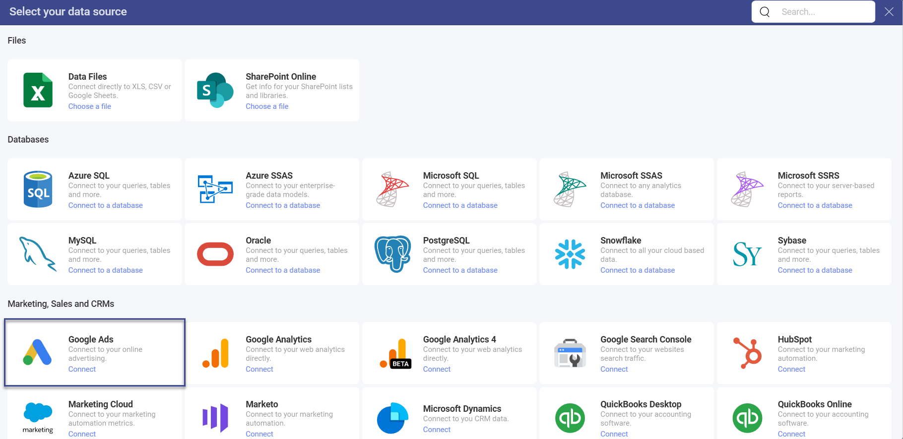
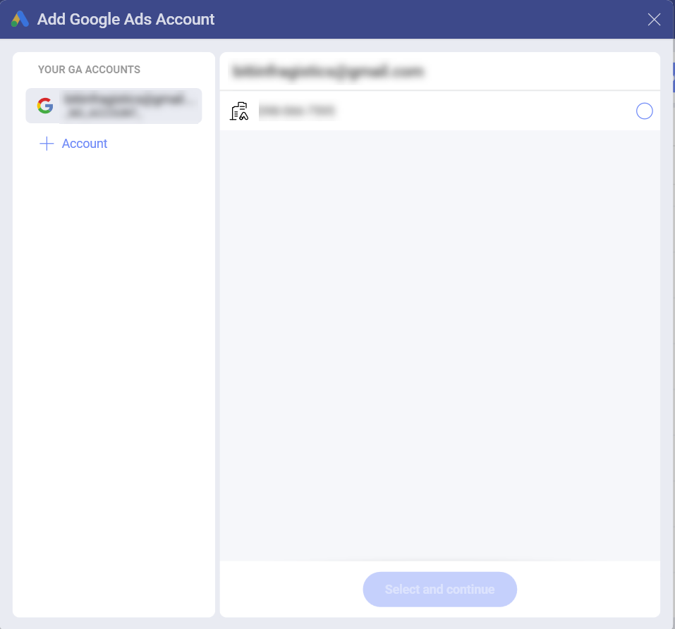
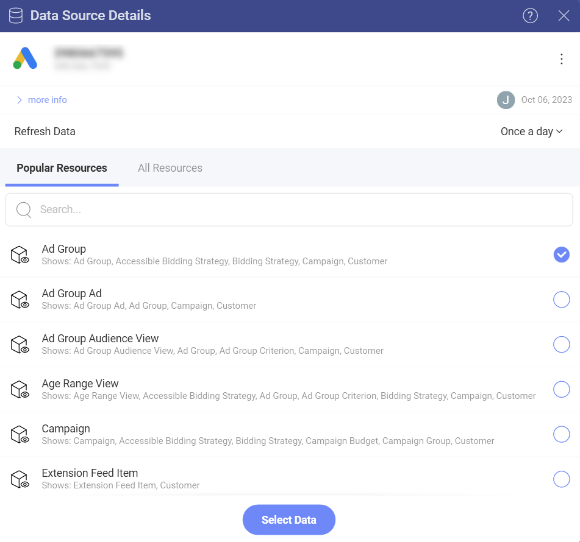
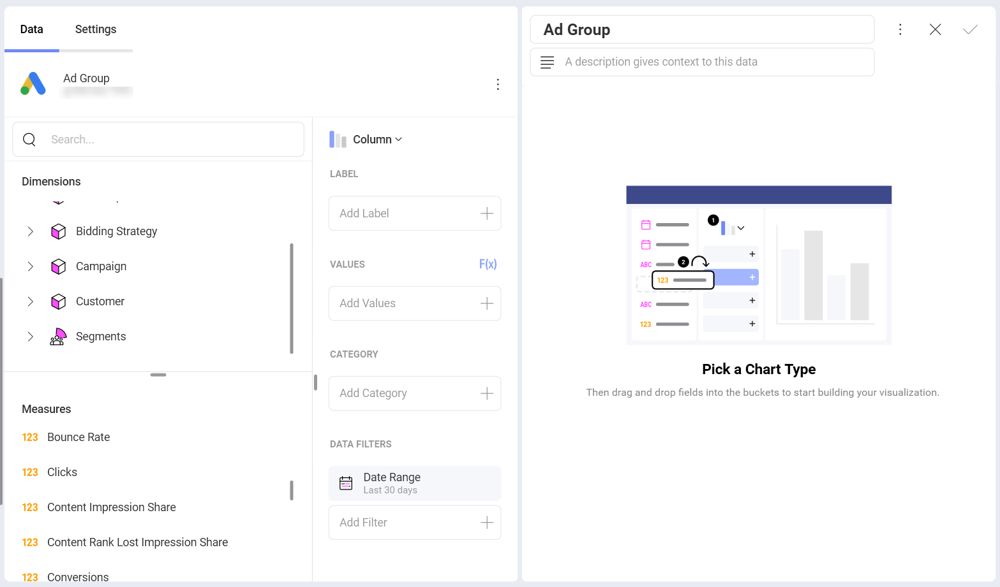

# Google 広告

Google 広告データ ソースを使用すると、Google 広告 (以前の Google Adwords) アカウントからデータ テーブルにアクセスして分析できます。Google 広告データを使用して表示形式を作成し、広告活動の高レベルの理解を構築します。

## Google 広告に接続する

In order to connect your Google Ads account to Slingshot, you need to:

1. Select *Google Ads* from the data sources list. 

2. Google's login screen will pop up. If multiple Google accounts are listed, select the account that contains the Google Ads data you want to access. 

3. Enter your login credentials, if you are not already signed in. 

4. Select *Allow* in the authorization prompt.

5. Choose a *Google Ads* account. If your Google account is connected to several Google Ads accounts, select the one you want to use in the following dialog.

6. Choose a resource from one of the two lists: *Popular Resources* or *All Resources*. Use the search to find quickly what you need.

>[!NOTE] Under each resource you will see a description. It gives information which dimensions from Google Ads are included in that specific resource. 

 

7. When you are ready, click/tap on **Select Data** to continue to the *Visualization Editor*.

## 表示形式エディターでの作業 

Google 広告からの情報を使用してダッシュボードを作成すると、表示形式エディターのフィールドが異なる方法で編成されていることがわかります (下のスクリーンショットを参照)。

**[データ]** ペインの左側に **[フィールド]** の見出しがないことに気付くかもしれません。代わりに、クエリ フィールドに 2 つのセクションがあります。

1. **ディメンション (Segments (セグメント) も含む)**: 

    a. **ディメンション**は、ピンク色の側面の立方体アイコンで表されます。ディメンションには、測定可能なデータの属性が含まれています。たとえば、*Ad Group* キューブの下のディメンション *Name* には、すべての広告グループが表示されます。 

    b. **Segments** は、人々のグループを示す 1 つのアイコンで表されます。セグメントは、*表示形式エディター*に読み込む Google 広告*リソース*ごとに異なります。Slingshot では、ディメンションを使用するのと同じ方法で、測定可能なデータまたはデータ フィルターとして Google 広告セグメントを使用できます。  
    セグメントの詳細については、公式の <a href="https://support.google.com/google-ads/answer/2454072?hl=en#zippy=" target="_blank">Google 広告ヘルプ</a>をご覧ください。 

2. **メジャー** ([123] アイコンで表示): メジャーは数値データで構成されます。たとえば、[Clicks] メジャーは、広告がクリックされた回数を示します。

### 日付範囲データ フィルター

**データ フィルター** ([データ] ペインの右下を参照) には、デフォルトで [過去 30 日間] に設定されている日付範囲フィルターがあります。つまり、今日を含む過去 30 日間のデータが取得されます。

日付フィルターを削除することはできませんが、カレンダー アイコンをクリック / タップしてデフォルトの日付範囲を変更できます。開始日*と終了日を選択します。または、右上隅の矢印をクリック/タップして (スクリーンショットを参照)、ドロップダウン オプションから日付範囲を選択します。

> [!NOTE] 
> **[今日]** に取得されたデータ。
> 日付範囲オプションから [今日] を選択した場合、日付範囲は午前 12:00:00 に開始し、すべてのデータは現在の時刻まで取得されることに注意してください。これは、Google 広告のデータが継続的に更新されているため、結果が 1 日を通して実行ごとに異なる可能性があることを意味します。  

## パフォーマンスについての考慮

取得しようとしているデータの量によっては、表示形式エディターで Google 広告からデータを読み込むのは時間のかかる作業になる場合があります。特定の操作は、他の操作よりも待機時間に影響を与えます。

### 日付範囲の選択

日付範囲を選択するときは、範囲が大きいほど、データの読み込みにかかる時間が長くなることに注意してください。したがって、最初に範囲を制限し、読み込み時間を評価してから、適切に拡張します。 

大きすぎるデータセットを読み込もうとすると、行/列の制限を超えたことを示すエラーが表示される場合があります。目的に合わせて時間範囲を制限できない場合は、<a href="https://account.slingshotapp.io">サポート</a>に連絡して制限を増やしてください。 

### セグメントの追加

Slingshot では、表示形式エディターで複数のセグメントを組み合わせることができます。セグメントはより詳細な統計に使用されるため、追加するセグメントが多いほど、取得するデータの行も多くなります。これは読み込み時間に影響を与える可能性があります。 