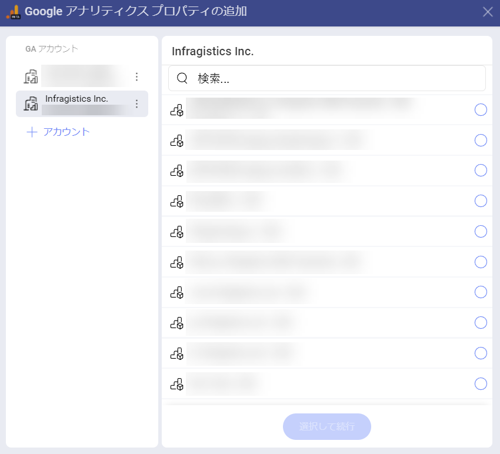
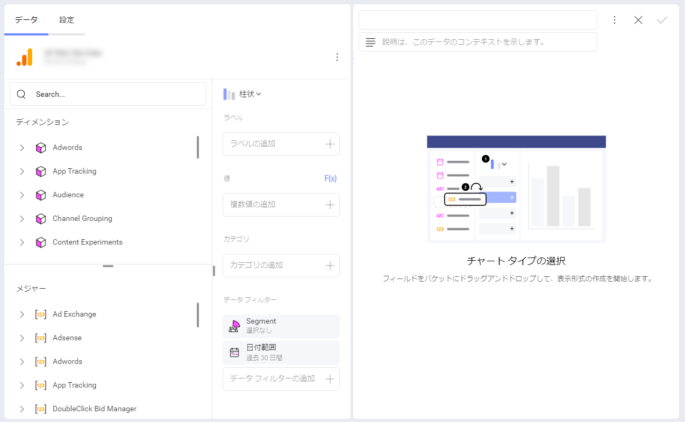
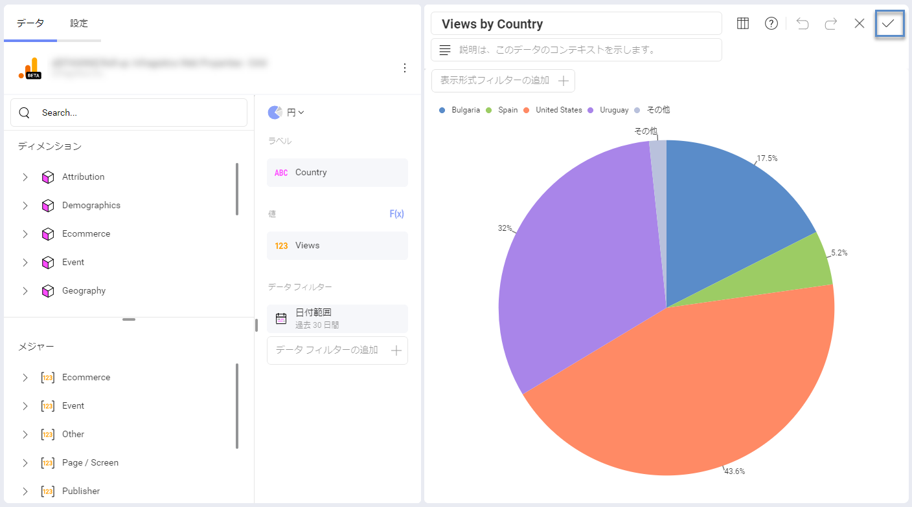
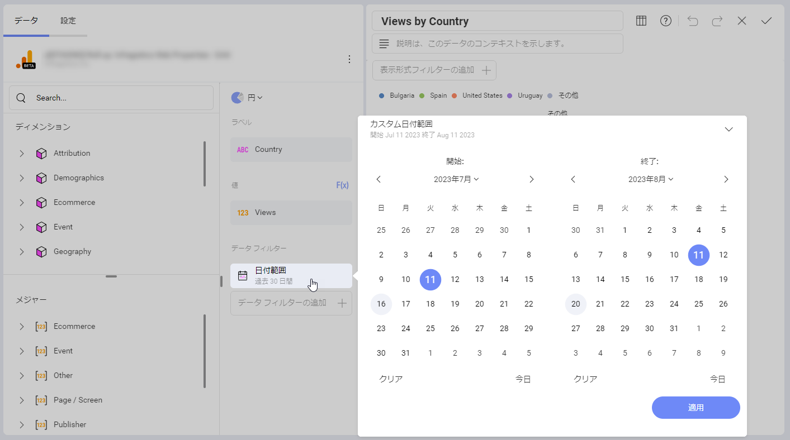

# Google アナリティクス 4

Google アナリティクス 4 は、ウェブ上で最もよく使用されている分析サービスの 1 つです。Web サイトのトラフィックを追跡し、レポートします。
Google アナリティクス 4 アカウントを Slingshot に接続すると、さまざまな表示形式を利用して明確かつ簡潔な情報を取得できます。

## Google アナリティクス 4 への接続

1.	Google のログイン画面を表示するには、データ ソースとして Google Analytics 4 を選択します。

2.	ログイン資格情報を入力し、「サインイン」 をクリックまたはタップします。認証プロンプトが表示された場合は、[許可] を選択できます。

3.	複数の Google アナリティクス アカウントがある場合は、使用するアカウントを選択します。

4.	使用する Google アナリティクス プロパティを選択します。

## 表示形式エディターでの作業

データ ソースを追加した後、表示形式エディターが表示されます。ここでは、表示形式を利用してダッシュボードを構築できます。

デフォルトでは柱状表示形式が選択されていることに注意してください。それをクリックまたはタップして、ドロップダウン メニューから別のチャート タイプを選択できます。データが 2 つのカテゴリに分けて表示されます:

- **ディメンション** (ピンク色の側面の立方体アイコンで表示): それらはデータの属性です。たとえば、*Country*　ディメンション (*Geography* の下) は、Web サイトの視聴者がどこから来ているかを示します。

- **メジャー** ([123] アイコンで表示): メジャーは数値データで構成されます。たとえば、*Views* (*Page/Screen*　の下) というメジャーは、一定期間のビュー数を示します。

ディメンションと指標について詳しくは、<a href="https://support.google.com/analytics/answer/9143382" target="_blank">この記事をご覧ください。</a> 

>[!Note] 一部のディメンションとメジャーは併用できません。有効なディメンションとメジャーの組み合わせのリストについては、Google Developer　ウェブサイトの <a href="https://ga-dev-tools.google/ga4/dimensions-metrics-explorer/" target="_blank">Dimensions & Metrics Explorer (英語)</a> を参照してください。

表示形式の準備ができたら、右上隅のチェックマークをクリックまたはタップして、ダッシュボードとして保存できます。

## 日付範囲データフィルター

カレンダーで特定のデータ範囲を選択することで、データをフィルタリングできます。右上の矢印をクリックして、日付範囲プリセットの 1 つを選択することもできます。

異なるデータ ソースの詳細については、[こちら](/docfx/en/docs/analytics/datasources/overview.md)を参照してください。
