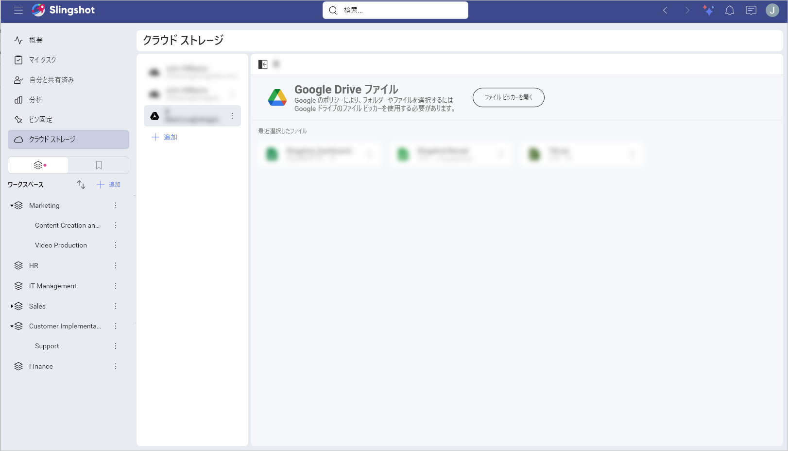
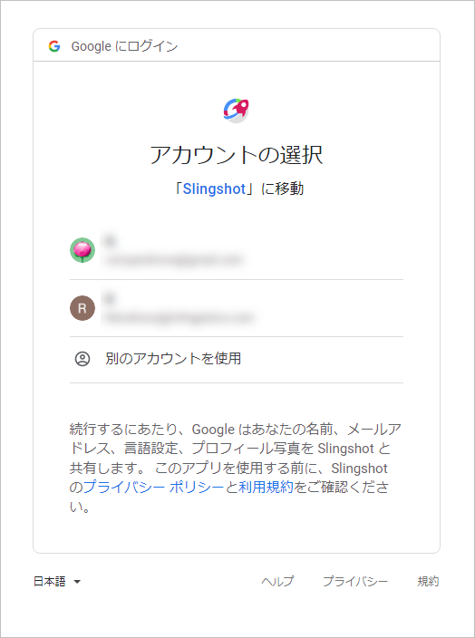
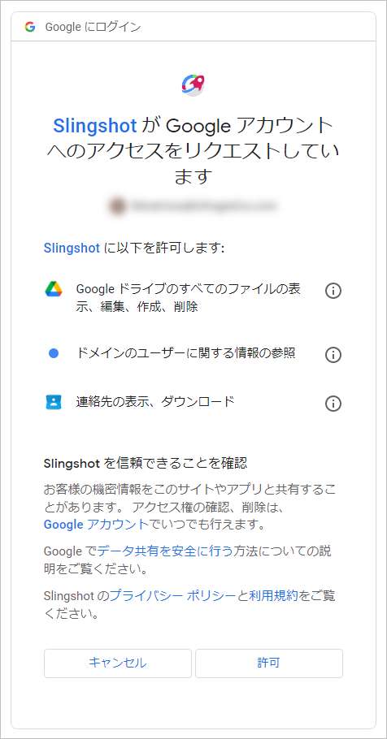
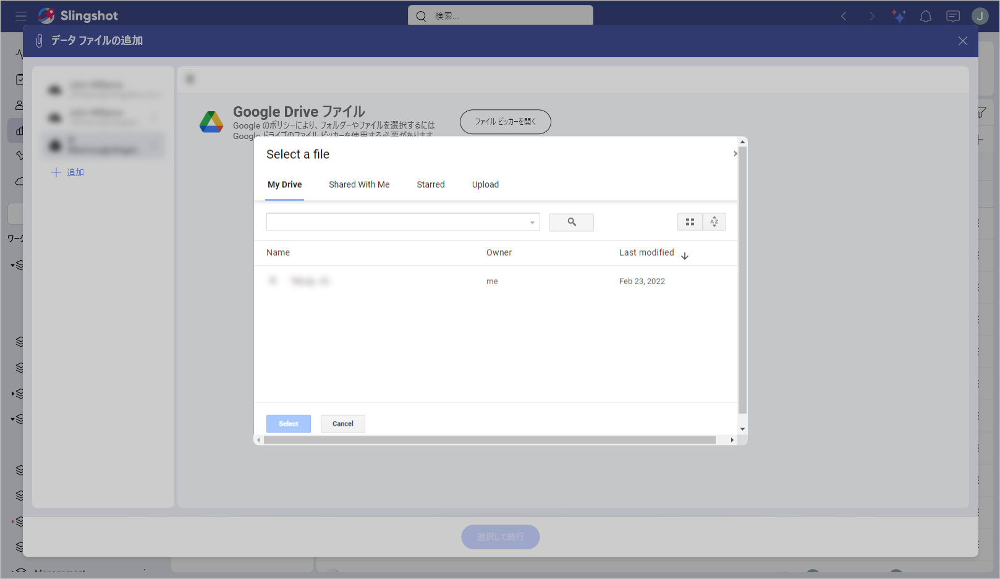

# Google ドライブ

Google アカウントでログインしている場合は、Google ドライブがデータ ソースに自動的に追加されます。

Google ドライブのデータを使用するには、以下の手順に従ってください。

1.  Google ドライブ (またはその中のフォルダー) を選択すると、アカウントを選択してアプリに接続するよう求められます。**ログイン情報**を入力するか、アカウントを選択して [次へ] を選択します。

    
    
2. **認証プロンプト**が表示されます。**[Allow] (許可)** を選択してプロセスを終了できます。

   

Google ドライブをクラウド ストレージのリストに追加すると、これらの権限を再度求められることはなくなります。

## ファイル ピッカー

Google ドライブ アカウントのファイルを使用するには、**[ファイル ピッカーを開く]** をクリックまたはタップする必要があります。次のセクションを含むダイアログが開きます。

- マイ ドライブ - Google ドライブのすべてのファイルを参照できます。

- 自分と共有済み - ユーザーがあなたと共有したすべての Google ドライブ ファイルを表示できます。

- スター付き - Google ドライブ アカウントでスターを付けた特定のファイルにすぐにアクセスできます。

- アップロード - ファイルをドラッグするか、デバイスから選択してアップロードできます。

ファイルを選択したら、Google ドライブのデータを使用して[表示形式](../../dashboards/creating-dashboards.md)を作成できます。

>[!NOTE] 
>Slingshot で Google ドライブ ファイルのオーバーフロー メニューから **[削除]** をクリックまたはタップすると、ファイルは Google ドライブの*ゴミ箱*フォルダーに移動され、ゴミ箱が空にされるまで残ります。

## サポートされるファイル

Analytics では、広範な種類のファイルを使用できます。

  - **スプレッドシートと表形式データ**: Excel (.xlsls、.xlsx)、CSV または TSV (Analytics 内で動的に使用できます)。

  - **その他のファイル**: プレビュー モードのみで表示されます (画像および PDF やテキストなどのドキュメント ファイルを含む)。
