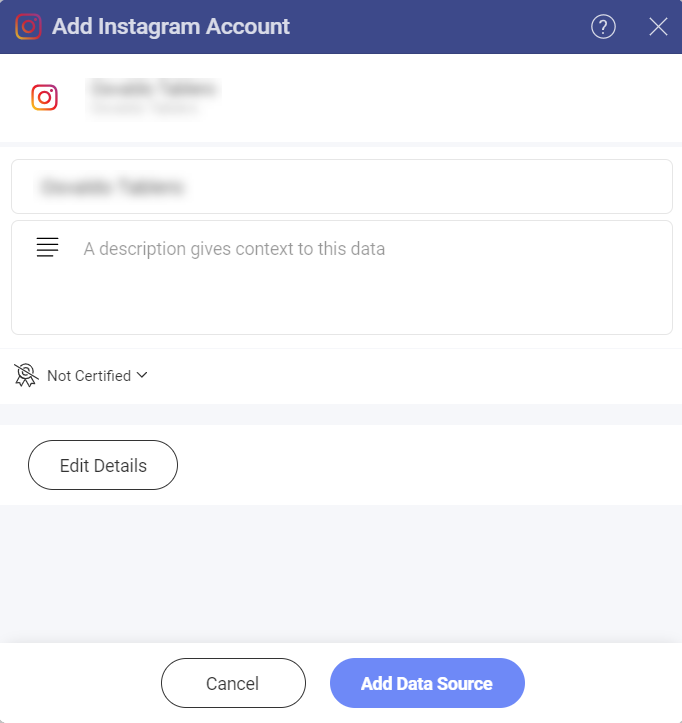
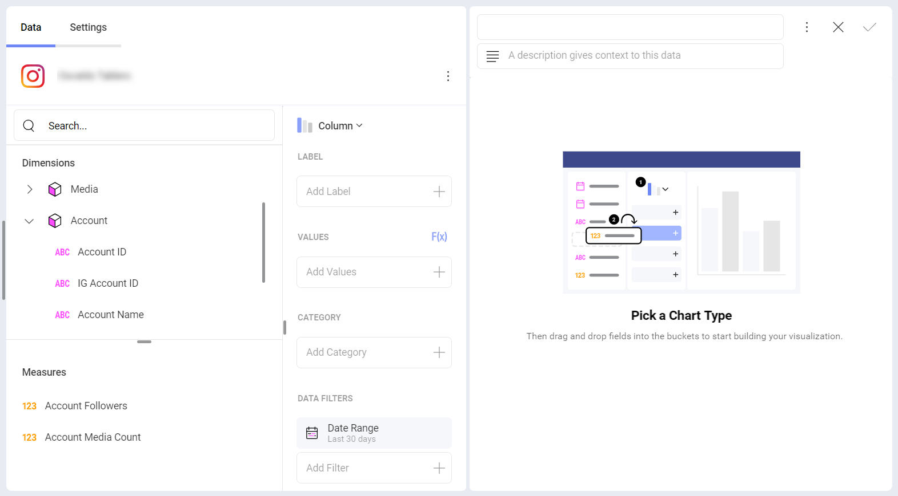
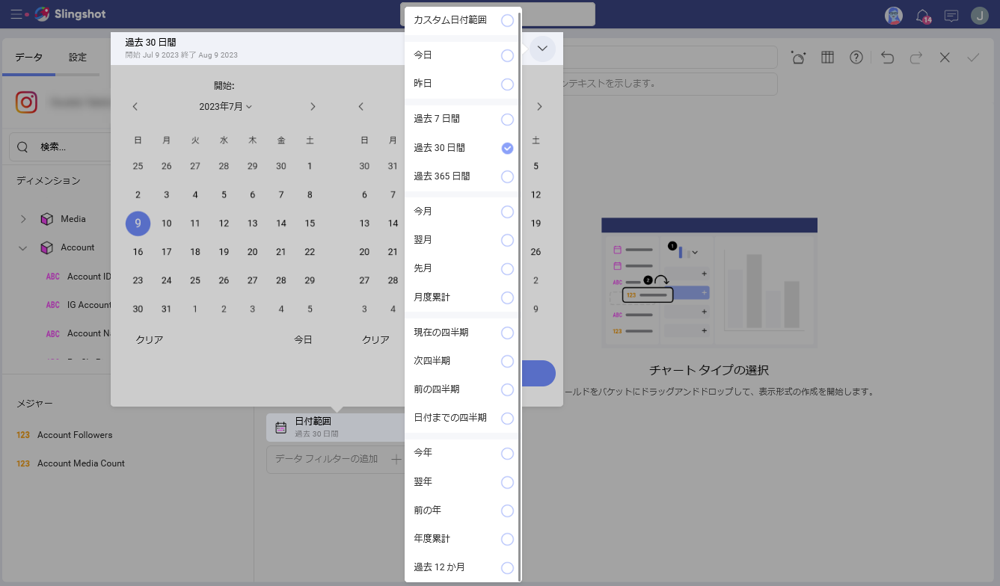
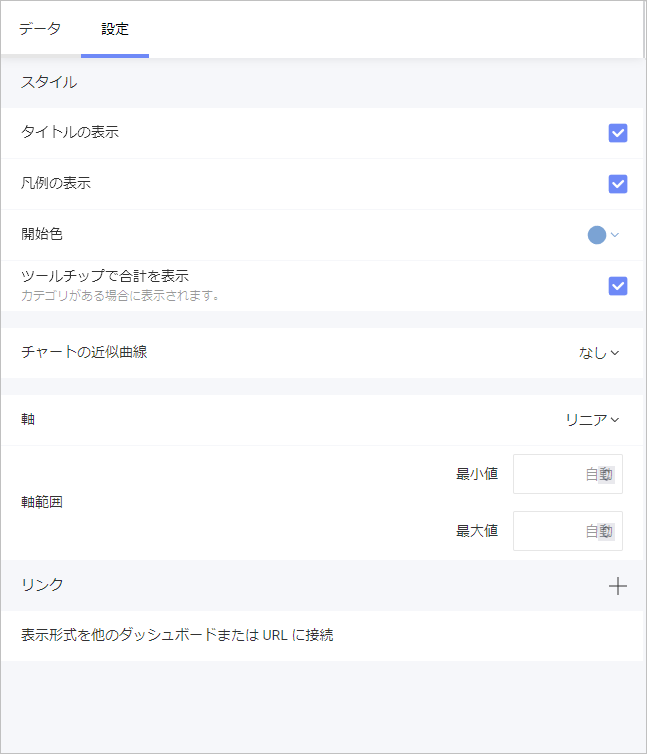
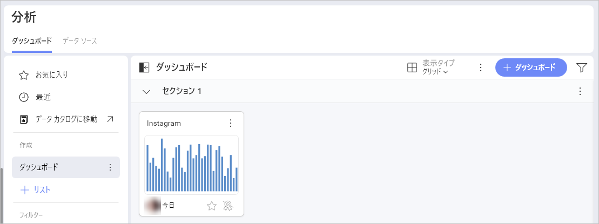

# Instagram

Instagram データ ソースを使用すると、**Instagram ビジネス アカウント**のデータを Slingshot に接続できます。インサイトに富んだダッシュボードにより、会社のブランド認知度をより的確に把握できます。

## Instagram Business アカウントを Slingshot に接続する

*Instagram* データ ソースをリストに追加するには、以下の手順に従ってください: 

1.	**[分析]** セクションの下にある **[+ ダッシュボード]** ボタンをクリックします。
2.	**[+ データ ソース]** ボタンをクリックします。

3.	データ ソースとして **Instagram** を選択します。データ ソース リストの **[ソーシャル メディア]** の下にあります。 

4.	**Instagram ビジネス アカウント**にログインします。アカウントを持っていない場合は、<a href="https://help.instagram.com/502981923235522" target="_blank">こちら</a>から、新しいアカウントを作成する方法を確認してください。Facebook ページを Instagram ビジネス アカウントに接続する必要があることに注意してください。

5.	ダイアログが開き、データ ソースの名前を変更したり、説明を追加したり、データ ソースが[認定されて](../../../certifications.md)いるかどうかを確認したり、詳細を編集したりできます。

    

6. ダッシュボードに使用するページを選択し、**[データの選択]** をクリックします。

## 表示形式エディターでの作業

データ ソース (この場合は Instagram ビジネス アカウント) を選択 / 追加すると、表示形式エディターでデータを管理できるようになります。

独自のクエリ フィールドに 2 つのセクションが表示されます:

- **ディメンション (ピンク色の側面の立方体アイコンで表示)**: ここで、測定したいデータの属性を見つけることができます。

- **メジャー ([123] アイコンで表示)**: メジャーは数値データで構成されます。たとえば、ウェブサイトの *Account Followers* (アカウントのフォロワー) 数および *Account Media count* (アカウントメディア数) を確認できます。

## 日付範囲データ フィルター

特定の日付範囲を選択して、データをフィルタリングできます。データ フィルターは削除できませんが、デフォルトの日付範囲 (*過去 7 日間*) は変更できることに注意してください。

日付範囲を変更するには、フィルターをクリックしてから、右上隅の矢印をクリックします。

## 設定

選択したチャート タイプに応じて、設定でさまざまな変更を行うことができます。[こちら](../../data-visualizations/overview.md)の表示形式エディター セクションで、さまざまなチャート タイプの詳細を確認できます。

以下の例では、次の設定を持つ柱状チャート タイプを使用しました:

- タイトルの表示

- 凡例の表示

- 開始色

- 軸を表示

- ツールチップで合計を表示

- チャートの近似曲線

- 軸を表示範囲に同期

- 自動ラベルの回転

- ズーム レベル

- 軸 (リニアまたは対数)

- 軸の境界

- [表示形式を他のダッシュボードまたは URL に接続](../../dashboards/dashboard-linking.md)

表示形式エディターの準備ができたら、ダッシュボードを **[分析] ⇒ [ダッシュボード]**、特定のワークスペース またはプロジェクトに保存できます。 

データ ソースの詳細については、[こちら (英語)](../../datasources/overview.md) を参照してください。 