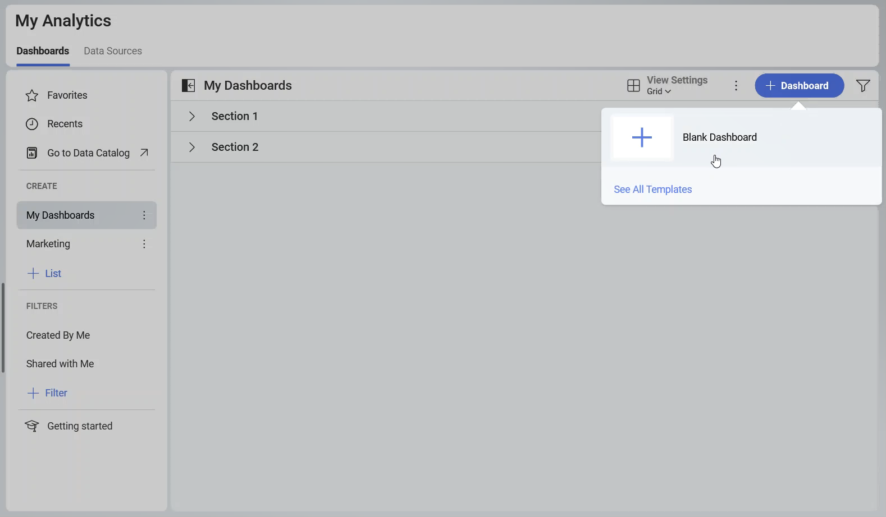
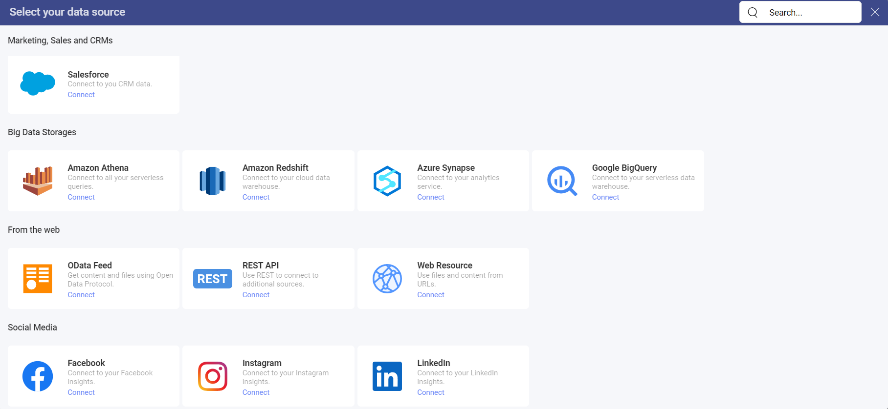
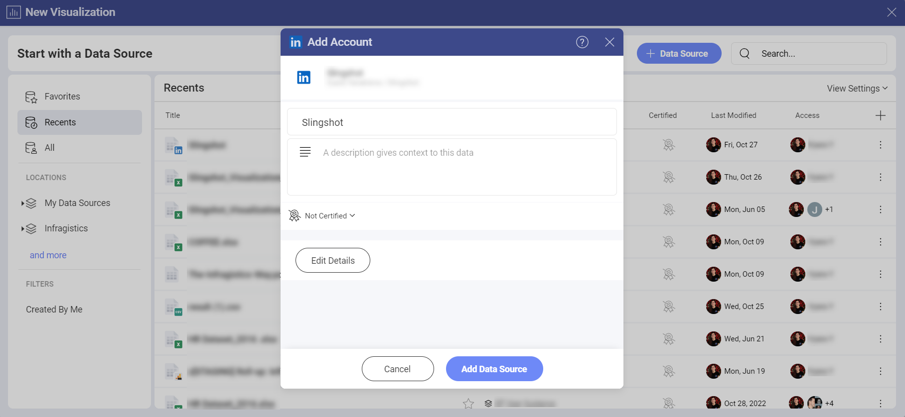
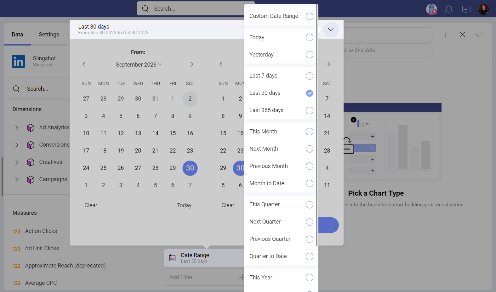
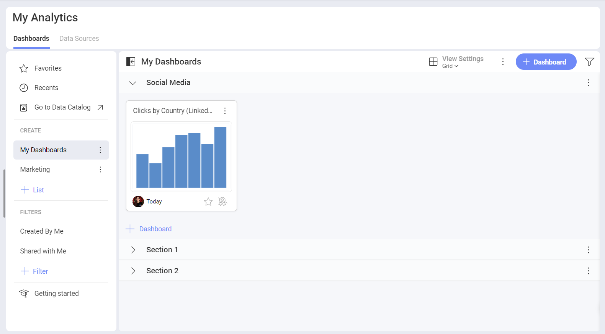

# LinkedIn

LinkedIn データ ソースを使用すると、**LinkedIn 広告アカウント**を Slingshot に接続できます。プラットフォームでの広告キャンペーンのパフォーマンスをよりよく把握するために、**表示形式エディター**を使用して洞察に満ちたダッシュボードを作成できます。

## LinkedIn 広告アカウントを Slingshot に接続する

1.	Click/tap on the **+Dashboard** button under the *My Analytics* section and choose **Blank Dashboard**.

2.	Click/tap on the **+Data Source** button.

3.	Select *LinkedIn* that is under **Social Media** in the Data Sources list.

4.	LinkedIn 広告アカウントにログインします。LinkedIn 広告アカウントをお持ちでない場合は、<a href="https://www.linkedin.com/help/linkedin/answer/a426102/create-an-ad-account?lang=en" target="_blank">この</a>記事で LinkedIn 広告アカウントの作成方法の詳細を確認できます。

5.	別の LinkedIn 広告アカウントを持っている場合は、**[+ 追加]** を選択して別のアカウントを含めることができます。

6.	In the dialog that opens, you can change the LinkedIn Ads Account name, add a description, certify the data source, and select the location for the data source.

 

7. Click/tap on **Add Data Source** to connect the account to your Slingshot account.

## 表示形式エディターでの作業

LinkedIn 広告アカウントからの情報でダッシュボードを作成すると、それぞれのフィールドに 2 つのセクションがあることがわかります。   

1.	**ディメンション**: それらはデータの属性です。

2.	**メジャー** ([123] アイコンで表示): メジャーは数値データで構成されます。たとえば、地域ごとのクリック数を確認できます。

## 日付範囲データ フィルター

このフィルターは削除できませんが、日付範囲は変更できます。デフォルトでは、日付フィルターは **[過去 30 日間]** に設定されています。

変更したい場合は、右上隅の矢印をクリックして (下のスクリーンショットを参照)、ドロップダウン メニューから日付範囲を選択するか、最初のオプションをクリックしてカスタムの日付範囲を作成します。

## 設定

使用しているチャートの種類に応じて、設定でさまざまな変更を行うことができます。さまざまなチャート タイプの詳細については、[こちら (英語)](https://www.slingshotapp.io/en/help/docs/analytics/data-visualizations/visualizations-editor)の表示形式セクションを参照してください。

この場合、設定メニューから次の変更を行うことができる**柱状**チャートを選択しました。

- タイトルを表示または非表示にする

- Show the *Legend*

- Choose the *Start Color* 

- Select which *Axis* to display

- Show *Totals on Tooltip* 

- Choose a *Chart Trendline*

- Sync Axis to the Visible Range

- Adjust the *Zoom Level*

- Choose between a *Linear* or *Logarithmic* Axis

- Adjust the *Axis Bounds*

- Connect this visualization to another dashboard or a URI. You can check [this](https://www.slingshotapp.io/en/help/docs/analytics/dashboards/dashboard-linking) article for more information about how to link dashboards.

表示形式エディターの準備ができたら、ダッシュボードを **[分析] ⇒ [ダッシュボード]** または特定のワークスペースに保存できます。

データ ソースの詳細については、[こちら (英語)](https://www.slingshotapp.io/en/help/docs/analytics/datasources/overview)を参照してください。