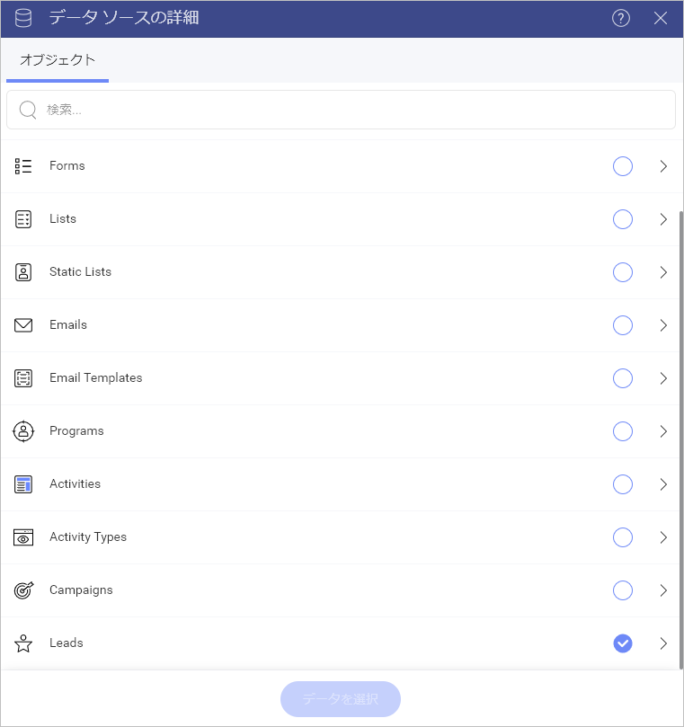
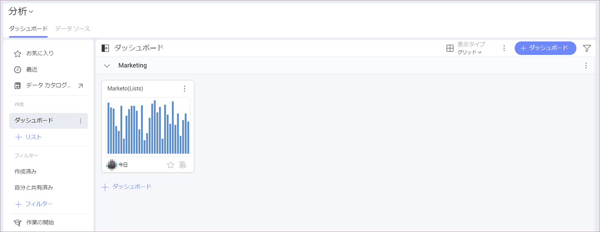

# Marketo 

## Marketo への接続

Marketo の REST API は、2-legged OAuth 2.0 で認証されています。
Analytics で Marketo データ ソース接続を構成するには、次の接続情報を提供する必要があります: 

Marketo の REST API は 2-legged OAuth 2.0 で認証されるため、接続を構成するには次の情報を確認する必要があります:

1. **[URL]** - Marketo 管理パネルにある *ID URL* をここに貼り付けます。
2. **資格情報**:
- **クライアント ID** 
- **クライアント シークレット**

Marketo の**管理**パネルには、上記の認証要素が含まれています。それらを見つける方法の詳細については、Marketo のドキュメントの<a href="https://developers.marketo.com/rest-api/authentication" target="_blank">認証 (英語)</a> に関する記事をご覧ください。

必要な OAuth 認証情報の作成方法について、詳細が必要な場合は、<a href="https://developers.marketo.com/rest-api/custom-services/?_fsi=oP2ZRHsM" target="_blank">こちらの</a>記事を参照してください。

## データの設定

ログイン後、次のダイアログで Marketo データを設定できます:

**Activities** と **Leads** オブジェクトでは、**表示形式エディター**に進む前に、データを取得するために *From* および *To* (日付) の 2 つのパラメーターを設定する必要があります。日付範囲は、最初日と最後日を含めて 31 日未満である必要があります。

> [!NOTE]
> **Activities** と **Leads** のオブジェクトからのデータが表示形式エディターに最初に読み込まれるまで、数分かかる場合があることに注意してください。次回は、同じクエリがより速く実行されます。

## 表示形式エディターでの作業

データ ソースを追加した後、表示形式エディターが表示されます。デフォルトでは、**柱状**表示形式が選択されます。それをクリックまたはタップして、別の[チャート タイプ](../../data-visualizations/overview.md)を選択できます。選択した表示形式に基づいて、さまざまなタイプのフィールドが表示されることに注意してください。

表示形式の準備ができたら、右上隅のチェックマークをクリックまたはタップして、ダッシュボードとして保存できます。以下の例では、ダッシュボードを **[分析]** ⇒ **[ダッシュボード]** ⇒ **Marketing** に保存しました。

