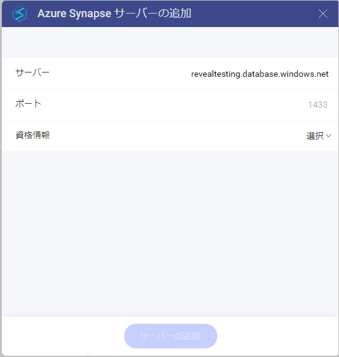
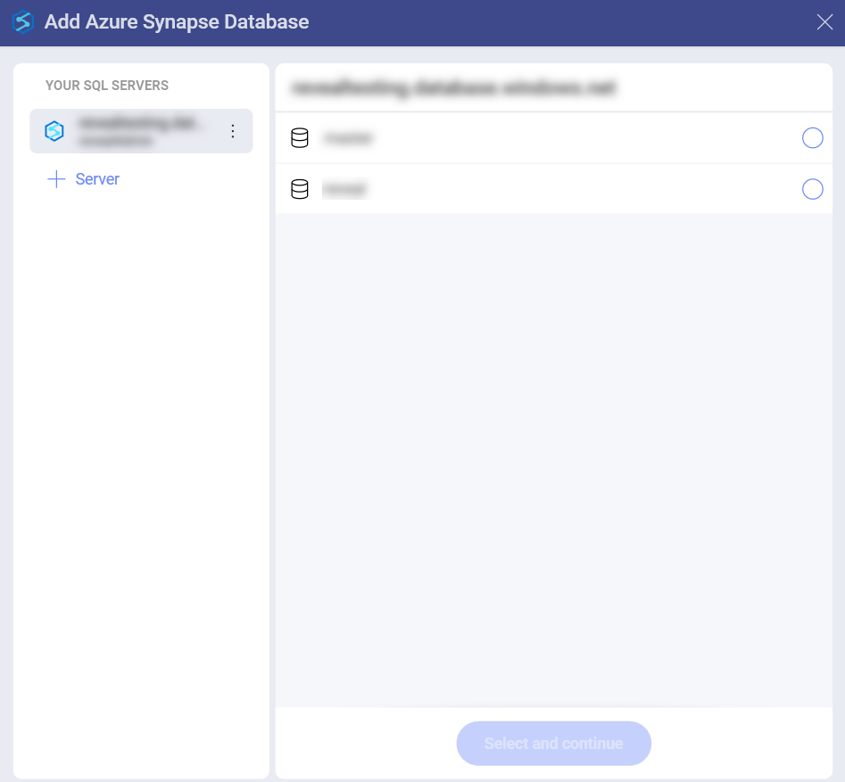
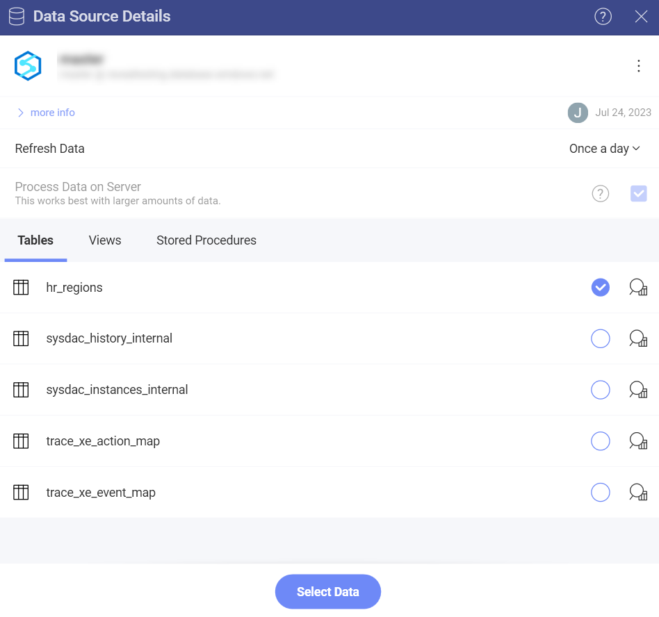

# Microsoft Azure Synapse Analytics

Microsoft Azure Synapse データ ソースは、Analytics 内でビッグ データを処理する際の速度を大幅に向上させます。これにより、大量のデータセットを速度低下することなく表示形式に使用できます。

## Azure Synapse Analytics データ ソースの設定

Microsoft Azure Synapse Analytics データ ソースを設定するには、以下の情報が必要です。

1. **[サーバー](#サーバー情報を見つける方法)**: コンピューター名またはサーバーを実行しているコンピューターに割り当てられた IP アドレス。

2.  **[ポート]**: 該当する場合、サーバー ポートの詳細。情報が入力されない場合、Analytics はデフォルトでヒント テキスト (1433) のポートに接続します。

3.  **[資格情報]**: [資格情報] を選択した後、Microsoft Azure Synapse Analytics の資格情報を入力するか、既存の資格情報 (適用可能な場合) を選択できます。

4.  **[データベース]**: アカウントに接続すると、データベースを選択できるようになります。準備ができたら、**[選択して続行]** をクリックまたはタップします。

## サーバー情報を見つける方法

以下の手順でサーバーを確認できます。

| WINDOWS                                                                                                         | LINUX                                                                                                         | MAC                                                                  |
| --------------------------------------------------------------------------------------------------------------- | ------------------------------------------------------------------------------------------------------------- | -------------------------------------------------------------------- |
| 1\. ファイル エクスプローラーを開きます。                                                                                     | 1\. ターミナルを開きます。                                                                                          | 1\. システム環境設定を開きます。                                         |
| 2\. [マイ コンピューター] ⇒ [プロパティ] を右クリックします。                                                                   | 2\. **$hostname** を入力します。                                                                                     | 2\. 共有セクションに移動します。                                 |
| ホスト名は、[コンピューター名、ドメインおよびワークグループの設定] セクションの下に [コンピューター名] として表示されます。 | [ホスト名] と [DNS ドメイン名] が表示されます。Analytics には**ホスト名**のみを含めるようにしてください。| [ホスト名] は、上部の [コンピューター名] の下に表示されます。|

以下の手順で *IP アドレス*も確認できます。コマンドはサーバーで実行する必要があることに注意してください。

| WINDOWS                              | LINUX                             | MAC                                                           |
| ------------------------------------ | --------------------------------- | ------------------------------------------------------------- |
| 1\. コマンド プロンプトを開きます。           | 1\. ターミナルを開きます。              | 1\. ネットワーク アプリケーションを起動します。                                  |
| 2\. **ipconfig** を入力します。             | 2\. **$/bin/ifconfig** を入力します。   | 2\. 接続を選択します。                                   |
| **IPv4 Address** は IP アドレスです。 | **Inet addr** は IP アドレスです。 | **IP アドレス** フィールドに必要な情報が含まれます。 |

## データの設定

MS Azure Synapse Analytics でデータベースに接続すると、テーブル全体、特定のビュー、またはストアド プロシージャーからデータを取得することを選択できます。

Azure Synapse Analytics を使用してテーブル、ビュー、およびストアド プロシージャーを操作することは、MS SQL Server のデータを操作することによく似ています。詳細については、**MS SQL Server データ ソース** トピックの[このセクション](microsoft-sql-server.md)を参照してください。

## 表示形式エディターでの作業

データ ソースを追加した後、表示形式エディターが表示されます。ここでダッシュボードを作成できます。

**柱状**表示形式がデフォルトで選択されることに注意してください。それをクリックまたはタップして、別のチャート タイプを選択できます。

## 表示形式エディターでの制限事項

Analytics でビッグ データを操作する場合、数百万のレコードを格納するデータ ソースを処理するために使用される特定のアプローチにより、**表示形式エディター**にはいくつかの制限があります。

### 計算フィールドで使用できる関数の制限

現在、Azure Synapse Analytics のデータを使用する**計算フィールド**で、使用できる**関数**の数は限られています。

- [日付](../../data-visualizations/fields/calculated-fields/date.md) - day; month; year; quarter; monthname; applytimezone; currenttimezone。
- [論理](../../data-visualizations/fields/calculated-fields/logic.md) - false; true; if; not。
- [数学](../../data-visualizations/fields/calculated-fields/math.md) - abs; log; log10; sign; sqrt。
- [文字列](../../data-visualizations/fields/calculated-fields/string.md) - find; len; trim; lower; mid; upper。

### データ ブレンディングの制限

現在、Azure Synapse Analytics データ ソースからのデータを使用する場合、データ ブレンディング ([データ ソースを 1 つの表示形式に統合](../../datasources/data-blending.md)) は**使用できません**。
