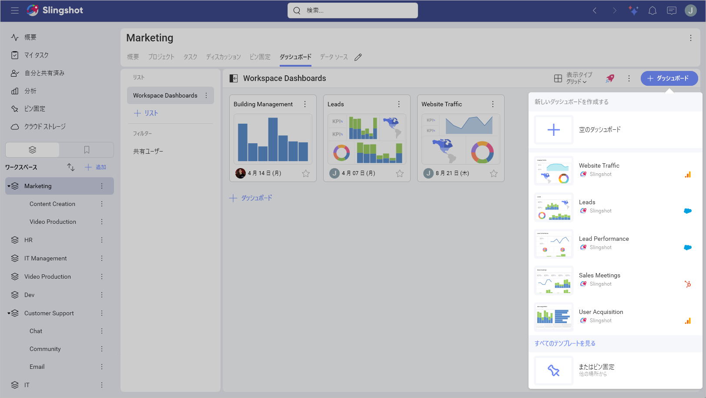

# NetSuite

Slingshot の NetSuite データ ソース コネクターを使用すると、ビジネス オペレーションと財務パフォーマンスをリアルタイムで可視化および分析するダッシュボードを作成できます。主要指標を追跡し、レポートを合理化し、NetSuite データから実用的なインサイトを得ることができます。

## 前提条件

### ロールのアクセス許可

接続を正常に行うには、各 NetSuite ロールに適切なアクセス許可が必要です:

- Reports(): SuiteAnalytics Workbook に必要

- Setup(): OAuth 2.0 アクセス トークン、REST Web サービス、カスタム フィールドを使用したログインに必要

>[!Note]
>テーブルには追加のアクセス許可が必要です。たとえば、*Account* テーブルにアクセスするには **Lists()** アクセス許可が必要です。

### OAuth 2.0

Slingshot で NetSuite に接続するには、まず NetSuite で OAuth 2.0 を設定する必要があります (まだ設定していない場合)。

そのためには:

1. <a href="https://system.netsuite.com/pages/customerlogin.jsp?" target="blank" rel="noopener">NetSuite</a> にログインします。

2. **[設定]** > **[統合]** > **[統合の管理]** に移動します。

3. 新しい統合レコードを**作成**します。新しい統合を作成するときに、アプリケーションの名前を入力したり、説明を追加したりできます。

4. [認証] サブタブで、次の設定を行う必要があります:

- **OAuth 2.0**: 提供されたオプションから、**認可コード付与**を選択します。

 - **スコープ**: 提供されたオプションから、**RESTlets** と **REST Web サービス**を選択します。

- **ユーザー資格情報**: ここで**ユーザー資格情報**を有効にします。

5. 設定が完了したら、https://my.slingshotapp.io/callback/generic_oauth をリダイレクト URL として登録する必要があります。

6. **クライアント ID** と**クライアント シークレット**が表示されます。それらをコピーして安全に保管してください。紛失した場合はリセットが必要です。

NetSuite での OAuth 2.0 の設定方法の詳細については、<a href="https://docs.oracle.com/en/cloud/saas/netsuite/ns-online-help/section_157771733782.html#procedure_157838925981" target="blank" rel="noopener">こちら</a>の記事をご覧ください。

## NetSuite への接続

NetSuite データ ソースを設定するには:

1.	ダッシュボード リストで **[+ ダッシュボード]** ボタンをクリックまたはタップします。

2. **[空のダッシュボード]** を選択します。

3.	右上隅の **[+ データ ソース]** ボタンをクリックします。

4.	*[データ ソース]* リストから **NetSuite** を選択します。

5.	次の情報を入力するように求められます:

1. **アカウント ID**: NetSuite アカウントの識別子。NetSuite の URL で確認できます (例: NetSuite URL が `https://1234567.app.netsuite.com` の場合、アカウント ID は `1234567` です)。

2. **資格情報**: *[資格情報]* を選択後、OAuth 2.0 を使用して認証する必要があります:

   - 認証 URL (自動入力): ユーザーが認証するために使用する Web アドレスです。

   - トークン URL (自動入力): トークン URL の形式は認証 URI の形式と似ています。

   - クライアント ID (必須): アプリの識別子。形式はシンボルのランダムな組み合わせです。
   
   - クライアント シークレット (必須): 追加の保護として使用されます。形式はシンボルのランダムな組み合わせです。
   
   - ログアウト URL (オプション): ユーザーの認証済みセッションからログアウトするための URL です。
   
   - スコープ (オプション): 追加のアクセス レベルを要求するために使用される値です。
   
   - リソース (オプション): 保護されたデータをホストするサービスへの URL を入力します。
   
   - 追加パラメーター (オプション): 認証プロセスに含めることができる追加フィールドです。
   
   - データ ソースのエイリアス: アカウントのリストに表示されるデータ ソース名です。いつでも変更できます。

3. 準備ができたら、**[追加]** をクリックまたはタップします。

4. *NetSuite* ページにリダイレクトされ、ログイン情報を入力できます。

5. Slingshot アプリへのアクセス許可を求められます。**[続行]** をクリックまたはタップして、NetSuite アカウントを Slingshot に接続します。

## データの設定

NetSuite に接続後、次のことができます:

1.	アカウントを追加します。

2.	**データ ソース**を追加します。データ ソースを追加する前に、アカウント名を変更したり、説明を追加したり、データ ソースが認定済みかどうかを確認したり (*[Enterprise](../../../slingshot-enterprise-subscription.md)* ユーザーが利用可能)、詳細を編集したりできます。適切な説明を追加すると、すべてのユーザーが長いリストをナビゲートし、探しているデータ ソースを見つけやすくなります。

3. **テーブルの選択**: 分析するデータが含まれているテーブルを選択します。

## 表示形式エディターでの作業

テーブルを選択すると、<a href="https://www.slingshotapp.io/en/help/docs/analytics/data-visualizations/visualization-editor" target="blank" rel="noopener">表示形式エディター</a>が表示されます。ここでテーブル内のフィールドを使用してダッシュボードを作成できます。

>[!Note] デフォルトでは、*柱状*グラフが表示されます。それを選択して、別のグラフの種類を選択できます。

表示形式エディターの準備ができたら、ダッシュボードを *[分析]* ⇒ *[ダッシュボード]*、組織、特定のワークスペース、またはプロジェクトに保存できます。

### よくある接続の問題

**問題**: "Account ID cannot be null or empty"

**解決策**:

NetSuite アカウント ID が正しく入力されていることを確認します。NetSuite URL でアカウント識別子を確認してください。

**問題**: OAuth 認証が失敗する

**解決策**:

- NetSuite で統合レコードが有効になっていることを確認します

- コールバック URL が正しく設定されていることを確認します

- NetSuite ユーザーに必要なアクセス許可があることを確認します

**問題**: 期待するデータにアクセスできない

**解決策**:

- NetSuite のロールに必要なレコードへのアクセス権があることを確認します

- 関連する NetSuite 機能が有効になっていることを確認します

- 適切なレコードレベルのアクセス許可が設定されていることを確認します
