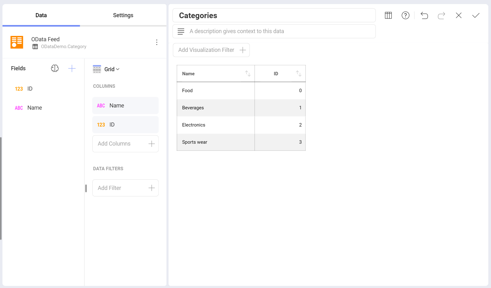
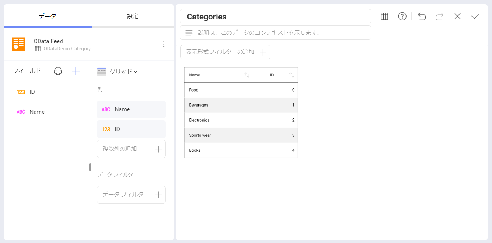
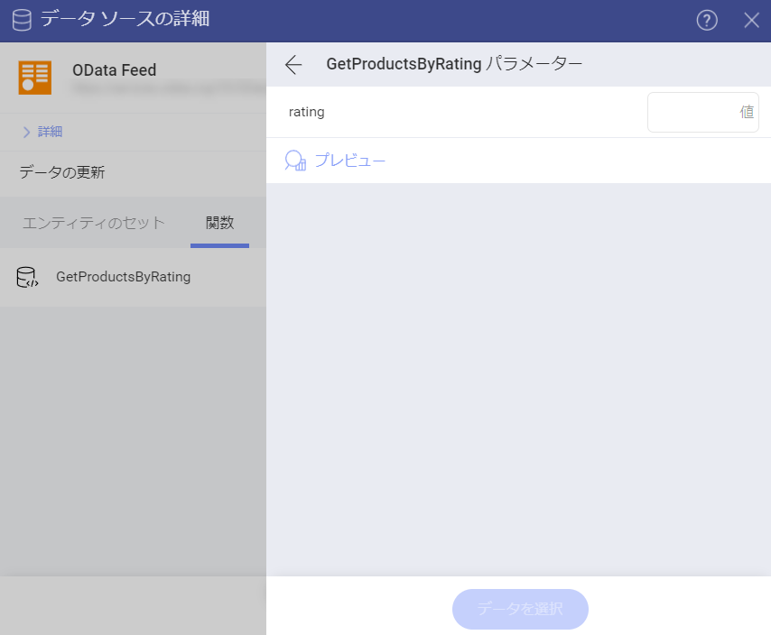
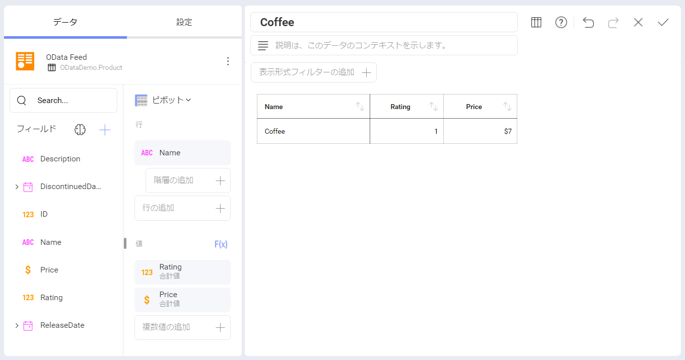

# OData フィード

## OData フィードへの接続

OData フィードのデータ ソースを設定するには、以下の情報が必要です。

1.  **[URL]**: サービスの URL (Northwind OData Test Service の <http://services.odata.org/Northwind/Northwind.svc> など)。

2.  **[資格情報]**: [資格情報] を選択した後、OData Service の資格情報を入力するか、既存の資格情報 (適用可能な場合) を選択できます。

      - **[ユーザー名]**: OData Service のユーザー アカウントまたはドメインの名前 (該当する場合)。

      - **[パスワード]**: OData Service にアクセスするためのパスワード (該当する場合)。

      - エイリアス: データ ソース名は前のダイアログのアカウントのリストに表示されます。デフォルトでは、Analytics は *OData Feed* という名前を付けます。好みに合わせて変更できます。

準備ができたら、**[データ ソースの追加]** を選択します。

保護された OData フィード データ ソースの *OAuth 2 / OIDC アカウント*を設定するには、[このトピック](../oauth-2-oidc-user-authentication.md)を参照してください。

## オープン型の列

Analytics は、動的な<a href="https://docs.microsoft.com/ja-jp/aspnet/web-api/overview/odata-support-in-aspnet-web-api/odata-v4/use-open-types-in-odata-v4" target="_blank">*オープン型の列*</a>を持つ OData フィードをサポートします。動的な OData フィードを変更した後、ダッシュボードを更新するだけで新しいデータが取得されます。

以下の例は、動的な Odata サンプルの [1 つ](https://services.odata.org/V3/OData/\(S\(bwrmr2ccg0nex5gmubqxjkkz\)\)/OData.svc/)に基づいて作成されます。
最初に 4 つのカテゴリを持つ 2 つのフィールド (**ID** および **Name**) の表示形式が作成されました。

<a href="https://www.odata.org/getting-started/learning-odata-on-postman/" target="_blank">Postman</a> を通じて、新しいプロパティを持つ新しいレコードがカテゴリ セクションに追加されました。
変更後、ダッシュボードが更新され、新しいレコードが表示されました。

## 関数の使用

OData フィードによって公開されるように設定した関数は、データ ソースの  **[新しい表示形式]** メニューの **[関数]** タブに表示されます。

関数によっては、データを取得するために 1 つ以上の値を入力する必要がある場合があります。V3 OData サンプルには、結果を得るために **rating** の値を入力する必要がある以下のサンプル関数が含まれています。

準備ができたら、表示形式エディターは関数条件に一致するデータ ソースのフィールドを読み込みます。

OData 関数の詳細については、<a href="https://docs.microsoft.com/ja-jp/aspnet/web-api/overview/odata-support-in-aspnet-web-api/odata-v4/odata-actions-and-functions" target="_blank">こちら</a>を参照してください。
