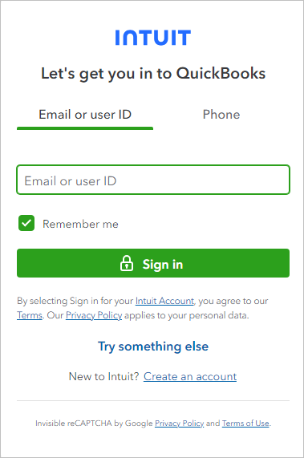
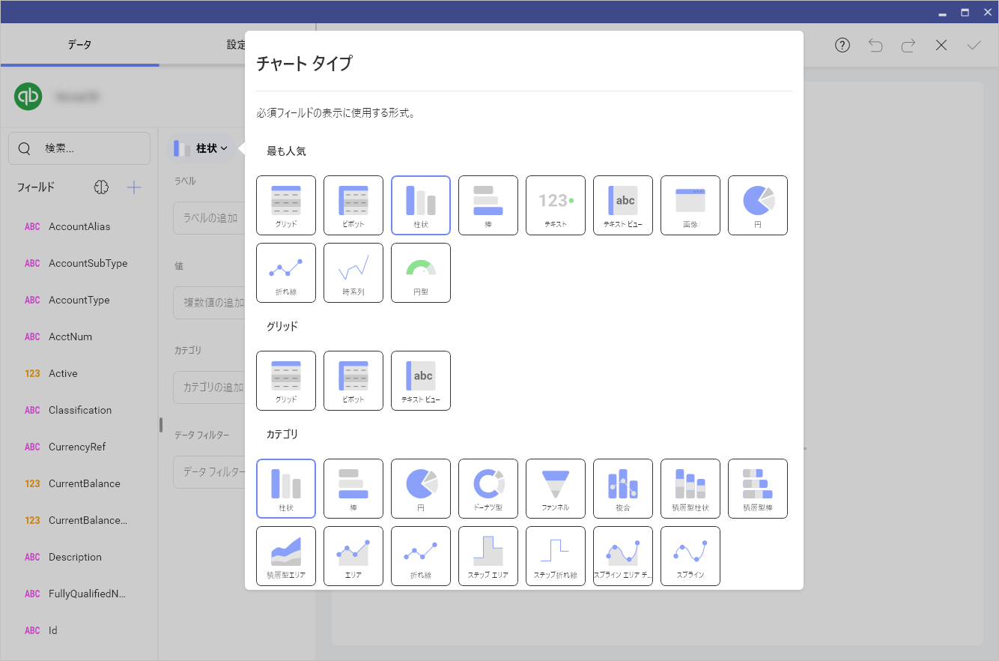
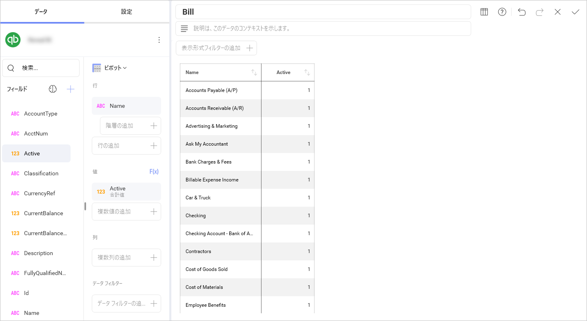
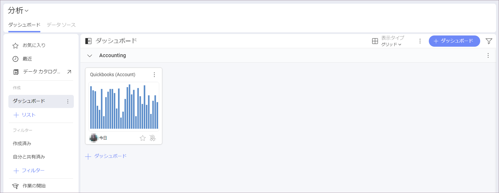

# QuickBooks

QuickBooks に接続すると、次のログイン プロンプトが表示されます:

メール アドレス、ユーザー ID、または電話番号を入力し、**[サインイン]** をクリックまたはタップします。

>[!Note]
>ID 認証が有効な場合は、送信された**確認コード**を入力するプロンプトが表示されます。

## データの設定

ログイン後、次のダイアログで QuickBooks データを設定できます:

ここで、必要な QuickBooks エンティティを選択できます。

- **[共通エンティティ]** - このカテゴリでは、ユーザーが最もよく使用するエンティティをすばやく選択できます。
- **[すべてのエンティティ]** - このカテゴリには、QuickBooks アカウントに含まれるエンティティの完全なリストが表示されます。提供されている検索を使用して、必要なエンティティをすばやく見つけることができます。

## 表示形式エディターでの作業

データ ソースを追加した後、表示形式エディターが表示されます。デフォルトでは、*柱状*表示形式が選択されます。それを選択して、別のチャート タイプを選択できます。

選択した表示形式に基づいて、さまざまなタイプのフィールドが表示されます。

表示形式の準備ができたら、右上隅のチェックマークをクリックまたはタップして、ダッシュボードとして保存できます。以下の例では、ダッシュボードを **[分析]** ⇒ **[ダッシュボード]** ⇒ **Accounting** に保存しました。

