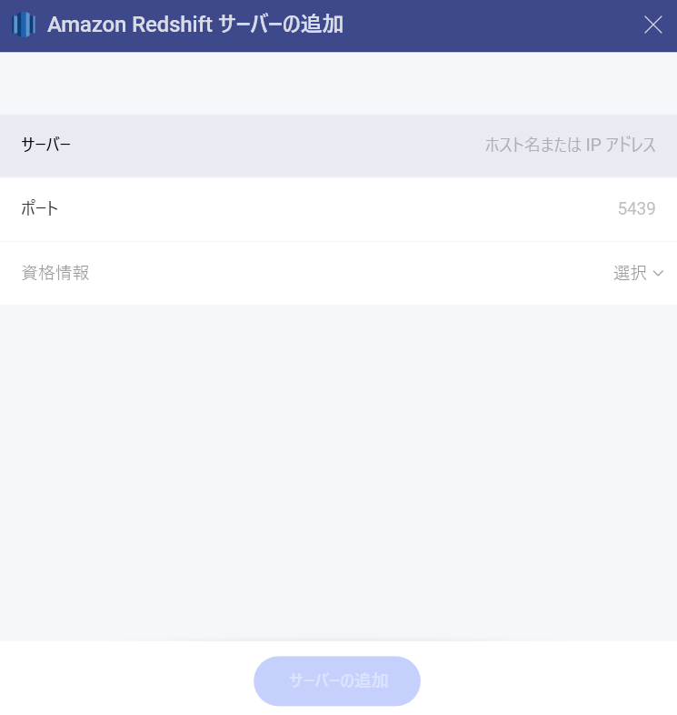
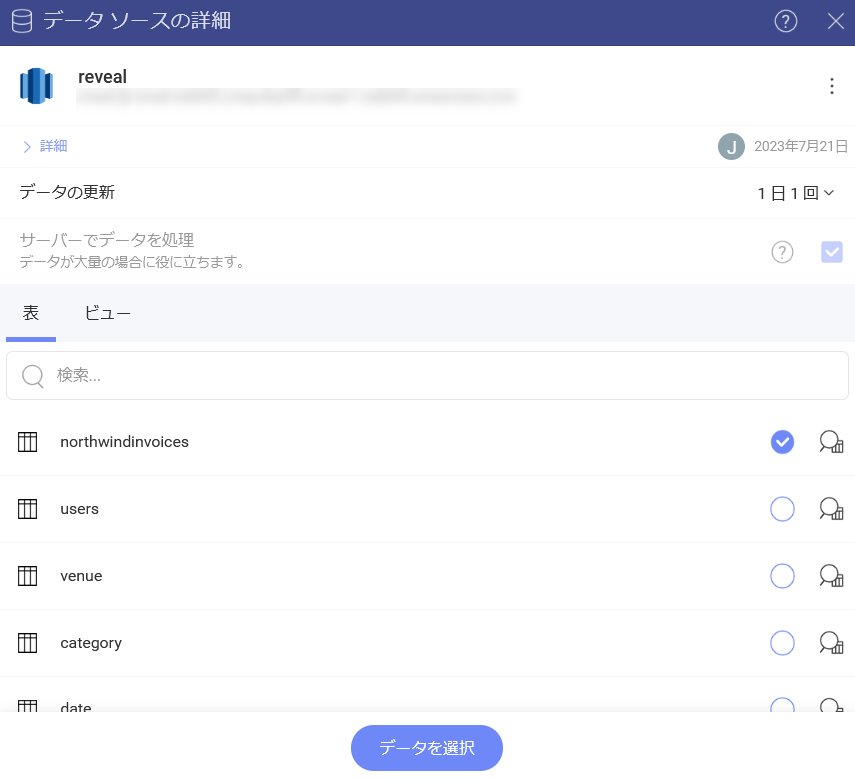
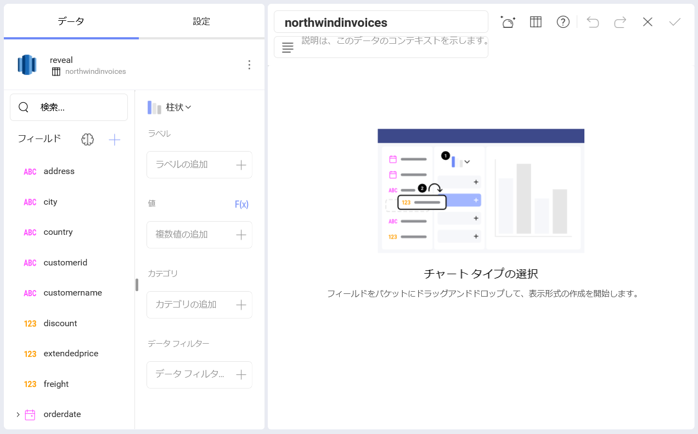

# Amazon Redshift

## Amazon Redshift への接続
Amazon Redshift のデータ ソースを設定するには、以下の情報が必要です:

1.  データ ソースの **デフォルト名**: データ ソース名は前のダイアログのアカウントのリストに表示されます。デフォルトでは、Slingshot は *Amazon Redshift* という名前を付けます。好みに合わせて変更できます。 

2.  [**サーバー**](#how-to-find-your-server-information): コンピューター名またはサーバーを実行しているコンピューターに割り当てられた IP アドレス。

3.  **[Port]**: 該当する場合、サーバー ポートの詳細。情報が入力されない場合、Slingshot はデフォルトでヒント テキスト (5432) のポートに接続します。

4.  **[資格情報]**: **資格情報**を選択した後、*Redshift* サーバーの資格情報を入力するか、既存の資格情報 (利用可能な場合) を選択できます。

      - **ユーザー名**: *Redshift* サーバーのユーザー アカウントまたはドメインの名前。

      - **[パスワード]**: *Redshift* サーバーにアクセスするためのパスワード。

      - **エイリアス**: データ ソース アカウントの名前。以前のダイアログのアカウントのリストに表示されます。

## サーバー情報を見つける方法

以下の手順でサーバーも確認できます。コマンドはサーバーで実行する必要があることに注意してください。

| WINDOWS                                                                                                         | LINUX                                                                                                         | MAC                                                                  |
| --------------------------------------------------------------------------------------------------------------- | ------------------------------------------------------------------------------------------------------------- | -------------------------------------------------------------------- |
| 1\. ファイル エクスプローラーを開きます。                                                                                     | 1\. ターミナルを開きます。                                                                                          | 1\. システム環境設定を開きます。                                         |
| 2\. [マイ コンピューター] → [プロパティ] を右クリックします。                                                                   | 2\. **$hostname** を入力します。                                                                                     | 2\. 共有セクションに移動します。                                 |
| ホスト名は、[コンピューター名、ドメインおよびワークグループの設定] セクションの下に [コンピューター名] として表示されます。 | [ホスト名] と [DNS ドメイン名] が表示されます。Reveal には**ホスト名**のみを含めるようにしてください。| [ホスト名] は、上部の [コンピューター名] の下に表示されます。 |

以下の手順で *IP アドレス*も確認できます。コマンドはサーバーで実行する必要があることに注意してください。

| WINDOWS                              | LINUX                             | MAC                                                           |
| ------------------------------------ | --------------------------------- | ------------------------------------------------------------- |
| 1\. コマンド プロンプトを開きます。           | 1\. ターミナルを開きます。              | 1\. ネットワーク アプリケーションを起動します。                                  |
| 2\. **ipconfig** を入力します。             | 2\. **$ /bin/ifconfig** を入力します。   | 2\. 接続を選択します。                                   |
| **IPv4 Address** は IP アドレスです。 | **Inet addr** は IP アドレスです。 | **IP アドレス** フィールドに必要な情報が含まれます。 |

## データの設定

Slingshot ではすべてのテーブルから *Redshift* データを取得できますが、その他にもテーブルまたはテーブルのセットからデータのサブセットを返す特定の<a href="https://docs.aws.amazon.com/redshift/latest/dg/r_CREATE_VIEW.html" target="_blank">ビュー</a>を選択することもできます。

## 表示形式エディターでの作業

データ ソースを追加した後、表示形式エディターが表示されます。

デフォルトでは、**柱状**表示形式が選択されます。それをクリックまたはタップして、ドロップダウン メニューから別のチャート タイプを選択できます。

表示形式エディターの準備ができたら、右上隅のチェックマークをクリックまたはタップして、**[分析]** ⇒ **[ダッシュボード]**、特定のワークスペース、またはプロジェクトにダッシュボードを保存できます。

データ ソースの詳細については、[ここ](../../datasources/overview.md)を参照してください。