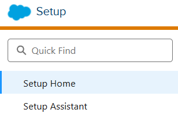
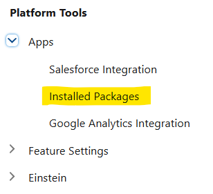
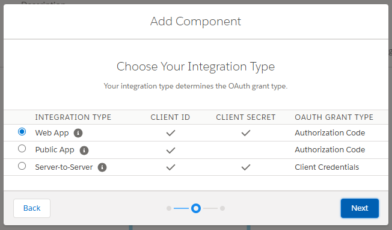
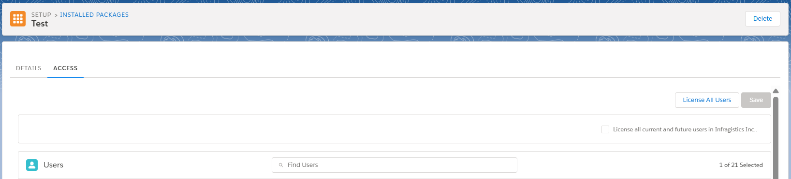
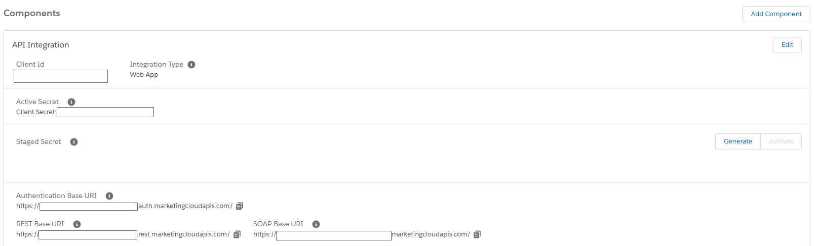
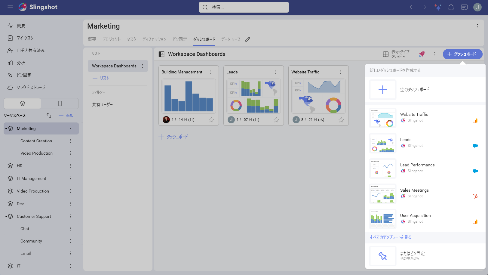
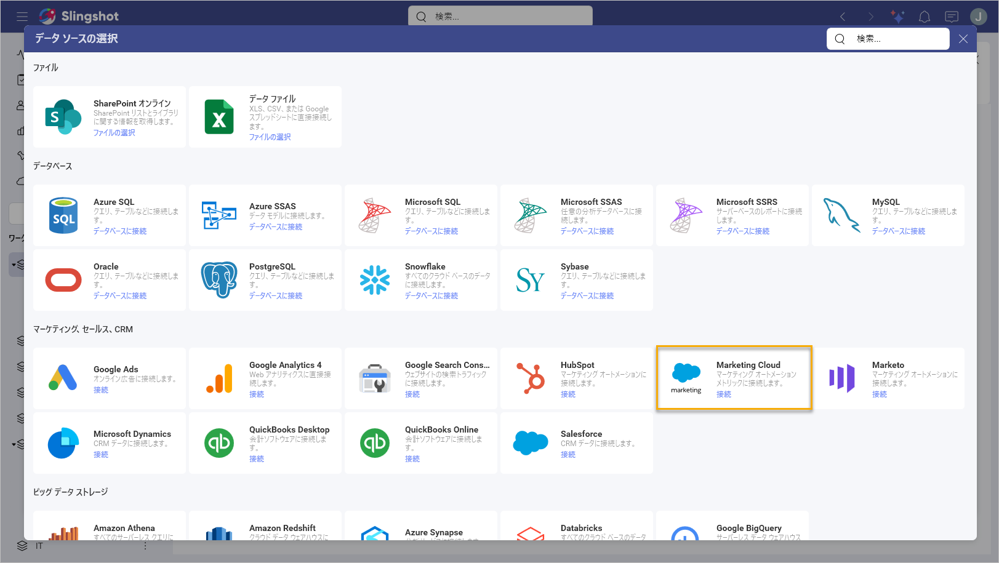
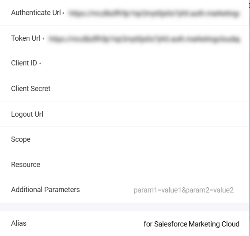

# Salesforce Marketing Cloud

Slingshot の Salesforce Marketing Cloud データ ソース コネクターを使用すると、マーケティング キャンペーンの成果を追跡するダッシュボードを作成できます。顧客とのつながり状況に関する有益なデータを取得できます。

## 前提条件 

Slingshot で Salesforce Marketing Cloud に接続するには、まず Salesforce Marketing Cloud で OAuth を設定する必要があります (未設定の場合)。  

そのためには、以下の手順を実行します: 

1. <a href="https://mc.exacttarget.com/cloud/login.html" target="blank" rel="noopener">Salesforce Marketing Cloud (SFMC)</a> にログインします。

2. **Settings/Setup** を開きます。 

3. **Platform Tools > Apps > Installed Packages** に移動します。

4. 新しいパッケージを**作成します**。 

パッケージの作成後、次を行います: 

1. コンポーネント タイプの一覧から **API Integration** を選択します。 

2. 統合タイプの一覧から **Web App** を選択します。

3. ダイアログが表示され、次のプロパティを設定できます: 

- *Redirect URIs*:  https://my.slingshotapp.io/callback/generic_oauth をリダイレクト URI として登録できます。 

- *Scope*:  レビューに必要なすべての **Read** スコープを選択します。

4. **Save** をクリックまたはタップしてプロパティを保存します。 

5. その後、**Client ID** と **Client Secret** が表示されます。Client Secret は再表示できないため、安全に保管してください。 

16. **Access** タブを開きます。 

7. パッケージにアクセス許可を付与するため、ユーザーを追加します。 

8. コンポーネントの作成が完了すると、その値を使用して Slingshot にアカウントを接続できます。 

>[!Note] 
> Authentication Base URI にテナント ID が含まれています。例: https://abcdef.auth.marketingcloudapis.com の場合、テナント ID は abcdef です。 

## Salesforce Marketing Cloud への接続

>[!Note]
> Salesforce Marketing Cloud の閲覧権限を持つユーザーのみが、Slingshot にデータ ソース アカウントを追加できます。Salesforce Marketing Cloud のロールの詳細については、<a href="https://help.salesforce.com/s/articleView?id=mktg.mc_overview_roles.htm&type=5" target="blank" rel="noopener">公式ドキュメント</a>を参照してください。

Salesforce Marketing Cloud に接続するには、次のことが必要です。

1.	ダッシュボード一リストで **[+ ダッシュボード]** ボタンをクリックまたはタップします。

2. **[空のダッシュボード]** を選択します。 

3.	右上隅にある **[+ データ ソース]** ボタンをクリックします。

4.	**データ ソース** リストから **Marketing Cloud** を選択します。

5.	以下の情報の入力が求められます:

-	**テナントのサブドメイン**: これは Salesforce Marketing Cloud アカウントの ID です。 

-	**資格情報**:

	  -	URL 認証: これは、ユーザーが認証するために使用する必要がある Web アドレスです。

	 - トークン URL: トークン URLの形式は認証 URL の形式と同様です。

	 - クライアント ID: アプリの識別子です。その形式は、シンボルのランダムな組み合わせです。

	 - クライアント シークレット (オプション): 追加の保護として使用されます。その形式は、シンボルのランダムな組み合わせです。

	 - ログアウト URL (オプション): ユーザーの認証されたセッションからログアウトするために使用される URL です。

	 - スコープ (オプション): 追加のアクセス レベルを要求するための値です。

	 - リソース (オプション): ここで、保護されたデータをホストするサービスに URL を入力する必要があります。

	 - 追加パラメーター (オプション): 認証プロセスに含めることができる追加フィールドです。

	 - データ ソースのエイリアス: アカウントのリストで表示されるデータ ソース名です。いつでも変更できます。

## データの設定

Salesforce Marketing Cloud データ ソースに接続すると、次が可能になります:

1.	アカウントを追加します。

<!--  -->

2.	**データ ソース**を追加します。データ ソースを追加する前に、アカウント名を変更し、適切な説明を追加し、データ ソースが認定済みかどうか (*Enterprise* ユーザー向け) を確認し、詳細を編集できます。適切な説明を追加すると、すべてのユーザーが長いリストをナビゲートし、検索しているデータ ソースを見つけるのに役立ちます。

<!--  -->

3.	オブジェクトを選択します。

<!--  -->

## 表示形式エディターでの作業

データ ソースを追加した後、<a href="https://www.slingshotapp.io/ja/help/docs/analytics/data-visualizations/visualization-editor" target="blank" rel="noopener">表示形式エディターが表示されます。</a>ここでは、オブジェクト内のフィールドを使用しながらダッシュボードを構築できます。

Salesforce Marketing Cloud データは、主に次の 2 つのカテゴリに分類されます。

-	**ディメンション** (ピンク色の側面の立方体アイコンで表示): ディメンションは、測定可能なデータを分類するために使用される構造です。ディメンションの要素は、以下の方法で整理できます。

	 -	階層 - ディメンション内の要素が階層別に編成されている場合、下位レベルの要素から開始して、階層全体または階層の一部を使用できます。 

	 -	属性 - 要素は単一レベルの階層に編成されます。

-	**メジャー** ([123] アイコンで表示): メジャーは数値データで構成されます。

<!--  -->

>[!Note] デフォルトでは、*柱状*チャートが表示されます。それを選択して、別のチャート タイプを選択できます。 

表示形式エディターの準備ができたら、ダッシュボードを **[分析]** ⇒ **[ダッシュボード]**、特定のワークスペース、またはプロジェクトに保存できます。
