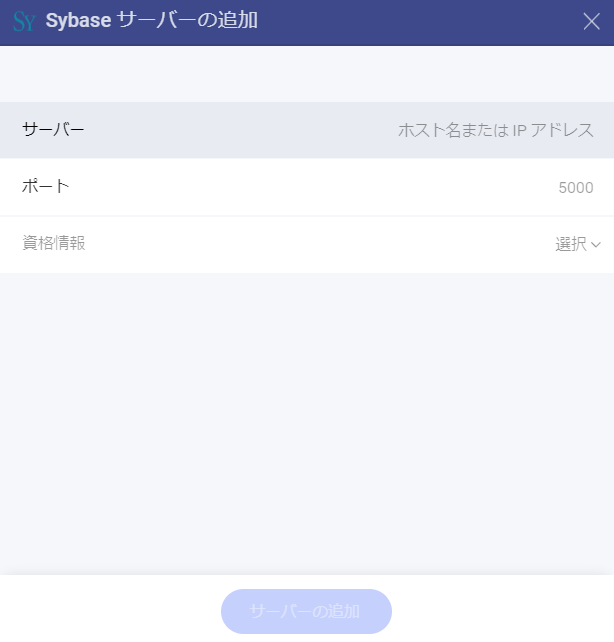
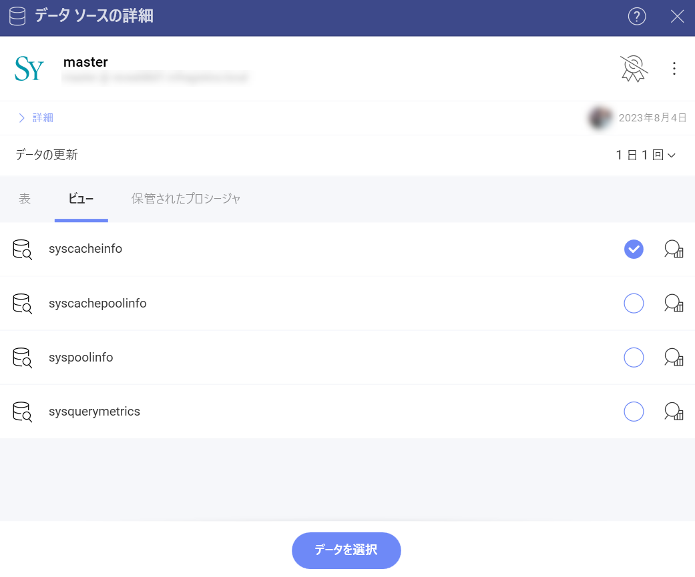
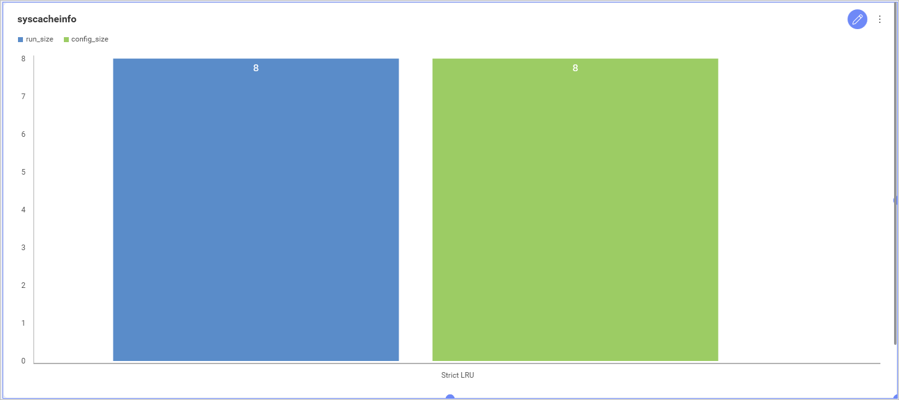
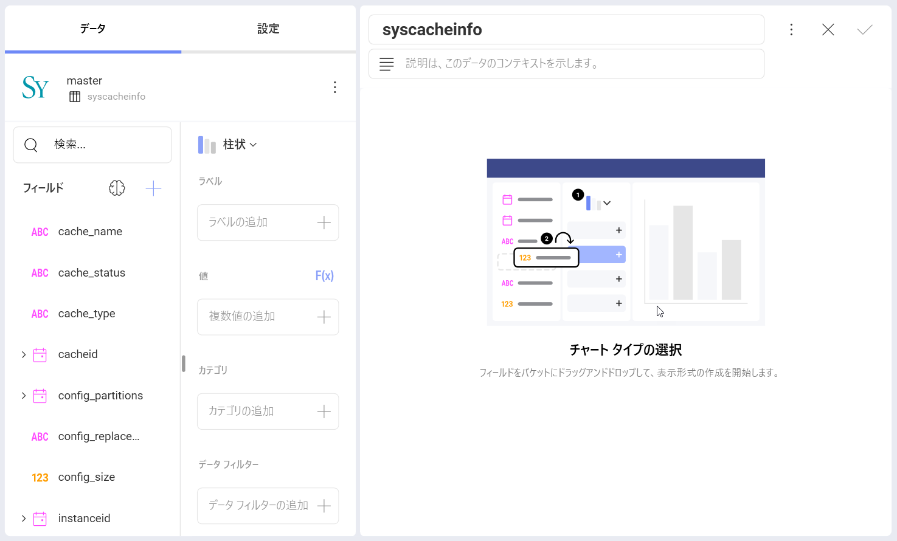
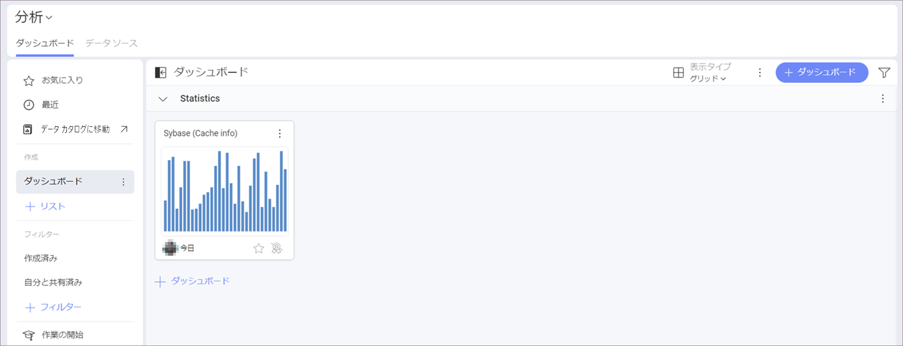

# Sybase

>[!NOTE] 
>**Web の制限**。*Analytics Web* アプリでは、公的にアクセス可能な Sybase アドレスにのみ接続できます。Sybase アドレスが一般公開 (プライベートまたは会社のイントラネットでホストされているなど) に制限されている場合は、*Analytics Desktop*、*iOS*、または *Android* を使用して接続できます。Analytics を実行しているデバイスは、Sybase アドレスにアクセスできる必要があります。この制限は、*Analytics Embedded* には適用されません。 

## Sybase への接続
Sybase サーバー データ ソースを構成するには、以下の情報が必要です。

1.  [**サーバー**](#how-to-find-your-server-information): コンピューター名またはサーバーを実行しているコンピューターに割り当てられた IP アドレス。

2.  **[ポート]**: 該当する場合、サーバー ポートの詳細。情報が入力されない場合、Analytics はデフォルトでヒント テキスト (5000) のポートに接続します。

3.  **[資格情報]**: [資格情報] を選択した後、Sybase サーバーの資格情報を入力するか、既存の資格情報 (適用可能な場合) を選択できます。

      - **[ユーザー名]**: Sybase サーバーのユーザー アカウントまたはドメインの名前。

      - **[パスワード]**: Sybase サーバーのパスワード。
    
    - **エイリアス**: データ ソース アカウントの名前。以前のダイアログのアカウントのリストに表示されます。

  準備ができたら、**[追加]** を選択してから **[サーバーの追加]** を選択します。

## サーバー情報を見つける方法

以下の手順でサーバーも確認できます。コマンドはサーバーで実行する必要があることに注意してください。

| WINDOWS                                                                                                         | LINUX                                                                                                         | MAC                                                                  |
| --------------------------------------------------------------------------------------------------------------- | ------------------------------------------------------------------------------------------------------------- | -------------------------------------------------------------------- |
| 1\. ファイル エクスプローラーを開きます。                                                                                     | 1\. ターミナルを開きます。                                                                                          | 1\. システム環境設定を開きます。                                         |
| 2\. マイコンピューターを右クリックしてプロパティを表示します。                                                                   | 2\. **$hostname** と入力します。                                                                                    | 2\. 共有セクションに移動します。                                 |
| ホスト名は、[コンピューター名、ドメイン、ワークグループ設定] の下に [コンピューター名] として表示されます。 | [ホスト名] と [DNS ドメイン名] が表示されます。Analytics では**ホスト名**のみを含めることに注意してください。| [ホスト名] は、上部の [コンピューター名] の下に表示されます。 |

以下の手順で *IP アドレス*も確認できます。コマンドはサーバーで実行する必要があることに注意してください。

| WINDOWS                              | LINUX                             | MAC                                                           |
| ------------------------------------ | --------------------------------- | ------------------------------------------------------------- |
| 1\. コマンド プロンプトを開きます。           | 1\. ターミナルを開きます。              | 1\. ネットワーク アプリケーションを起動します。                                  |
| 2\. **ipconfig** と入力します。            | 2\. **$ /bin/ifconfig** と入力します。  | 2\. 接続を選択します。                                   |
| **IPv4 アドレス** はあなたの IP アドレスです。 | **Inet addr** はあなたの IP アドレスです。 | **IP アドレス** フィールドに必要な情報が提供されます。 |

## データの設定

### ビューの作業

Analytics を使用すると、テーブル全体から Sybase データを取得できますが、代わりにテーブルまたはテーブルのセットからデータのサブセットを返す特定の<a href="http://infocenter.sybase.com/help/index.jsp?topic=/com.sybase.infocenter.dc32300.1570/html/sqlug/X29678.htm" target="_blank">ビュー (英語)</a> を選択することもできます。

たとえば、**syscacheinfo** ビューには、データベース内のテーブルの 1 つから取得したキャッシュに関する情報が含まれています。

ビューおよび Sybase の詳細については、<a href="http://infocenter.sybase.com/help/index.jsp?topic=/com.sybase.infocenter.dc32300.1570/html/sqlug/X29678.htm" target="_blank">このドキュメント Web サイト (英語)</a> を参照してください。

### 保管されたプロシージャの作業

Sybase では、保管されたプロシージャを使用すると、特定のパラメーターを使用してリレーショナル データベースで一連のクエリ ステートメントを実行できます。

たとえば、この場合、ストアド プロシージャでは、ユーザーが @name 範囲値を設定する必要があります。

ストアド プロシージャと Sybase の詳細については、<a href="http://infocenter.sybase.com/help/index.jsp?topic=/com.sybase.infocenter.dc32300.1570/html/sqlug/X39397.htm" target="_blank">このドキュメント Web サイト</a>を参照してください。

## 表示形式エディターでの作業

データ ソースを追加した後、**表示形式エディター**が表示されます。ここでダッシュボードを作成できます。デフォルトでは、**柱状**表示形式が選択されます。それを選択して、別のチャート タイプを選択できます。

表示形式の準備ができたら、右上隅のチェックマークをクリックまたはタップして、ダッシュボードとして保存できます。以下の例では、ダッシュボードを **[分析]** ⇒ **[ダッシュボード]** ⇒ **Statistics** に保存しました。

