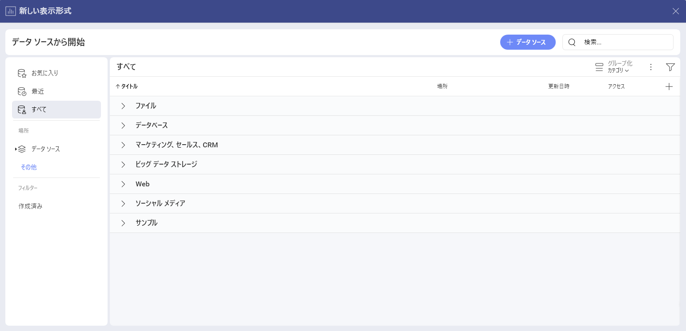

# TikTok Organic

Slingshot の TikTok Organic データ ソース コネクターを使用すると、TikTok のオーガニック (非広告) パフォーマンス データに基づいて表示形式を作成できます。

## TikTok Organic への接続

TikTok Organic データ ソースに接続するには、以下の手順を実行します。

1. ダッシュボード リストで **[+ ダッシュボード]** ボタンをクリックまたはタップします。

2. **[空のダッシュボード]** を選択します。

3. **[+ データ ソース]** ボタンをクリックします。

4. **[データ ソース]** リストで *ソーシャル メディア* の下にある **TikTok Organic** を選択します。

5. **TikTok プロファイル**でログインするように求められます。

## データの設定

*TikTok Organic* に接続した後、次の操作を行う必要があります。

1. アカウントを追加します。1 つ以上の TikTok Organic アカウントから選択できます。分析するアカウントを選択し、**[選択して続行]** をクリックまたはタップします。

2. **データ ソース**を追加します。データ ソースを追加する前に、アカウント名を変更し、適切な説明を追加し、データ ソースが認定済みかどうか (**Enterprise** ユーザー向け) を確認し、詳細を編集できます。

3. テーブルを選択します。

## 表示形式エディターでの作業

テーブルを選択すると、*表示形式エディター*が表示されます。ここでは、テーブル内のデータを使用してダッシュボードを作成できます。

デフォルトでは、*柱状*チャートが表示されます。それを選択して、別のチャート タイプを選択できます。

*表示形式エディター*の準備ができたら、ダッシュボードを **[分析]** ⇒ **[ダッシュボード]**、特定のワークスペース、またはプロジェクトに保存できます。

## 関連記事

- [データ ソースの概要](~/jp/docs/analytics/datasources/overview.md)
