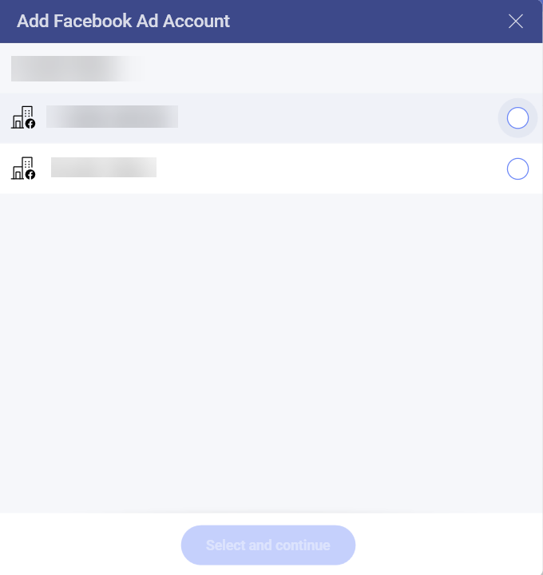
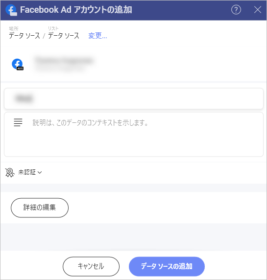
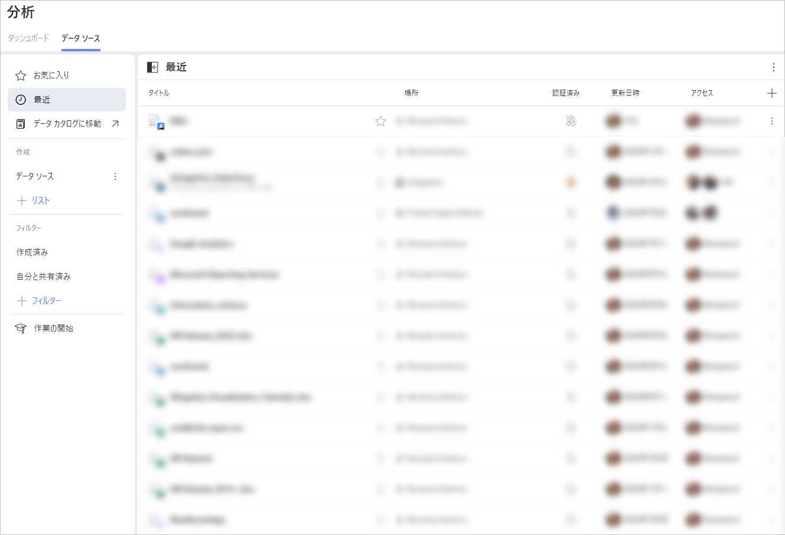
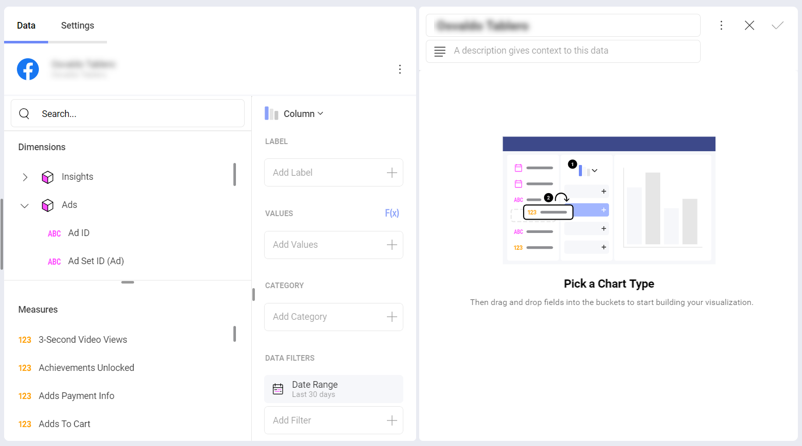
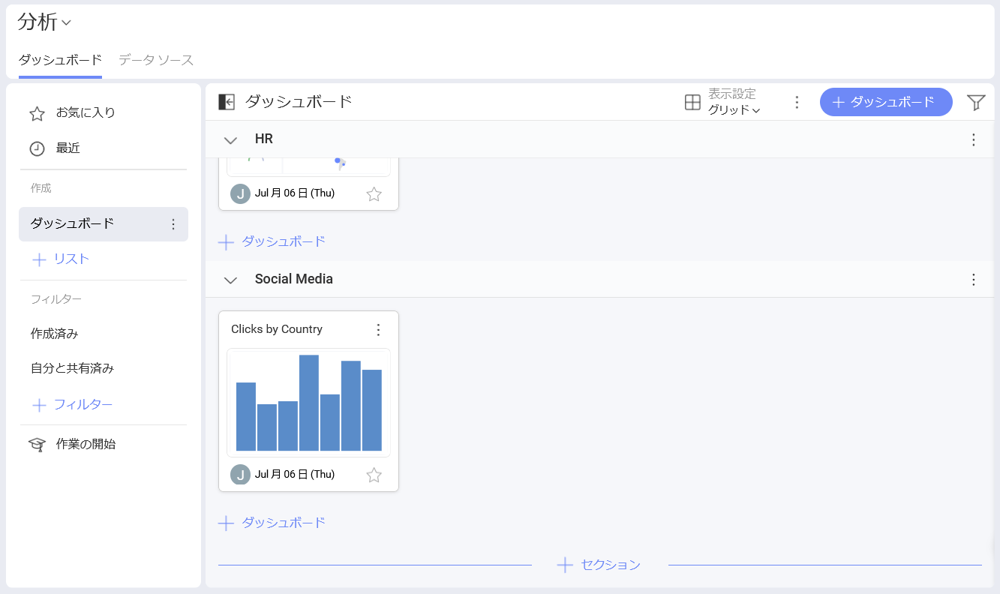

# TikTok Ads

[分析] の *TikTok Ads* データ ソース コネクターを使用すると、TikTok のマーケティング データを Slingshot に取り込むことができます。**広告アカウント**のデータを使用して、インサイトに満ちたダッシュボードを作成し、ビジネスのソーシャル メディアのパフォーマンスを測定します。

## 前提条件

分析で TikTok Ads データ ソースを使用する前に、次のことを確認してください:

- <a href="https://ads.tiktok.com/help/" target="_blank">TikTok Ads Manager</a> アカウントを使用すること。

- <a href="https://ads.tiktok.com/help/article/how-to-set-up-a-tiktok-ads-manager-account" target="_blank">広告マネージャ</a>で、接続するプロファイルの**広告アカウント**を設定済みであること。

- 接続するプロファイルの**広告アカウント**が有効であること。よくわからない場合は、TikTok Ads Manager でアカウントの状態を確認してください。

## 新しい TikTok データ ソース広告アカウントの追加

TikTok データ ソースを**データ ソース** リストにすでに追加している場合は、この部分をスキップして、[データの設定](#データの設定)に進むことができます。

TikTok Ads データ ソースをリストに追加するには、以下の手順に従ってください:

1.	**[分析]** セクションの下にある **[+ ダッシュボード]** ボタンをクリックします。

2.	**[+ データ ソース]** ボタンをクリックします。

3.	**[データ ソース]** リストで **[ソーシャル メディア]** の下にある *TikTok Ads* を選択します。

4. *TikTok* プロファイルでログインするように求められます。

    >[!NOTE] **Slingshot** で接続しようとしている TikTok プロファイルに関連付けられた**広告アカウント**が少なくとも 1 つ必要です。

5. 次のダイアログでは、選択できる TikTok 広告アカウントが表示されます。分析するアカウントを選択し、**[選択して続行]** をクリックまたはタップします。

6. 開いた最後のダイアログで、広告アカウント名を変更し、適切な説明を追加し、データ ソースが認定されているかどうかを確認し (*Enterprise* ユーザーが利用可能)、詳細を編集できます。適切な説明を追加すると、すべてのユーザーが長いリストをナビゲートし、検索しているデータ ソースを見つけるのに役立ちます。**[データ ソースの追加]** を選択してプロセスを終了します。

新しい TikTok 広告アカウント接続が最近使用したデータ ソースに追加されていることがわかります。

## データの設定

**[データ ソース]** リストから、接続する TikTok 広告アカウントを選択します。[データ ソースの詳細] ダイアログが表示され、データを確認して設定できます (下のスクリーンショットを参照)。

ここに、次のデータ ソースの詳細があります:

* タイプと名前。

* 説明。

* [認証](../../../certifications.md)。

* データ ソースを追加したユーザーとその日付。

* 最後に変更したユーザーとその日付。

* アクセスできるユーザーとワークスペース。

* データの更新頻度。期間を変更するには、右側のドロップダウンを選択します。

**[データの設定]** は、表示形式エディターに読み込むデータを選択するのに役立ちます。

- *Attribution Window*: ドロップダウン リストから特定の期間のデータを表示するように選択できます。

- **アクション レポート時間**: **impression** (インプレッション)、**conversion** (コンバージョン)、および **mixed** (混合) に関するデータをレポートするように選択できます。

- *Account Attribution Setting* を使用するかどうか。

- *Unified Attribution Setting* を使用するかどうか。

準備ができたら、**[データを選択]** をクリックまたはタップして、*表示形式エディター*に進みます。

## 表示形式エディターでの作業

データ ソースを追加した後、表示形式エディターが表示されます。

デフォルトでは、**柱状**表示形式が選択されます。それをクリックまたはタップして、ドロップダウン メニューから別のチャート タイプを選択できます。

表示形式エディターの準備ができたら、ダッシュボードを **[分析]** ⇒ **[ダッシュボード]**、特定のワークスペースまたはプロジェクトに保存できます。

データ ソースの詳細については、[こちら](../../datasources/overview.md)を参照してください。
