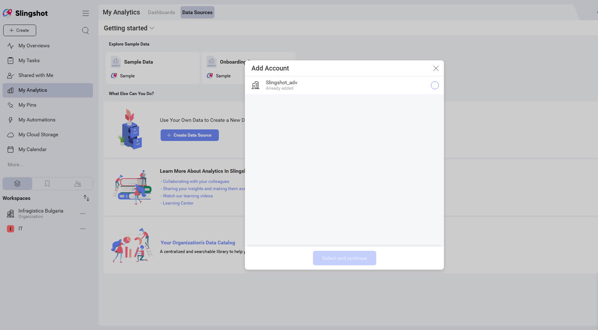
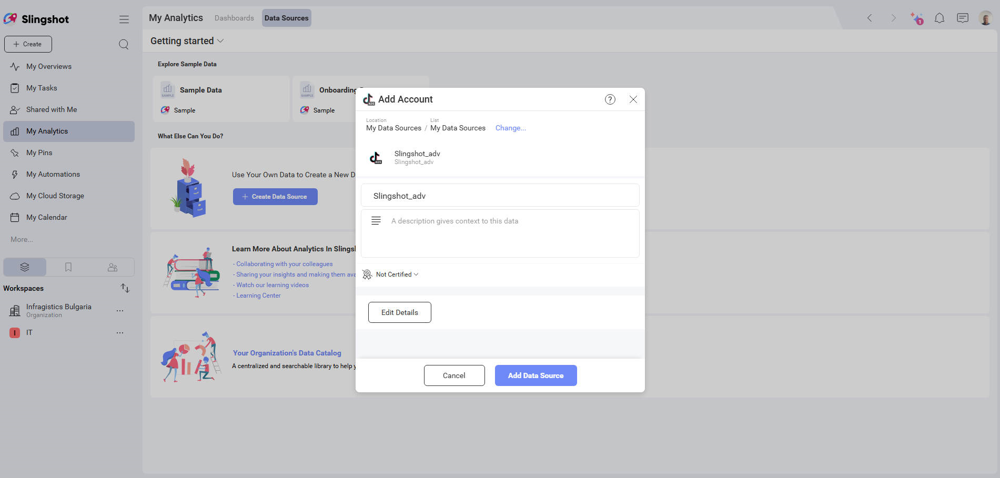
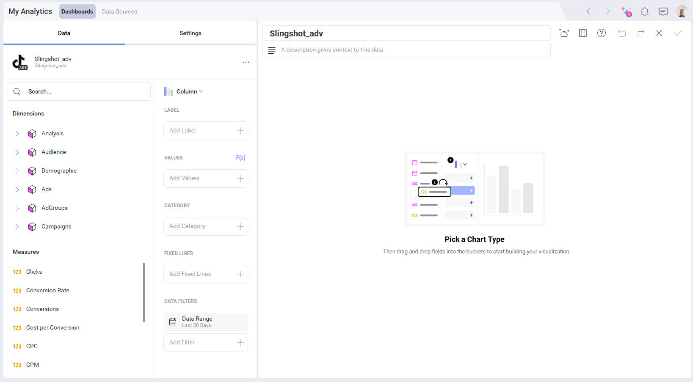

# TikTok Ads

[分析] の *TikTok Ads* データ ソース コネクターを使用すると、TikTok のマーケティング データを Slingshot に取り込むことができます。**広告アカウント**のデータを使用して、インサイトに満ちたダッシュボードを作成し、ビジネスのソーシャル メディアのパフォーマンスを測定します。

## 新しい TikTok Ads データ ソースの追加

TikTok データ ソースを**データ ソース** リストにすでに追加している場合は、この部分をスキップして、[データの設定](#データの設定)に進むことができます。

TikTok Ads データ ソースをリストに追加するには、以下の手順に従ってください:

1.	**[分析]** セクションの下にある **[+ ダッシュボード]** ボタンをクリックします。

2.	**[+ データ ソース]** ボタンをクリックします。

3.	**[データ ソース]** リストで **[ソーシャル メディア]** の下にある *TikTok Ads* を選択します。

4. *TikTok* プロファイルでログインするように求められます。

    > [!NOTE]
    > **Slingshot** で接続しようとしている TikTok プロファイルに関連付けられた**広告アカウント**が少なくとも 1 つ必要です。

5. 次のダイアログでは、選択できる TikTok 広告アカウントが表示されます。分析するアカウントを選択し、**[選択して続行]** をクリックまたはタップします。

6. 開いた最後のダイアログで、広告アカウント名を変更し、適切な説明を追加し、データ ソースが認定されているかどうかを確認し (*Enterprise* ユーザーが利用可能)、詳細を編集できます。適切な説明を追加すると、すべてのユーザーが長いリストをナビゲートし、検索しているデータ ソースを見つけるのに役立ちます。**[データ ソースの追加]** を選択してプロセスを終了します。

新しい TikTok 広告アカウント接続が最近使用したデータ ソースに追加されていることがわかります。

## データの設定

**[データ ソース]** リストから、接続する TikTok 広告アカウントを選択すると、*表示形式エディター*が表示されます。

## 表示形式エディターでの作業

データ ソースを追加した後、表示形式エディターが表示されます。

デフォルトでは、**柱状**表示形式が選択されます。それをクリックまたはタップして、ドロップダウン メニューから別のチャート タイプを選択できます。

表示形式エディターの準備ができたら、ダッシュボードを **[分析]** ⇒ **[ダッシュボード]**、特定のワークスペースまたはプロジェクトに保存できます。

データ ソースの詳細については、[こちら](../../datasources/overview.md)を参照してください。
