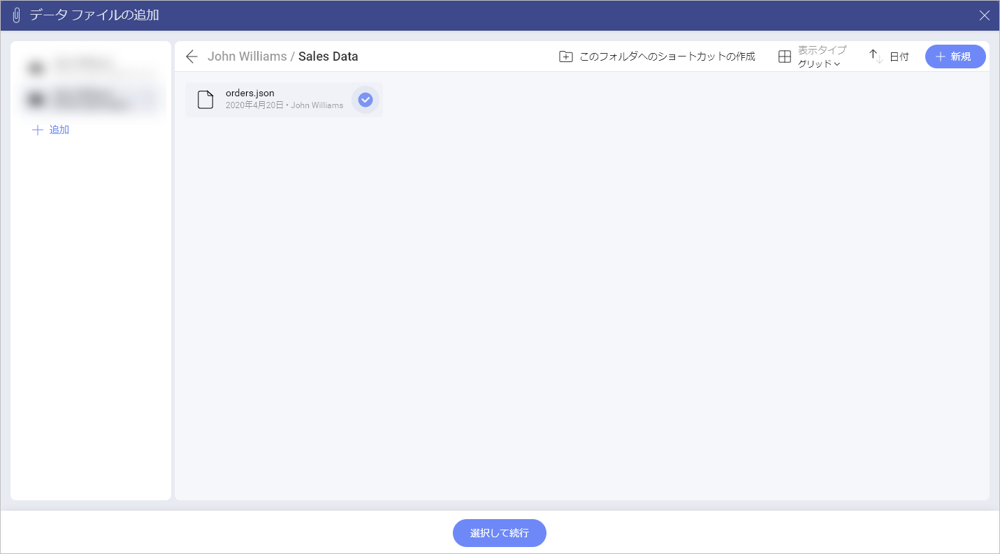
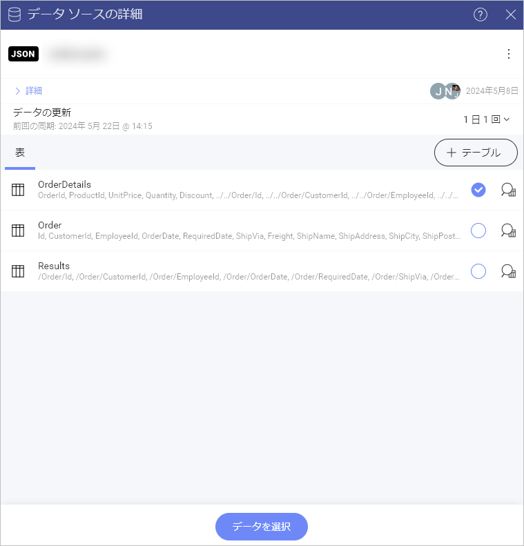
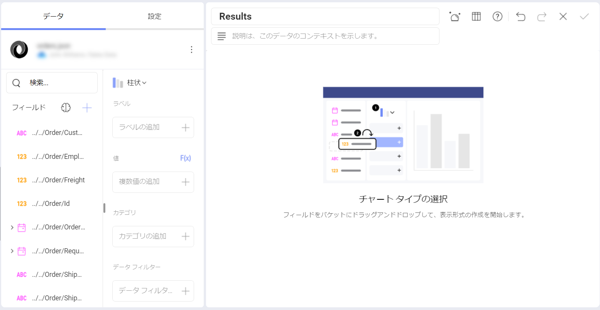
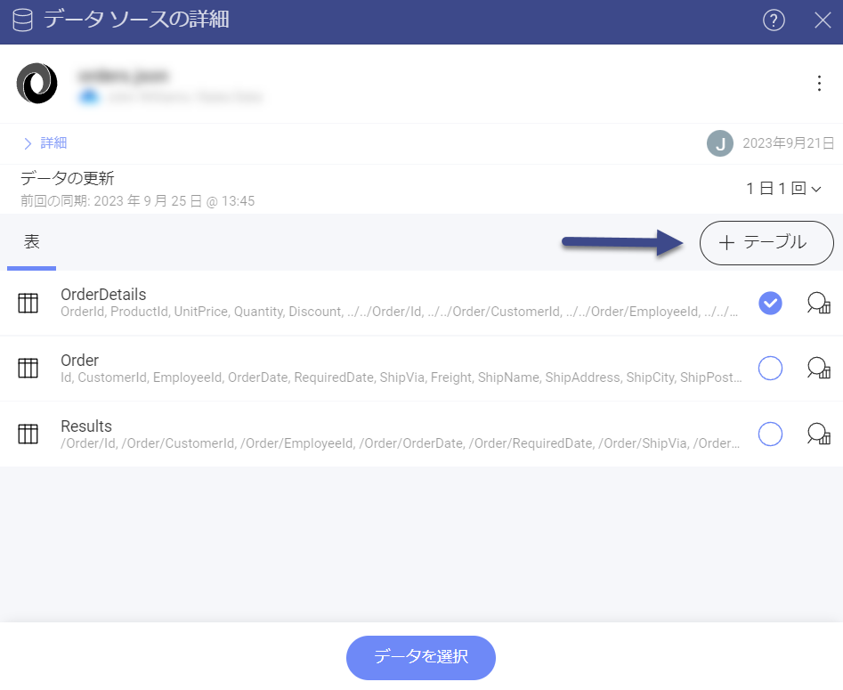
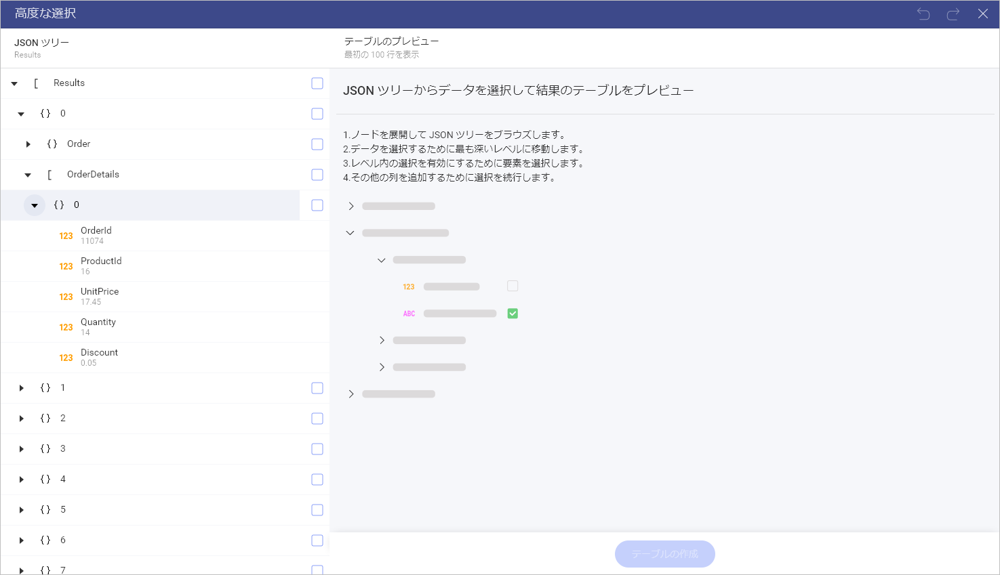
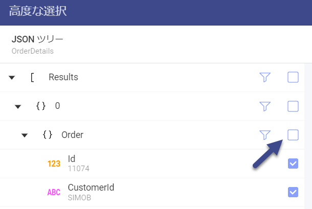
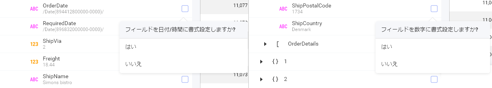
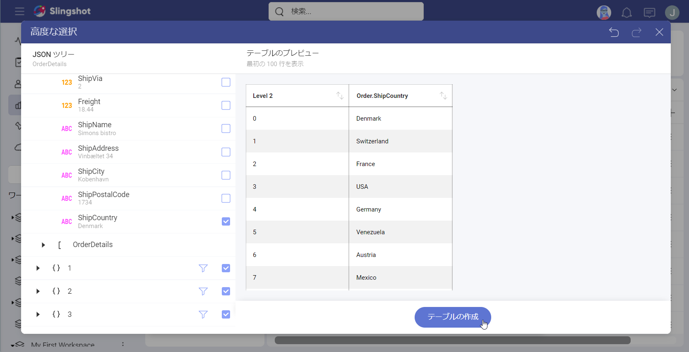

# JSON ファイルの作業

Slingshot では、JSON ファイル データの表示形式をサポートします。

JSON ファイル形式を読み込んだ後、使用できるデータ構造が表示されます。さらに、カスタム データ構造を選択できる[**高度な選択**](#高度な選択モード)モードがあります。

## JSON 書式の情報

JSON (**J**ava**S**cript **O**bject **N**otation) は、データを保存および交換するための自己記述型の軽量な書式です。

書式のハイライト:

  - JSON の書式は、**データのさまざまな構造を表す**ために使用できます。

  - データは常に**コンマで区切られた名前/値のペア**として配置されます。

  - データ型の表記には、**オブジェクトの波括弧 {}** と**配列の角括弧 \[\]** が含まれます。

## JSON ファイルの読み込み

JSON ファイルのデータを使用する新しい表示形式を作成するには、次の手順に従います。

1.  **ファイルを利用できるようにする**。

    JSON ファイルをストレージ プロバイダーのいずれかにアップロードして、後で Slingshot からアクセスできるようにします。次の使用可能なオプションから選択できます: Dropbox、OneDrive、Box、Google Drive、および SharePoint。

2.  **ファイルを参照する**。

    2.1.  ファイルのあるストレージ プロバイダーを選択し、ログイン認証情報を提供します。

    2.2.  プロバイダーを参照し、JSON ファイルを選択します。

    

3.  **必要なデータ構造を選択する**。

    ファイルをデータ ソースのリストに追加すると、選択できるデータ構造のリストが表示されます。

    

    リストに目的のデータ構造が含まれていない場合は、[**高度な選択モード**](#高度な選択モード)を使用して、カスタムデータ構造を選択できます。

4.  **[データの選択]** をクリック / タップする。

    データ構造を選択し、[データの選択] ボタンをクリック / タップして、表示形式エディターを開きます。

    

## 高度な選択モード

JSON ファイルを使用して、さまざまなデータ構造を表すことができます。このため、Slingshot では、作業するカスタム データ構造を選択できます。処理したいデータ列を選択した後、それらの上に表示形式を構築することができます。そのためには、次のことを行う必要があります。

1.  **高度な選択モードを開く**。

    **[+ テーブル]** ボタンをクリック/タップして、**[高度な選選択]** 画面にアクセスします。

    

2.  **JSON ツリーをナビゲートする**。

    ノードを展開し、データを選択する最も深いレベルを選択します。

    

3.  **ツリー要素とフィールドを選択する**。
    子の選択を有効にするには、ツリー要素 (オブジェクト **[ ]** または配列 **{ }**) を選択する必要があります。

    |                                                                             |                                                                                                                                           |
    | --------------------------------------------------------------------------- | ----------------------------------------------------------------------------------------------------------------------------------------- |
    |  | 1 つ以上の子の選択後、親要素 (オブジェクトと配列) の選択を解除し、データ構造から除外できます。 |

4.  (*オプション*) **テキスト フィールドを日付/時刻または数値に書式設定する**。

    フィールドを選択すると、Slingshot はその値を読み取り、最適な形式を自動検出し、実行する操作を選択できるダイアログを表示します。

    

5.  **[テーブルの作成]** をクリック / タップする。

    カスタム データ構造を選択後、**[テーブルの作成]** をクリック / タップして、表示形式エディターを開きます。

    

