# ダッシュボード フィルターとそのプロパティ

## ダッシュボード フィルター プロパティにアクセスする

新しいダッシュボード フィルターを追加するには:

1. **ダッシュボード エディター**に移動し、**[フィルターの追加]** を選択します。

2. **[ダッシュボード フィルターの追加]** をクリックまたはタップします。

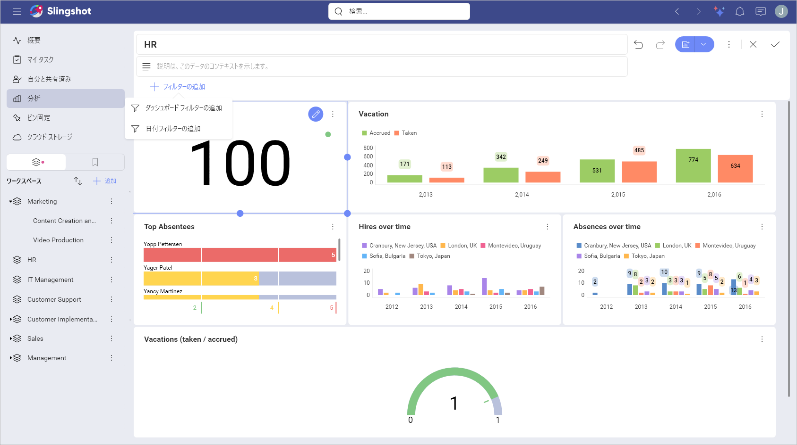

2. データ ソースを選択します。 

3. **ダッシュボード フィルター** メニューが開きます。ここで、別のデータ ソースに切り替えて、ダッシュボードとして使用するデータセットを選択できます。

  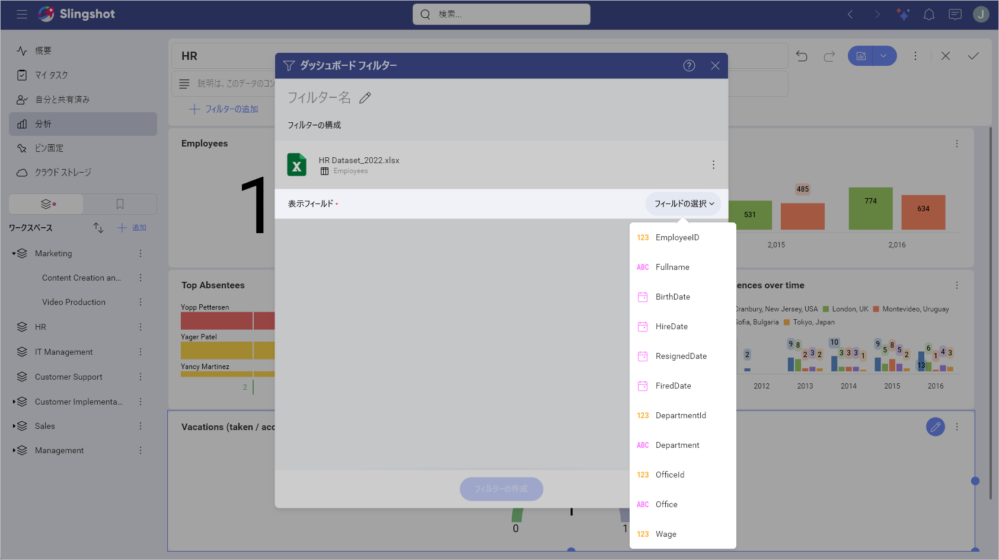

3. フィールドを選択したら、**[フィルターの作成]** をクリックまたはタップします。

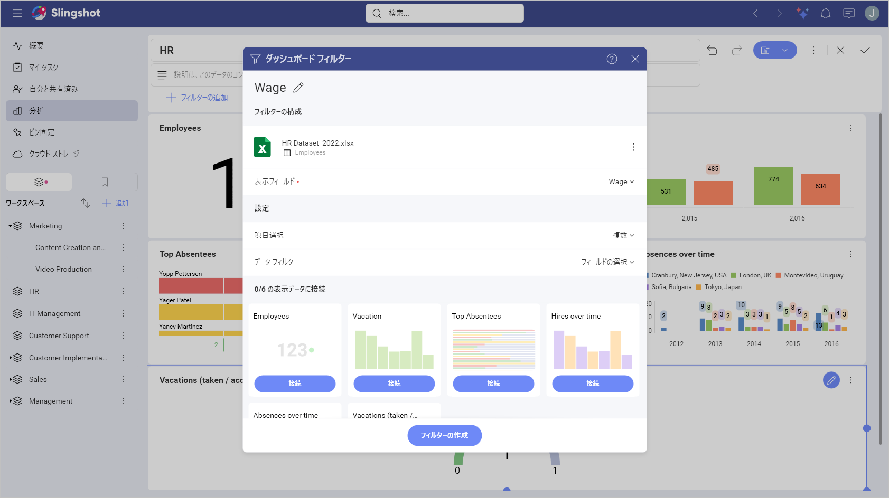

## フィルター設定の概要

フィルターの以下の設定を変更できます:

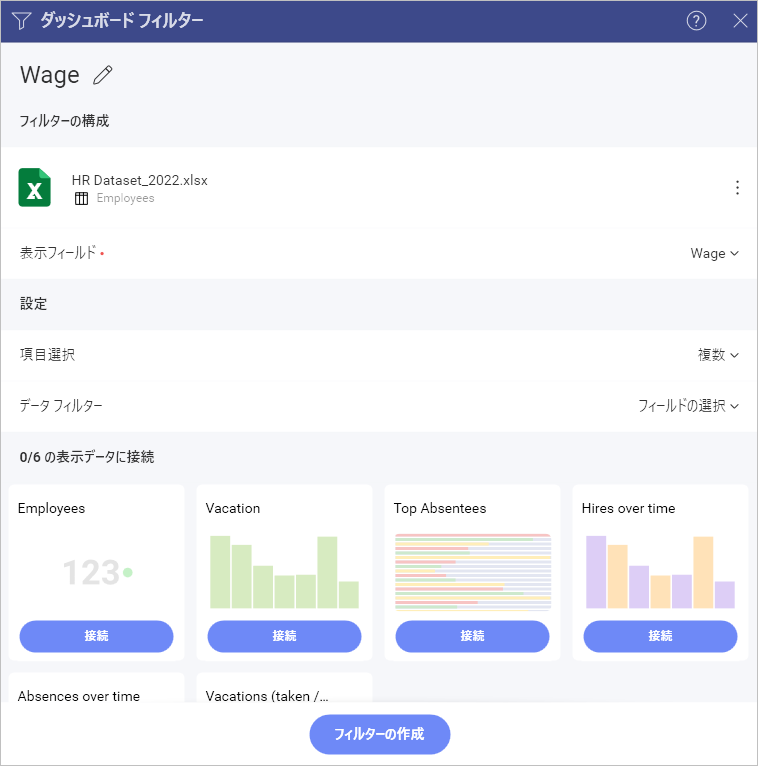

- タイトル。ダッシュボードのタイトルのすぐ下に表示される、ダッシュボード ィルターのタイトル。デフォルトで、これはフィルターとして使用されるフィールド名です。</th>

- <a href="#displayed-field">表示フィールド/要素</a>。ダッシュボード フィルターとして使用されるデータセット内のフィールド。

- 選択。この設定では、次を構成できます。<a href="#multiple-selection">複数選択</a> (一度に複数の値を選択できます) および/または<a href="#required-selection">必須選択</a> (少なくとも 1 つの値を常に選択する必要があります)。

- <a href="#data-filters">データ フィルター</a>。この設定により、ダッシュボード フィルターに使用されるデータ ソースに<a href="../../analytics/data-visualizations/fields/field-filters-rules.md">フィールド フィルターとルール</a>を適用できます。

- <a href="connecting-dashboard-filters-visualization.md">接続された表示形式</a>。ダッシュボードを表示形式に接続するかどうか。

## 表示フィールド

>[!NOTE] 
>**Microsoft Analysis Services** および **Google アナリティクス**のデータを使用するダッシュボード フィルターの場合、この設定の名前は **[表示する要素]** です。

**表示するフィールド/要素**設定は、ダッシュボード フィルターの値を表示するために使用されるデータセット フィールドを指定します。リスト値は、元のデータセットで複数回表示された場合も繰り返されません。

ダッシュボード フィルター名の隣りのオーバーフロー メニューで [編集] ボタンをクリックして、編集モードで表示列を変更できます。

## 複数選択

Analytics は、複数のダッシュボード フィルター値の同時選択をサポートしています。これにより、コレクション内で要素を並べて比較できます。たとえば、[HR ダッシュボード] で複数の選択を有効にすることで、さまざまなオフィスの雇用や欠勤を比較することができます。

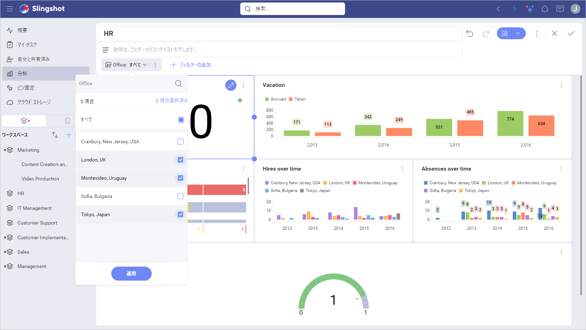

**複数選択**を有効にするには、次の操作を実行する必要があります:

1. ダッシュボードを**編集**モードに切り替えます。

2. ダッシュボード フィルターのオーバーフロー メニューから **[編集]** を選択します。

3. **[選択]** をクリックまたはタップします。

4. **[複数選択]** チェックボックスをオンにします。

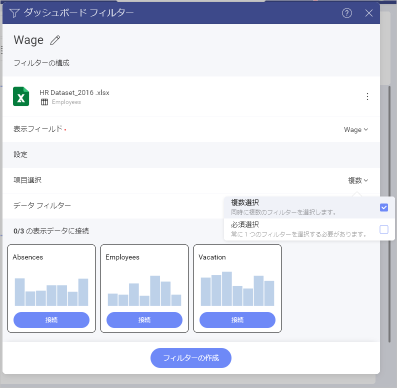

## 必須選択

ダッシュボード フィルターで選択オプションを必須または無効にできます。デフォルトでは、選択は不要です。選択オプションで、ユーザーがすべてのダッシュボード フィルター値を解除することができ、実行したクエリからフィルターを削除します。クエリはデータ ソースのすべてのデータを取得し、ダッシュボード フィルター行に「選択なし」と表示されます。

**須選択**を有効にするには、次の操作を実行する必要があります:

1. ダッシュボードを**編集**モードに切り替えます。

2. ダッシュボード フィルターのオーバーフロー メニューから **[編集]** を選択します。

3. **[選択]** をクリックまたはタップします。

4. **[必須選択]** チェックボックスをオンにします。

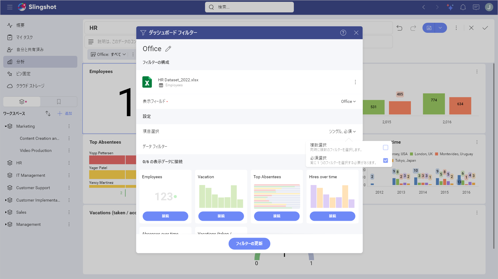

## データ フィルター

ダッシュボード フィルターに表示されるデータセットのフィールドにフィルターを適用することもできます。これにより、特定のフィールドの null または空の値をフィルター アウトできます ([空の値のフィルター](../../analytics/data-visualizations/fields/field-filters-rules.md#空値をフィルター))。[特定の値](../../analytics/data-visualizations/fields/field-filters-rules.md#値の選択)を選択するか、フィールド タイプに応じてオプションを変更するためにフィールドに[ルール](../../analytics/data-visualizations/fields/field-filters-rules.md#日付フィールドのルール)を追加することもできます。詳細は、「[フィールド フィルターとルール](../../analytics/data-visualizations/fields/field-filters-rules.md)」トピックをご覧ください。

たとえば、**Fullname** フィールドを使用して **HR ダッシュボード**のデータをフィルタリングする場合、**ダッシュボード フィルター**は会社のすべてのオフィスの従業員リストを表示します。

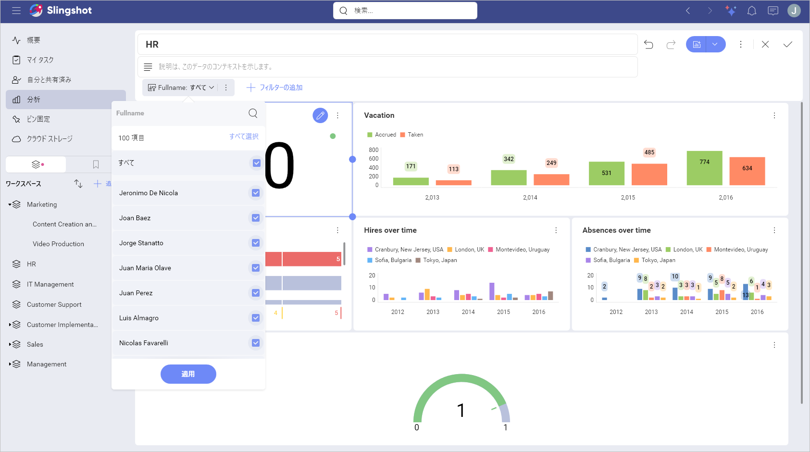

ここでは、特定のオフィスで働いている従業員だけをフィルターとして使用する場合は、**データ フィルター** プロパティを適用でる、たとえば、*London, UK*。それにより、ダッシュボード フィルターには、ロンドンオフィスで働く従業員のリストが表示されます。

### ダッシュボード フィルターにデータ フィルターを適用

フィルター リストに特定のオフィスで働いている従業員のみ (たとえば、*London, UK*) を含める場合は、以下に示すようにデータ フィルターを適用します。

1.  ダッシュボード フィルター設定の**データ フィルター**に移動します。

2.  **表示フィールド**プロパティで **Fullname** を選択します。

3.  [フィールドの選択] をクリックまたはタップして、リストから Office を選択します。

  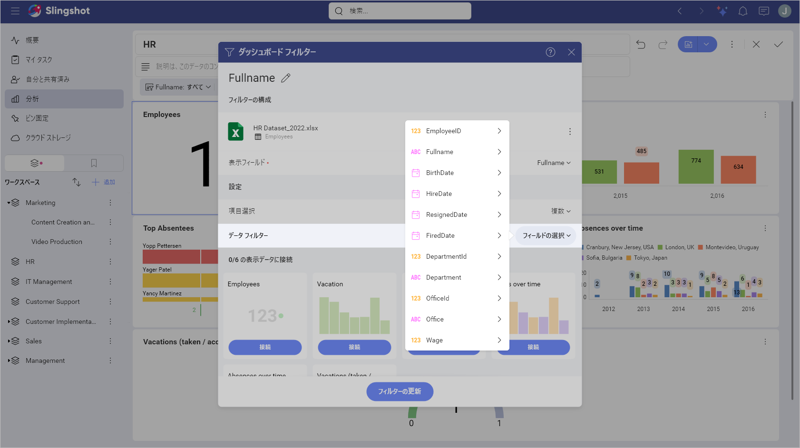

4.  次のダイアログで、適用するフィルター タイプを選択します (この例では、**[値の選択]** を選択します)。

  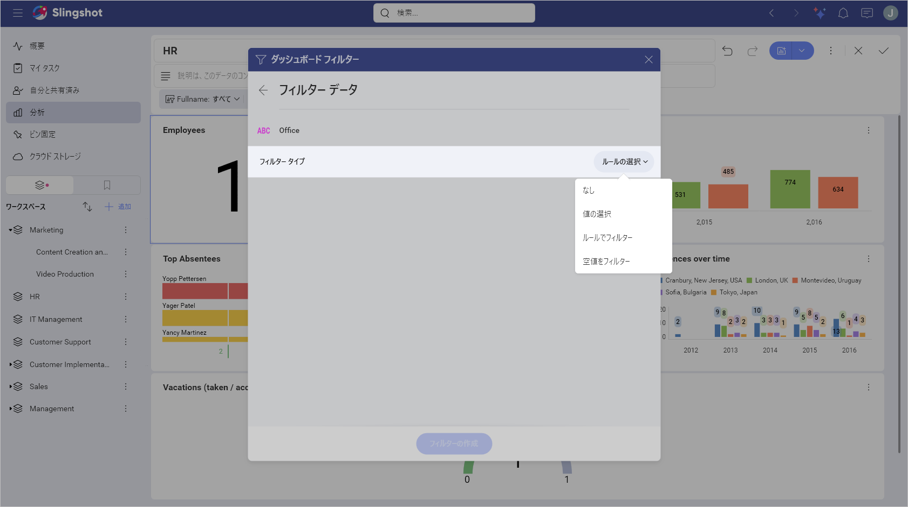

5.  リストから *London, UK* を選択し、[フィルターの作成] ボタンをクリックまたはタップします。

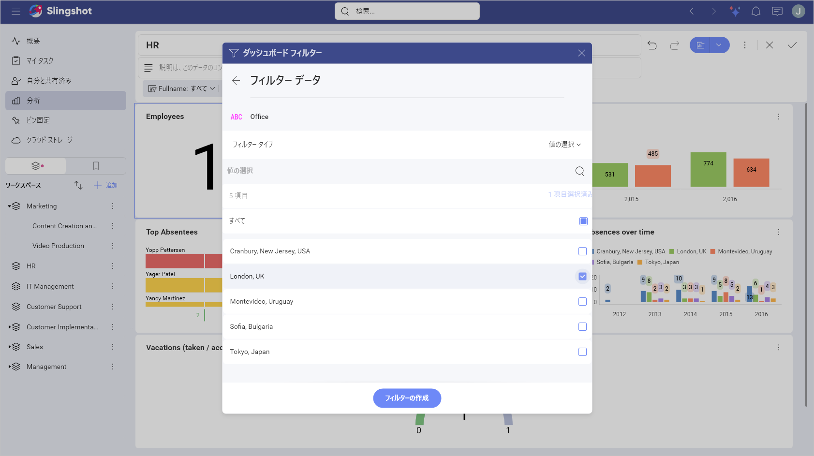

## Microsoft Analysis Data を使用したダッシュボード フィルター

MS Analysis のダッシュボード フィルターを構成する場合、いくつかの詳細があります (以下のリストを参照)。

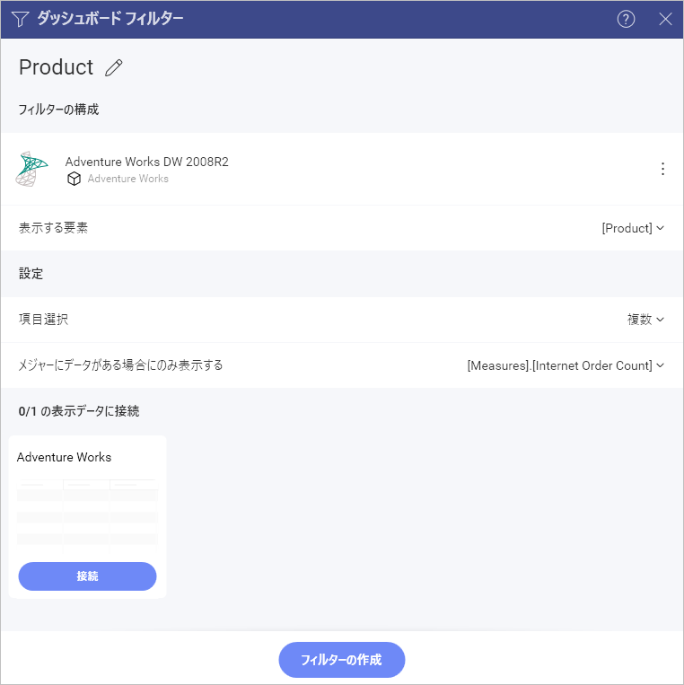

 1. **表示される要素** - ダッシュボード フィルター値を表示するために **ディメンション**、**階層**または**レベル** データ フィールドを選択できますが、**メジャー** データ フィールドは選択できません。

 2. (オプション) **メジャーにデータがある場合のみ表示** - メジャーを選択して、ダッシュボードのフィルター リストを特定のメジャーのデータを含む値に制限します。

たとえば、上のスクリーンショットに見えるように、**Product** ディメンションは **[表示する要素]** として選択されているため、ダッシュボード フィルターには製品のリスト (自転車、衣服など) のリストが表示されます。
[メジャーにデータがある場合のみ表示] フィールドの **Internet orders** メジャーを追加選択すると、**Internet orders** メジャーに関する情報を含まないダッシュボード フィルター値を除外します。自転車のインターネット注文がない場合、その製品はダッシュボード フィルター リストに表示されません。

## 次の手順 

ダッシュボード フィルターを作成したので、フィルターを適用する**表示形式に接続する**必要があります。詳細は、「[ダッシュボード フィルターを表示形式に接続](connecting-dashboard-filters-visualization.md)」トピックをご覧ください。
