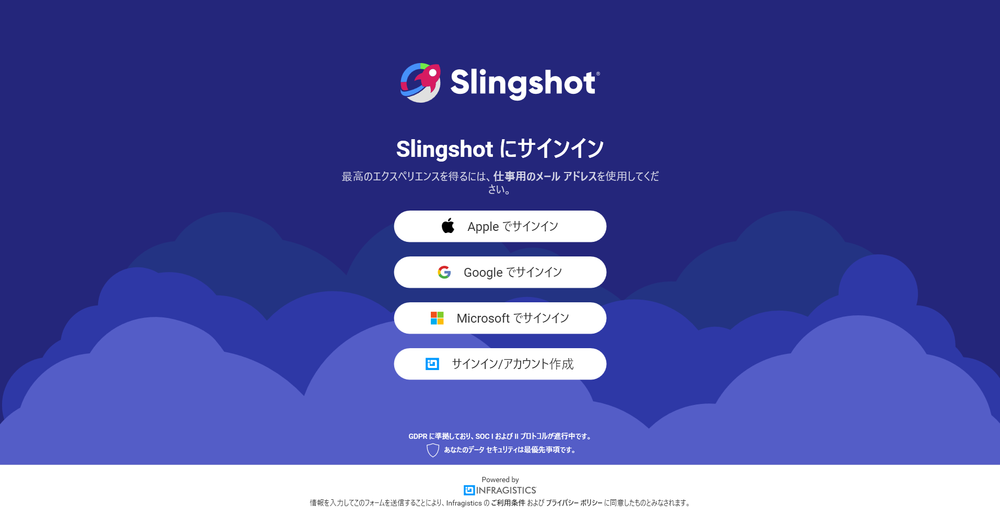
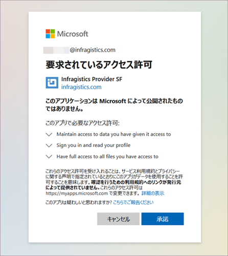

# Slingshot へのログイン

アプリケーションをインストールして最初の起動時に以下の画面が表示されます。

Slingshot では、Office 365、Google アカウントまたは iCloud (*Apple*) の認証情報を使用してログインできます。インフラジスティックス ユーザーアカウントを作成することもできます。アプリケーションに自動的にログインするには、一度サインインするだけでよいので、複数のパスワードを覚えておく必要はありません。

## Office 365 および Google アカウントの権限リクエスト

Slingshot で **Office 365** アカウントを使用して初めてサインインすると、Slingshot にプロファイルを読み取り、アクセスを維持するためのアクセス許可を与えるように求められます。

**Google** アカウントを使用してサインインする場合は、アカウントの資格情報を入力するだけで済みます。

サインインに使用したアカウントに応じて、OneDrive または Google ドライブが[データ ソース](https://www.slingshotapp.io/en/help/docs/analytics/datasources/overview)のリストに自動的に追加されます。さらに、[OneDrive](https://www.slingshotapp.io/en/help/docs/analytics/datasources/supported-data-sources/onedrive) と [Google ドライブ](https://www.slingshotapp.io/en/help/docs/analytics/datasources/supported-data-sources/google-drive)を初めて使用するときにのみ、制限された制限付きのアクセス許可を求められます。
