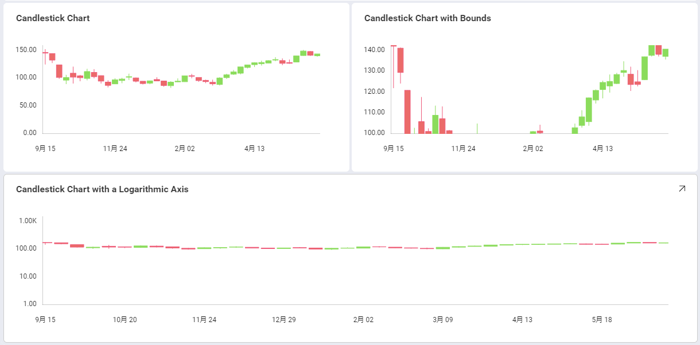
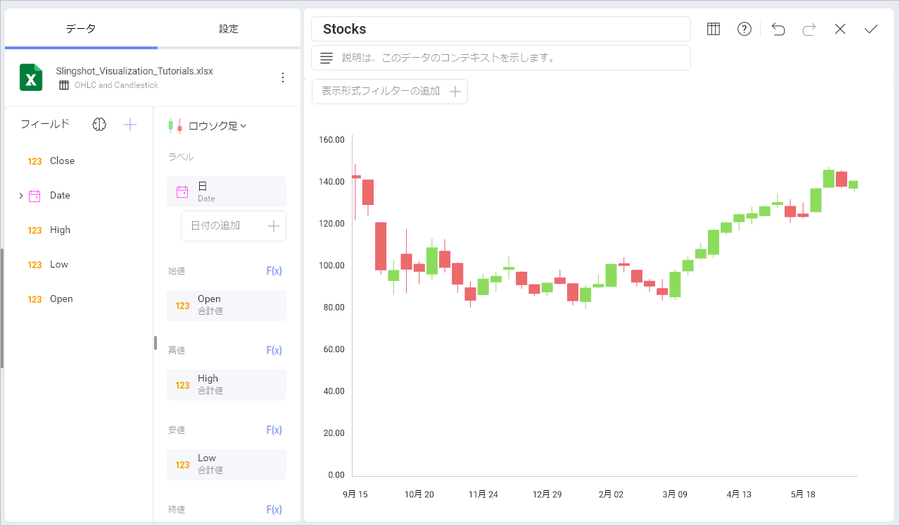
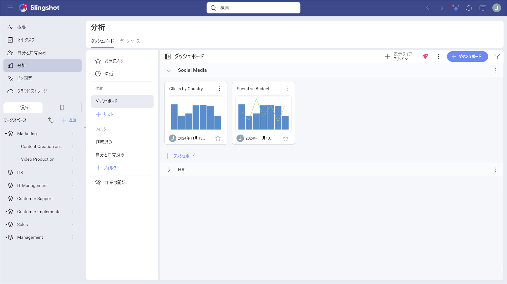
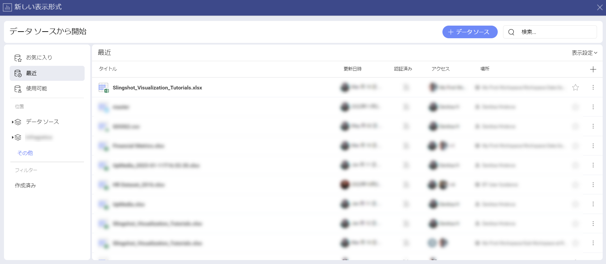
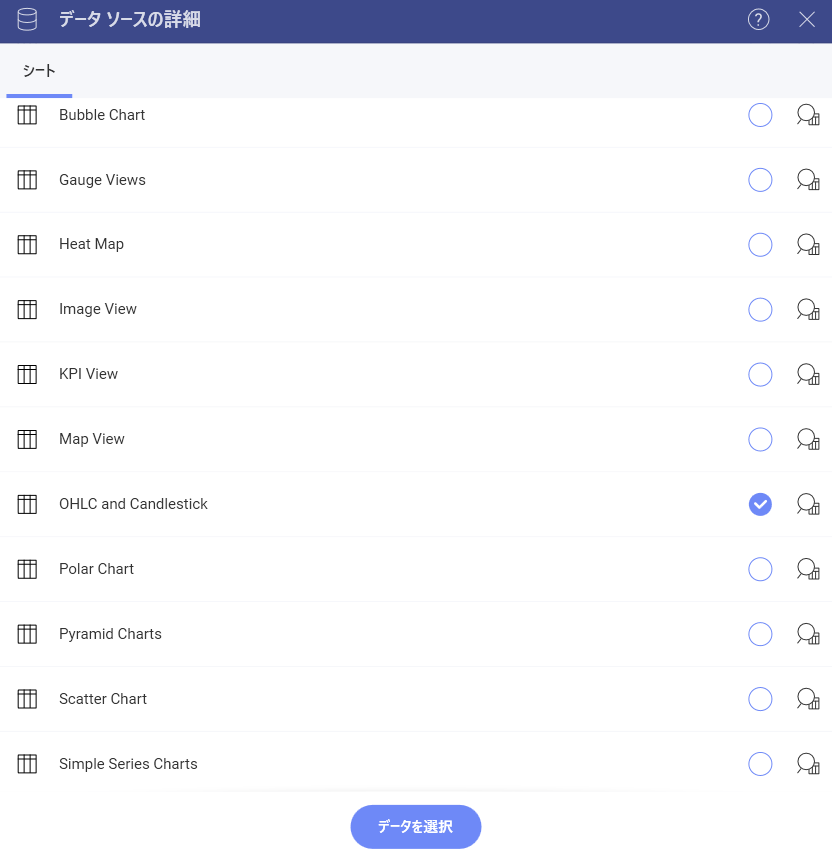
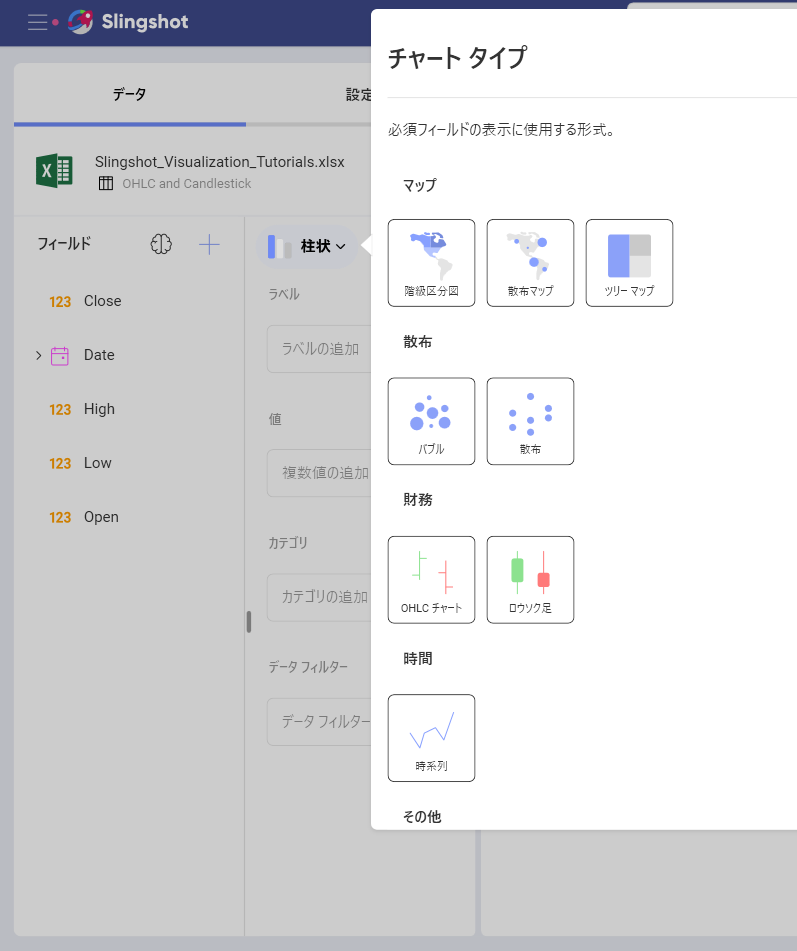
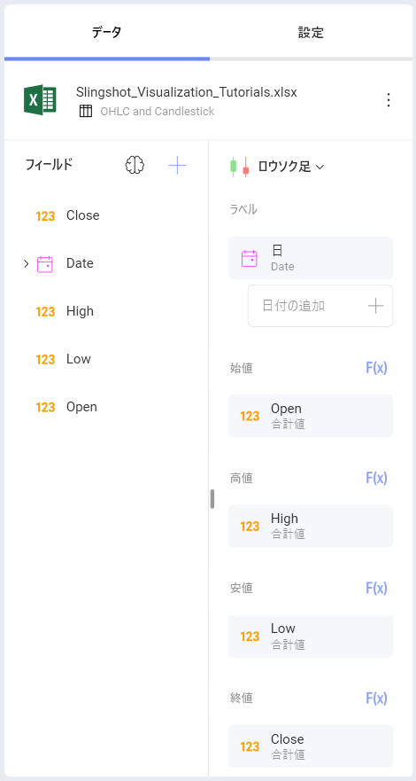
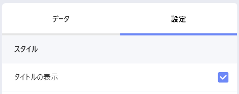
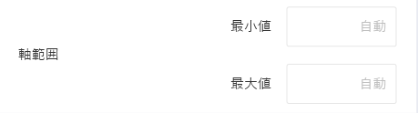
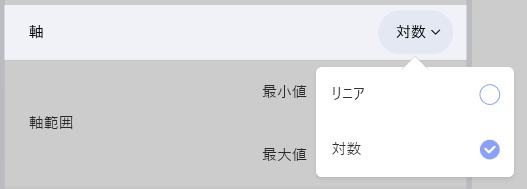

## ローソク足で表示する方法

このチュートリアルは、サンプル スプレッドシートを使用して**ローソク足**の表示形式を作成する方法を説明します。

ローソク足チャート ビューのガイドは、以下のリンクから参照してください。

  - [ローソク足チャートを作成する方法](https://www.slingshotapp.io/en/help/docs/analytics/visualization-tutorials/candlestick-chart#creating-a-candlestick-chart)

  - [軸の構成を変更する方法](https://www.slingshotapp.io/en/help/docs/analytics/visualization-tutorials/candlestick-chart#changing-your-axis-configuration)

  - [軸の構成を対数に変更する方法](https://www.slingshotapp.io/en/help/docs/analytics/visualization-tutorials/candlestick-chart#setting-your-axis-configuration-as-logarithmic)

## 重要なコンセプト

[OHLC](ohlc-chart.html) チャートとローソク足チャートは各財務データの始値、高値、安値、終値を表します。財務シナリオと株の変動の分析のために役立ちます。このチャートは各垂直軸に始値および終値を表す 2 つの水平線で数値を垂直軸に表します。

そのため、ローソク足チャートには以下の項目が必要になります。

  - 通常日付に関連するデータ エディターの **[ラベル] プレースホルダーにドロップする 1 つのフィールド**。

  - Open、High、Low および Close の **4 つの異なるフィールド** データ エディターのカテゴリ。

チャートに追加情報を表示するためのオプションが複数あります。

  - **軸の構成**: 軸の構成でチャートの最大値と最小値を構成できます。デフォルトで最小値は 0 に設定され、最大値は使用されるデータによって設定されます。

  - **対数軸構成**: [対数] ボックスをチェックする場合、値のスケールは通常のリニア スケールを使用する代わりに大きさを使用するリニア スケール以外で計算されます。

## サンプル データ ソース

このチュートリアルでは、[Slingshot Visualization Tutorials](https://download.infragistics.com/slingshot/samples/Slingshot_Visualization_Tutorials.xlsx) の *OHLC and Candlestick* シートを使用します。

>[!NOTE]
>このリリースでは、ローカル ファイルとしての Excel ファイルはサポートされていません。チュートリアルを実行するには、サポートされているクラウド サービスのいずれかにファイルをアップロードするか、[ウェブ リソース](../datasources/supported-data-sources/web-resource.md)として追加してください。

## ローソク足チャートを作成する方法

1. **[分析]** セクションの右上隅にある **[+ ダッシュボード]** ボタンを選択します。

                                         

2. データ ソースのリストからデータ ソース (**Slingshot Tutorials Spreadsheet**) を選択します。データ ソースが新しい場合は、最初に右上隅の **[+ データ ソース]** ボタンから追加する必要があります。

                                             

 3. **OHLC and Candlestick** シートを選択します。
  
    
         
4. **表示形式ピッカー**を開き、**ローソク足**の表示形式を選択します。デフォルトで、表示形式のタイプは**柱状**に設定されています。

                                                                
5.  *Date* フィールドを **[ラベル]** にドラッグアンドドロップし、*Open*、*High*、*Low* および *Close* フィールドを対応するプレースホルダーにドラッグアンドドロップします。
                                                        

## 軸の構成を変更する方法

[ゲージの範囲](../visualization-tutorials/gauge-charts.md#adding-bounds-to-your-gauge)と同様に、チャート軸構成でチャート (範囲) の最小値と最大値を設定できます。この機能を使用して、特定のデータ含有や除外ができます。

以下は軸構成のメニューにアクセスするための手順です。

|                                             |                                                                                               |                                                             |
| ------------------------------------------- | --------------------------------------------------------------------------------------------- | ----------------------------------------------------------- |
| 1\. **設定メニューにアクセスする**            |   | 表示形式エディターの **[設定]** セクションに移動します。 |
| 2\. **軸範囲セクションに移動する** |  | 変更する設定は **[軸範囲]** です。   |

最大値または最小値 (または両方) のどれを設定するかに基づいて、以下のオプションの 1 つにアクセスする必要があります。

### 最小境界値を変更する

デフォルト値は「自動」に設定されています。境界値を変更する場合は、チャートの開始値を入力してください。

### 最大境界値を変更する

最大境界値の場合、Analytics が元のデータを使用するためにデフォルトの値は **[自動]** に設定されます。別の値を設定するには、チャートの上限値を入力します。

## 軸を対数軸として設定

|                                        |                                                                                                              |                                                             |
| -------------------------------------- | ------------------------------------------------------------------------------------------------------------ | ----------------------------------------------------------- |
| 1\. **設定メニューにアクセスする**       |                  | 表示形式エディターの **[設定]** セクションに移動します。 |
| 2\. **軸を対数に変更する** |  | **[軸]** ドロップダウンを開き、**[対数]** を選択します。      |
